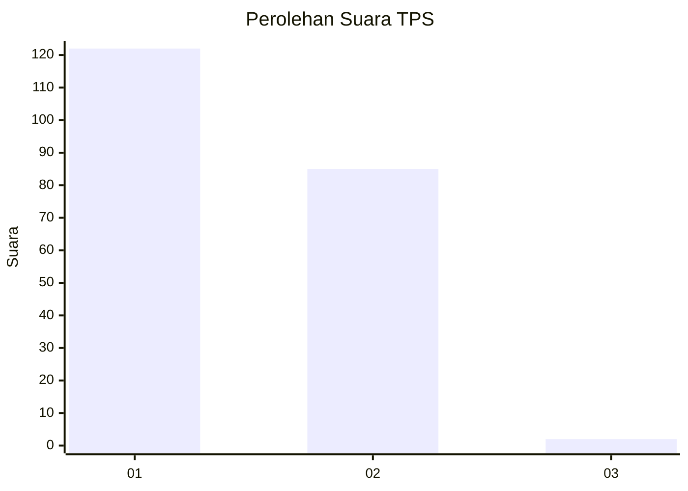
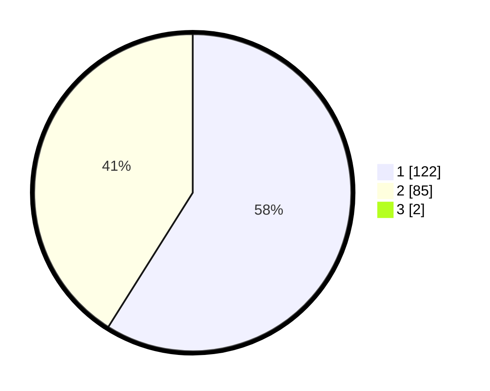

# Hasil

## Grafik

## Tabel

| No. | Nama Paslon    | Suara | Suara (raw) | Persentase |
|:--- |:-------------- | -----:| -----------:| ----------:|
| 1   | ANIES MUHAIMIN | 122   | [122][p-1]  | 58,37      |
| 2   | PRABOWO GIBRAN | 85    | [85][p-2]   | 40,67      |
| 3   | GANJAR MAHFUD  | 2     | [2][p-3]    | 0,96       |

[p-1]: https://github.com/gigit-pemilu/pemilu-2024-14-riau/blob/main/pilpres/hitung-suara/sub/14-riau/sub/01-kampar/sub/01-bangkinang-kota/sub/1011-bangkinang/sub/001-tps/sub/paslon-1.txt
[p-2]: https://github.com/gigit-pemilu/pemilu-2024-14-riau/blob/main/pilpres/hitung-suara/sub/14-riau/sub/01-kampar/sub/01-bangkinang-kota/sub/1011-bangkinang/sub/001-tps/sub/paslon-2.txt
[p-3]: https://github.com/gigit-pemilu/pemilu-2024-14-riau/blob/main/pilpres/hitung-suara/sub/14-riau/sub/01-kampar/sub/01-bangkinang-kota/sub/1011-bangkinang/sub/001-tps/sub/paslon-3.txt

## Foto C Plano

https://sirekap-obj-formc.kpu.go.id/0431/pemilu/ppwp/14/01/01/10/11/1401011011001-20240216-155632--e290d29b-8cd8-417e-b395-a38fba6caa14.jpg

https://sirekap-obj-formc.kpu.go.id/0431/pemilu/ppwp/14/01/01/10/11/1401011011001-20240216-155633--8c60a40e-17ba-43f7-8e06-48c7cf56273c.jpg

https://sirekap-obj-formc.kpu.go.id/0431/pemilu/ppwp/14/01/01/10/11/1401011011001-20240216-155633--770822b1-7f1f-490c-85ea-986a7b651423.jpg

## Metadata

| Key        | Value               |
| ---------- | ------------------- |
| Time Stamp | 2024-02-16 21:01:00 |

## DATA PEMILIH TETAP

Jumlah pemilih dalam DPT: **276**.
 * L: **133**.
 * P: **143**.

## DATA PENGGUNA HAK PILIH

Jumlah pengguna hak pilih dalam DPT: **207**.
 * L: **99**.
 * P: **108**.

Jumlah pengguna hak pilih dalam DPTb: **0**.
 * L: **0**.
 * P: **0**.

Jumlah pengguna hak pilih dalam DPK: **2**.
 * L: **1**.
 * P: **1**.

Jumlah pengguna hak pilih: **209**.
 * L: **100**.
 * P: **109**.

## JUMLAH SUARA SAH DAN TIDAK SAH

JUMLAH SELURUH SUARA SAH: **209**.

JUMLAH SUARA TIDAK SAH: **0**.

JUMLAH SELURUH SUARA SAH DAN SUARA TIDAK SAH: **209**.

