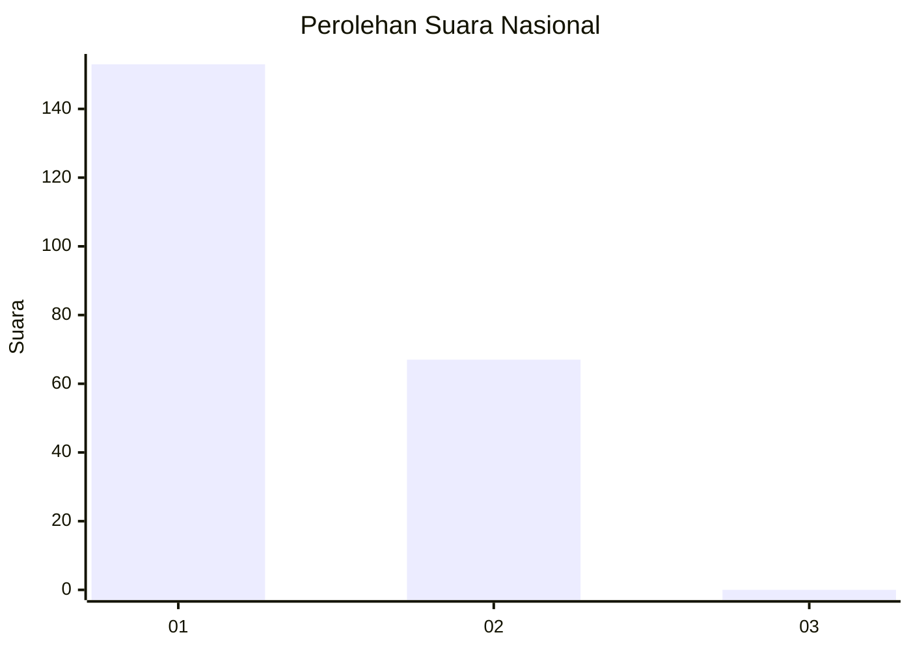
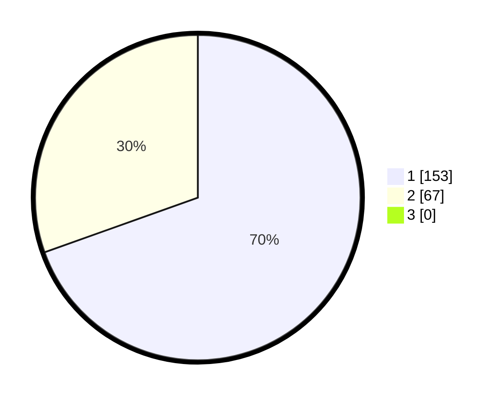

# Hasil

## Grafik

## Tabel

| No. | Nama Paslon    | Suara | Suara (raw) | Persentase |
|:--- |:-------------- | -----:| -----------:| ----------:|
| 1   | ANIES MUHAIMIN | 153   | [153][p-1]  | 69,55      |
| 2   | PRABOWO GIBRAN | 67    | [67][p-2]   | 30,45      |
| 3   | GANJAR MAHFUD  | 0     | [0][p-3]    | 0,00       |

[p-1]: https://github.com/gigit-pemilu/pemilu-2024/blob/main/pilpres/hitung-suara/sub/14-riau/sub/01-kampar/sub/01-bangkinang-kota/sub/1011-bangkinang/sub/003-tps/sub/paslon-1.txt
[p-2]: https://github.com/gigit-pemilu/pemilu-2024/blob/main/pilpres/hitung-suara/sub/14-riau/sub/01-kampar/sub/01-bangkinang-kota/sub/1011-bangkinang/sub/003-tps/sub/paslon-2.txt
[p-3]: https://github.com/gigit-pemilu/pemilu-2024/blob/main/pilpres/hitung-suara/sub/14-riau/sub/01-kampar/sub/01-bangkinang-kota/sub/1011-bangkinang/sub/003-tps/sub/paslon-3.txt

## Foto C Plano

https://sirekap-obj-formc.kpu.go.id/d1d3/pemilu/ppwp/14/01/01/10/11/1401011011003-20240215-031028--887675c5-63fb-477d-95be-9dc74636eafd.jpg

https://sirekap-obj-formc.kpu.go.id/d1d3/pemilu/ppwp/14/01/01/10/11/1401011011003-20240216-132652--de084aa6-1c8f-4cfd-aca6-3cad552de713.jpg

https://sirekap-obj-formc.kpu.go.id/d1d3/pemilu/ppwp/14/01/01/10/11/1401011011003-20240216-132651--9d0b7ec8-9680-457b-9cdf-7190ccfda7f5.jpg

## Metadata

| Key        | Value               |
| ---------- | ------------------- |
| Time Stamp | 2024-02-16 16:25:10 |

