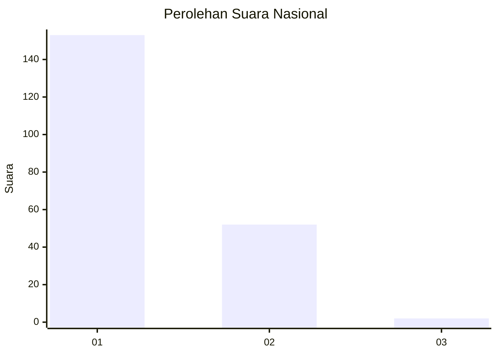
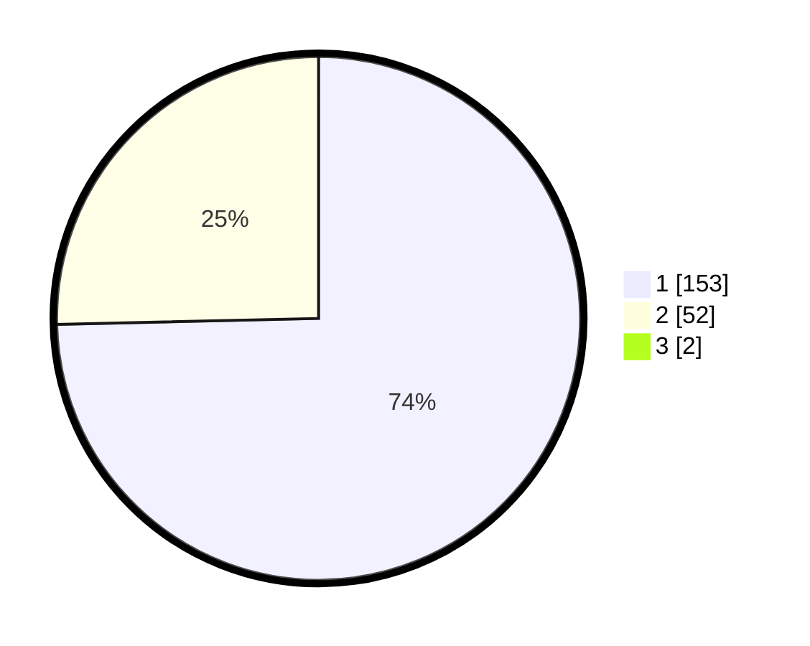

# Hasil

## Grafik

## Tabel

| No. | Nama Paslon    | Suara | Suara (raw) | Persentase |
|:--- |:-------------- | -----:| -----------:| ----------:|
| 1   | ANIES MUHAIMIN | 153   | [153][p-1]  | 73,91      |
| 2   | PRABOWO GIBRAN | 52    | [52][p-2]   | 25,12      |
| 3   | GANJAR MAHFUD  | 2     | [2][p-3]    | 0,97       |

[p-1]: https://github.com/gigit-pemilu/pemilu-2024/blob/main/pilpres/hitung-suara/sub/14-riau/sub/01-kampar/sub/01-bangkinang-kota/sub/1011-bangkinang/sub/004-tps/sub/paslon-1.txt
[p-2]: https://github.com/gigit-pemilu/pemilu-2024/blob/main/pilpres/hitung-suara/sub/14-riau/sub/01-kampar/sub/01-bangkinang-kota/sub/1011-bangkinang/sub/004-tps/sub/paslon-2.txt
[p-3]: https://github.com/gigit-pemilu/pemilu-2024/blob/main/pilpres/hitung-suara/sub/14-riau/sub/01-kampar/sub/01-bangkinang-kota/sub/1011-bangkinang/sub/004-tps/sub/paslon-3.txt

## Foto C Plano

https://sirekap-obj-formc.kpu.go.id/5727/pemilu/ppwp/14/01/01/10/11/1401011011004-20240216-150511--45e36679-5ec4-4bc6-9183-8b407433b39f.jpg

https://sirekap-obj-formc.kpu.go.id/5727/pemilu/ppwp/14/01/01/10/11/1401011011004-20240216-150513--33005101-ad89-4b07-98dc-a4f68e828871.jpg

https://sirekap-obj-formc.kpu.go.id/5727/pemilu/ppwp/14/01/01/10/11/1401011011004-20240216-150512--7f0c6b06-aa81-4825-83ee-d3ce7f5bff9a.jpg

## Metadata

| Key        | Value               |
| ---------- | ------------------- |
| Time Stamp | 2024-02-16 16:25:10 |

## DATA PEMILIH TETAP

Jumlah pemilih dalam DPT: **265**.
 * L: **135**.
 * P: **130**.

## DATA PENGGUNA HAK PILIH

Jumlah pengguna hak pilih dalam DPT: **201**.
 * L: **99**.
 * P: **102**.

Jumlah pengguna hak pilih dalam DPTb: **3**.
 * L: **2**.
 * P: **1**.

Jumlah pengguna hak pilih dalam DPK: **3**.
 * L: **2**.
 * P: **1**.

Jumlah pengguna hak pilih: **207**.
 * L: **103**.
 * P: **104**.

## JUMLAH SUARA SAH DAN TIDAK SAH

JUMLAH SELURUH SUARA SAH: **207**.

JUMLAH SUARA TIDAK SAH: **0**.

JUMLAH SELURUH SUARA SAH DAN SUARA TIDAK SAH: **207**.

