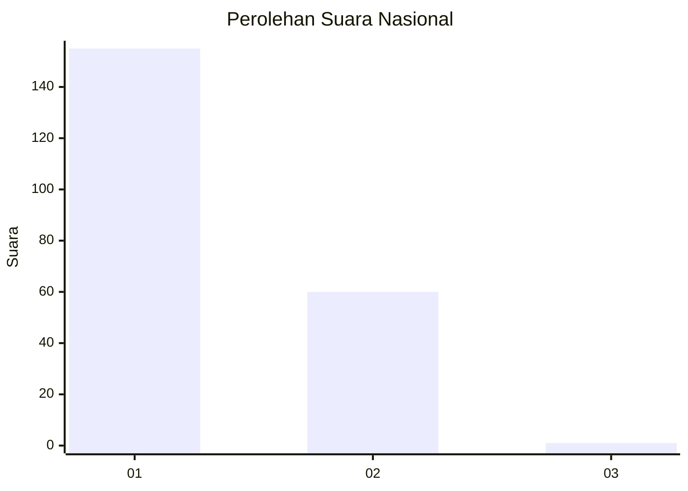
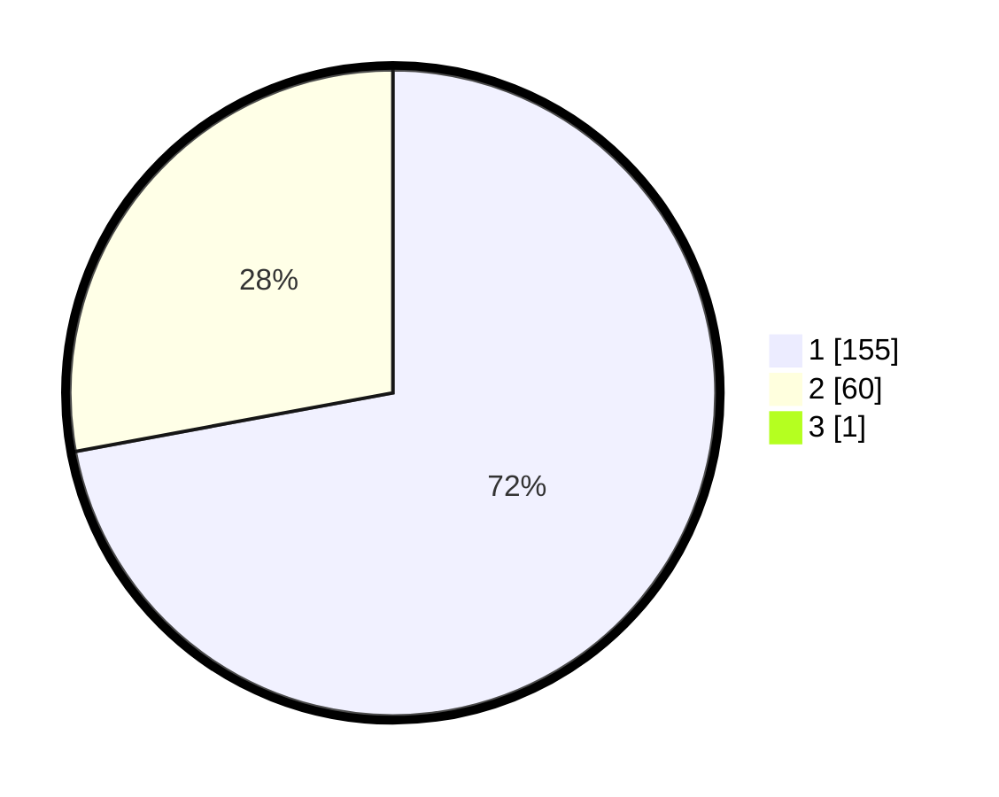

# Hasil

## Grafik

## Tabel

| No. | Nama Paslon    | Suara | Suara (raw) | Persentase |
|:--- |:-------------- | -----:| -----------:| ----------:|
| 1   | ANIES MUHAIMIN | 155   | [155][p-1]  | 71,76      |
| 2   | PRABOWO GIBRAN | 60    | [60][p-2]   | 27,78      |
| 3   | GANJAR MAHFUD  | 1     | [1][p-3]    | 0,46       |

[p-1]: https://github.com/gigit-pemilu/pemilu-2024/blob/main/pilpres/hitung-suara/sub/14-riau/sub/01-kampar/sub/01-bangkinang-kota/sub/1011-bangkinang/sub/011-tps/sub/paslon-1.txt
[p-2]: https://github.com/gigit-pemilu/pemilu-2024/blob/main/pilpres/hitung-suara/sub/14-riau/sub/01-kampar/sub/01-bangkinang-kota/sub/1011-bangkinang/sub/011-tps/sub/paslon-2.txt
[p-3]: https://github.com/gigit-pemilu/pemilu-2024/blob/main/pilpres/hitung-suara/sub/14-riau/sub/01-kampar/sub/01-bangkinang-kota/sub/1011-bangkinang/sub/011-tps/sub/paslon-3.txt

## Foto C Plano

https://sirekap-obj-formc.kpu.go.id/16f2/pemilu/ppwp/14/01/01/10/11/1401011011011-20240215-070317--fb34a376-1ab7-407b-bd6d-4ec823ecc164.jpg

https://sirekap-obj-formc.kpu.go.id/16f2/pemilu/ppwp/14/01/01/10/11/1401011011011-20240215-063544--ffad9817-c03c-4f6b-aaea-e0c08b2cfcc2.jpg

https://sirekap-obj-formc.kpu.go.id/16f2/pemilu/ppwp/14/01/01/10/11/1401011011011-20240215-103747--69786fe0-3bd7-4dd4-86a5-64370dad25b9.jpg

## Metadata

| Key        | Value               |
| ---------- | ------------------- |
| Time Stamp | 2024-02-15 20:00:44 |

