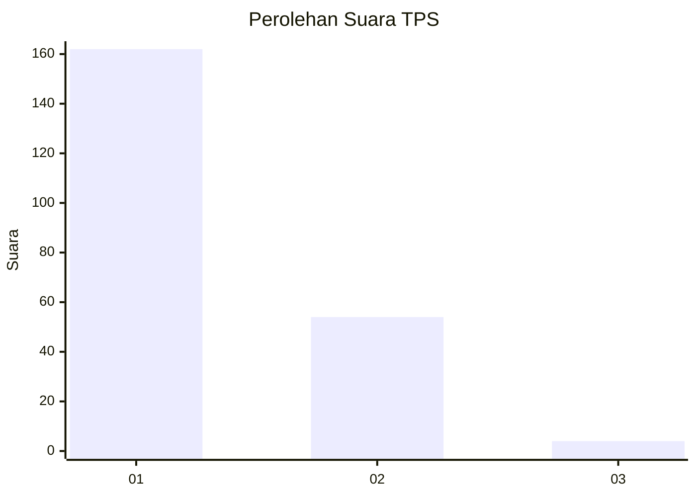
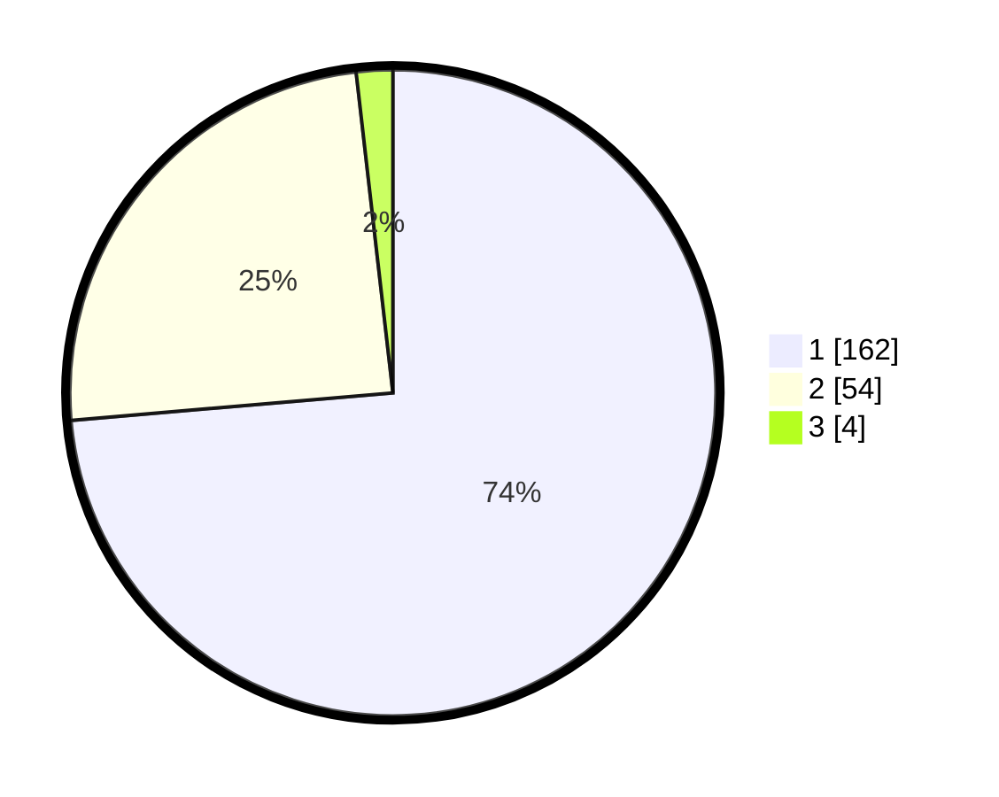

# Hasil

## Grafik

## Tabel

| No. | Nama Paslon    | Suara | Suara (raw) | Persentase |
|:--- |:-------------- | -----:| -----------:| ----------:|
| 1   | ANIES MUHAIMIN | 162   | [162][p-1]  | 73,64      |
| 2   | PRABOWO GIBRAN | 54    | [54][p-2]   | 24,55      |
| 3   | GANJAR MAHFUD  | 4     | [4][p-3]    | 1,82       |

[p-1]: https://github.com/gigit-pemilu/pemilu-2024-14-riau/blob/main/pilpres/hitung-suara/sub/14-riau/sub/01-kampar/sub/01-bangkinang-kota/sub/1011-bangkinang/sub/034-tps/sub/paslon-1.txt
[p-2]: https://github.com/gigit-pemilu/pemilu-2024-14-riau/blob/main/pilpres/hitung-suara/sub/14-riau/sub/01-kampar/sub/01-bangkinang-kota/sub/1011-bangkinang/sub/034-tps/sub/paslon-2.txt
[p-3]: https://github.com/gigit-pemilu/pemilu-2024-14-riau/blob/main/pilpres/hitung-suara/sub/14-riau/sub/01-kampar/sub/01-bangkinang-kota/sub/1011-bangkinang/sub/034-tps/sub/paslon-3.txt

## Foto C Plano

https://sirekap-obj-formc.kpu.go.id/3afe/pemilu/ppwp/14/01/01/10/11/1401011011034-20240214-194938--21f6e3c4-2cbd-4bb4-8077-2485313b10d5.jpg

https://sirekap-obj-formc.kpu.go.id/3afe/pemilu/ppwp/14/01/01/10/11/1401011011034-20240214-195031--98228edc-7d4f-4180-a0b3-56b91d4f3bd7.jpg

https://sirekap-obj-formc.kpu.go.id/3afe/pemilu/ppwp/14/01/01/10/11/1401011011034-20240214-195126--1fbe1a7b-ce6c-4a89-bcc6-d1aa0881d9a7.jpg

## Metadata

| Key        | Value               |
| ---------- | ------------------- |
| Time Stamp | 2024-02-14 21:46:01 |

