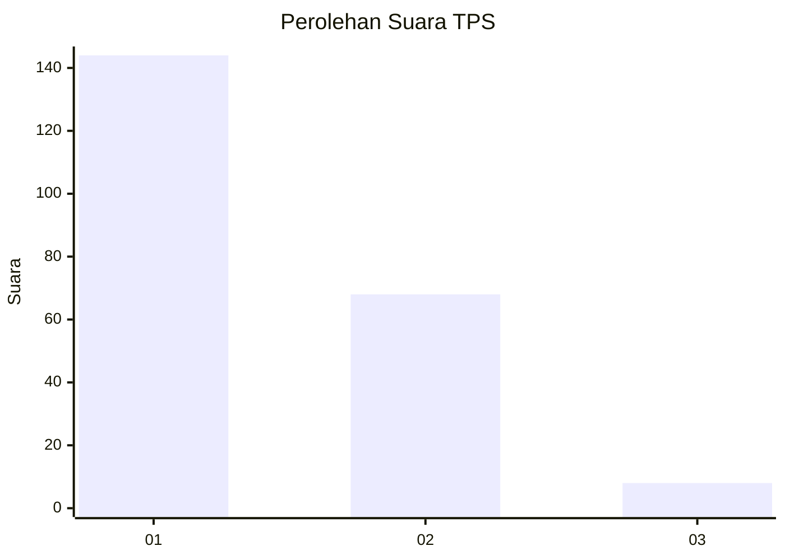
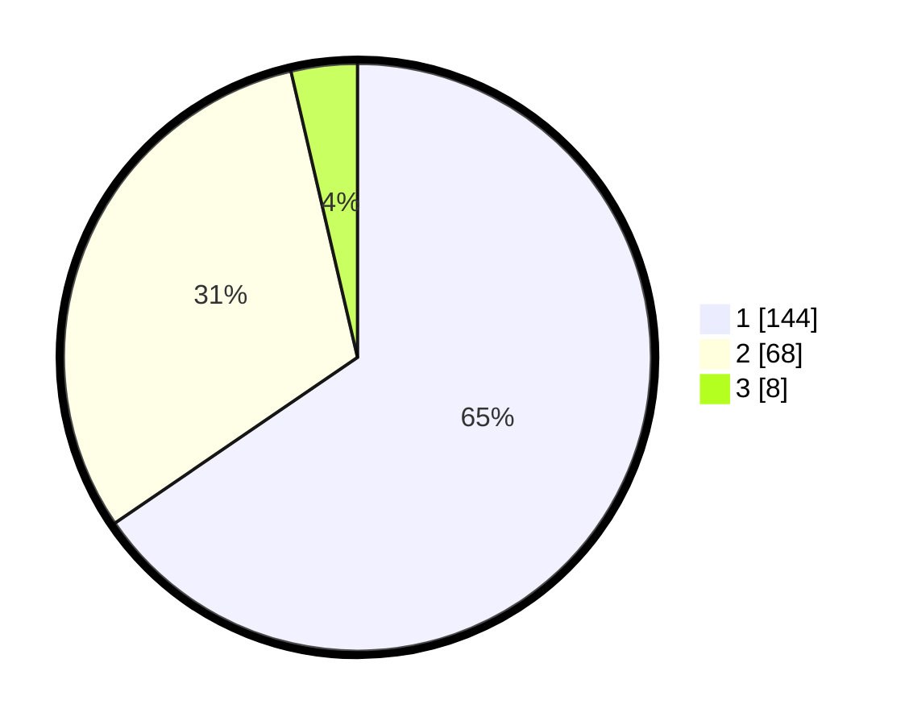

# Hasil

## Grafik

## Tabel

| No. | Nama Paslon    | Suara | Suara (raw) | Persentase |
|:--- |:-------------- | -----:| -----------:| ----------:|
| 1   | ANIES MUHAIMIN | 144   | [144][p-1]  | 65,45      |
| 2   | PRABOWO GIBRAN | 68    | [68][p-2]   | 30,91      |
| 3   | GANJAR MAHFUD  | 8     | [8][p-3]    | 3,64       |

[p-1]: https://github.com/gigit-pemilu/pemilu-2024-14-riau/blob/main/pilpres/hitung-suara/sub/14-riau/sub/01-kampar/sub/01-bangkinang-kota/sub/1013-langgini/sub/037-tps/sub/paslon-1.txt
[p-2]: https://github.com/gigit-pemilu/pemilu-2024-14-riau/blob/main/pilpres/hitung-suara/sub/14-riau/sub/01-kampar/sub/01-bangkinang-kota/sub/1013-langgini/sub/037-tps/sub/paslon-2.txt
[p-3]: https://github.com/gigit-pemilu/pemilu-2024-14-riau/blob/main/pilpres/hitung-suara/sub/14-riau/sub/01-kampar/sub/01-bangkinang-kota/sub/1013-langgini/sub/037-tps/sub/paslon-3.txt

## Foto C Plano

https://sirekap-obj-formc.kpu.go.id/39b8/pemilu/ppwp/14/01/01/10/13/1401011013037-20240214-222900--ecd4afe6-944c-41c5-bea2-96a83950e5a8.jpg

https://sirekap-obj-formc.kpu.go.id/39b8/pemilu/ppwp/14/01/01/10/13/1401011013037-20240214-222913--e03b78b4-58cd-46b4-a1c5-a13a0e3595f4.jpg

https://sirekap-obj-formc.kpu.go.id/39b8/pemilu/ppwp/14/01/01/10/13/1401011013037-20240214-222937--17e3c931-db28-462e-b327-81585fc283ab.jpg

## Metadata

| Key        | Value               |
| ---------- | ------------------- |
| Time Stamp | 2024-02-15 17:00:25 |

