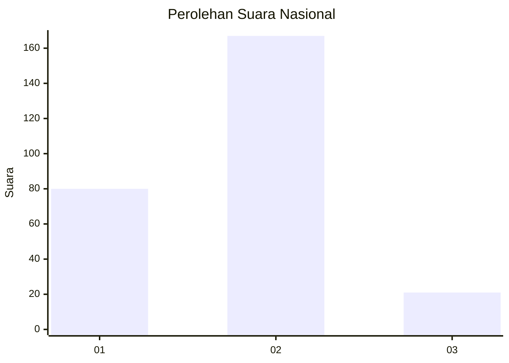
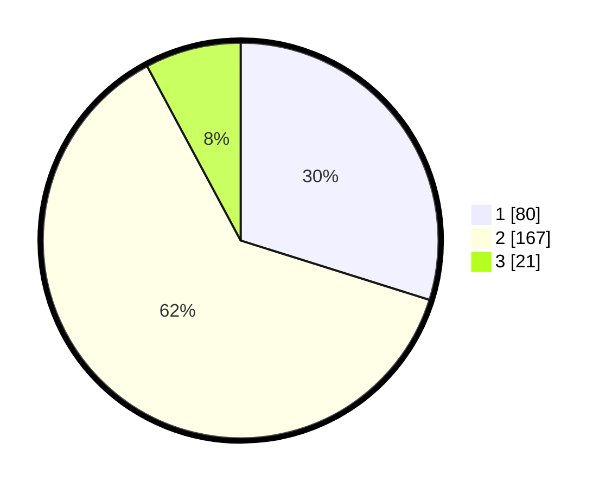

# Hasil

## Grafik

## Tabel

| No. | Nama Paslon    | Suara | Suara (raw) | Persentase |
|:--- |:-------------- | -----:| -----------:| ----------:|
| 1   | ANIES MUHAIMIN | 80    | [80][p-1]   | 29,85      |
| 2   | PRABOWO GIBRAN | 167   | [167][p-2]  | 62,31      |
| 3   | GANJAR MAHFUD  | 21    | [21][p-3]   | 7,84       |

[p-1]: https://github.com/gigit-pemilu/pemilu-2024/blob/main/pilpres/hitung-suara/sub/14-riau/sub/01-kampar/sub/01-bangkinang-kota/sub/1013-langgini/sub/906-tps/sub/paslon-1.txt
[p-2]: https://github.com/gigit-pemilu/pemilu-2024/blob/main/pilpres/hitung-suara/sub/14-riau/sub/01-kampar/sub/01-bangkinang-kota/sub/1013-langgini/sub/906-tps/sub/paslon-2.txt
[p-3]: https://github.com/gigit-pemilu/pemilu-2024/blob/main/pilpres/hitung-suara/sub/14-riau/sub/01-kampar/sub/01-bangkinang-kota/sub/1013-langgini/sub/906-tps/sub/paslon-3.txt

## Foto C Plano

https://sirekap-obj-formc.kpu.go.id/555f/pemilu/ppwp/14/01/01/10/13/1401011013906-20240214-210442--2603b94b-4828-4691-a470-b3fb65a28259.jpg

https://sirekap-obj-formc.kpu.go.id/555f/pemilu/ppwp/14/01/01/10/13/1401011013906-20240214-212349--53620e73-487c-41b7-a183-d75bfddb9d70.jpg

https://sirekap-obj-formc.kpu.go.id/555f/pemilu/ppwp/14/01/01/10/13/1401011013906-20240214-212633--9c4b1fc7-a0dc-4aa5-ba51-283cb08038b4.jpg

## Metadata

| Key        | Value               |
| ---------- | ------------------- |
| Time Stamp | 2024-02-15 12:00:28 |

