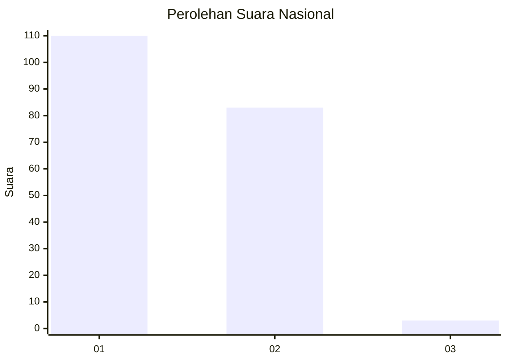
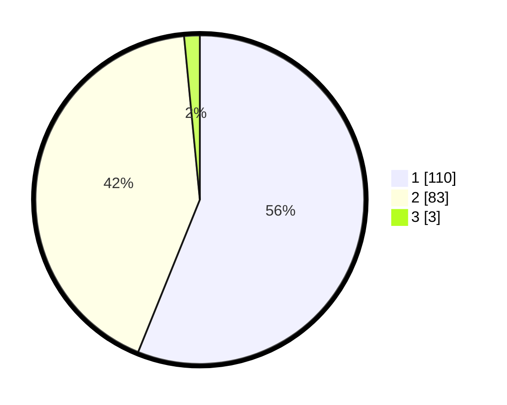

# Hasil

## Grafik

## Tabel

| No. | Nama Paslon    | Suara | Suara (raw) | Persentase |
|:--- |:-------------- | -----:| -----------:| ----------:|
| 1   | ANIES MUHAIMIN | 110   | [110][p-1]  | 56,12      |
| 2   | PRABOWO GIBRAN | 83    | [83][p-2]   | 42,35      |
| 3   | GANJAR MAHFUD  | 3     | [3][p-3]    | 1,53       |

[p-1]: https://github.com/gigit-pemilu/pemilu-2024/blob/main/pilpres/hitung-suara/sub/14-riau/sub/01-kampar/sub/03-tambang/sub/2001-tambang/sub/004-tps/sub/paslon-1.txt
[p-2]: https://github.com/gigit-pemilu/pemilu-2024/blob/main/pilpres/hitung-suara/sub/14-riau/sub/01-kampar/sub/03-tambang/sub/2001-tambang/sub/004-tps/sub/paslon-2.txt
[p-3]: https://github.com/gigit-pemilu/pemilu-2024/blob/main/pilpres/hitung-suara/sub/14-riau/sub/01-kampar/sub/03-tambang/sub/2001-tambang/sub/004-tps/sub/paslon-3.txt

## Foto C Plano

https://sirekap-obj-formc.kpu.go.id/0e03/pemilu/ppwp/14/01/03/20/01/1401032001004-20240215-100526--987c973b-6005-43c0-b93d-c95cb9bfe215.jpg

https://sirekap-obj-formc.kpu.go.id/0e03/pemilu/ppwp/14/01/03/20/01/1401032001004-20240215-100646--c0b38370-b276-4eef-bebd-9364cfa698ca.jpg

https://sirekap-obj-formc.kpu.go.id/0e03/pemilu/ppwp/14/01/03/20/01/1401032001004-20240215-101032--a24cb80e-f953-498f-81a3-5d861f8478d7.jpg

## Metadata

| Key        | Value               |
| ---------- | ------------------- |
| Time Stamp | 2024-02-24 22:31:28 |

