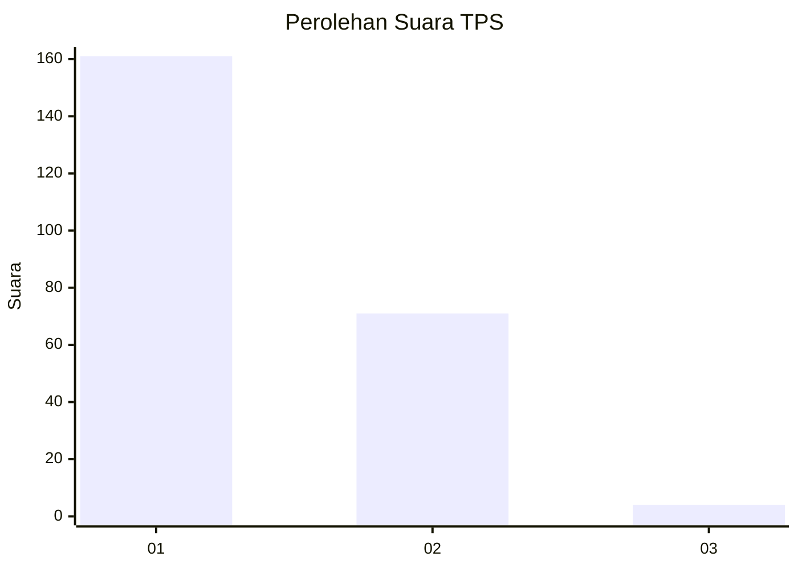
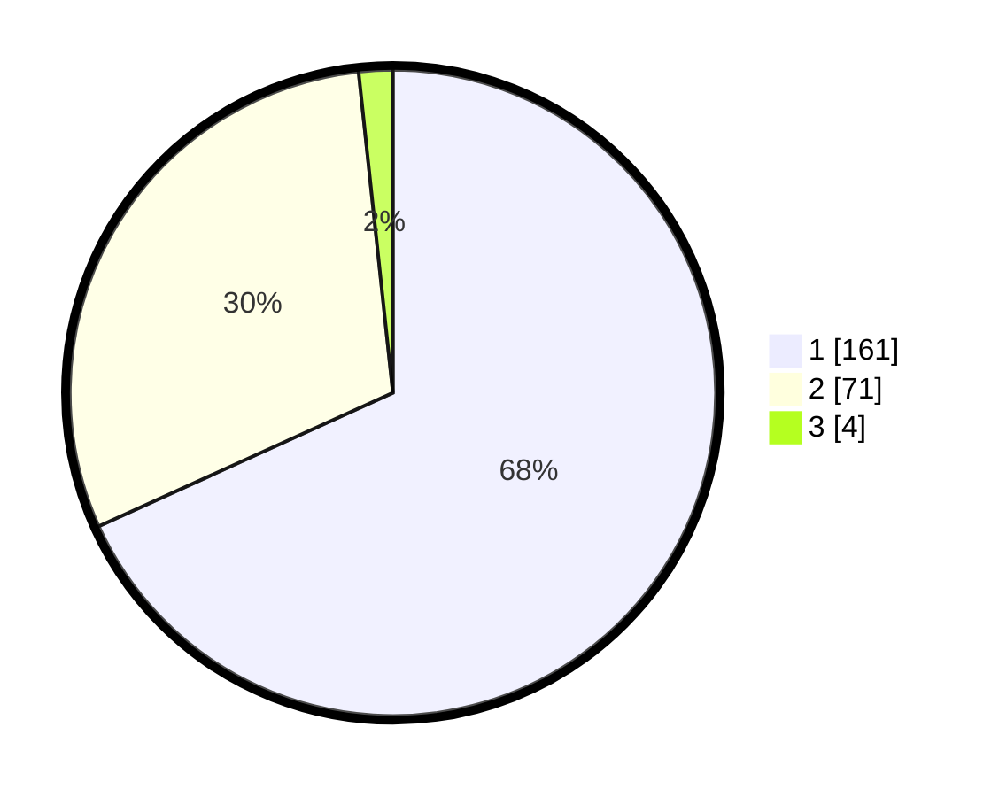

# Hasil

## Grafik

## Tabel

| No. | Nama Paslon    | Suara | Suara (raw) | Persentase |
|:--- |:-------------- | -----:| -----------:| ----------:|
| 1   | ANIES MUHAIMIN | 161   | [161][p-1]  | 68,22      |
| 2   | PRABOWO GIBRAN | 71    | [71][p-2]   | 30,08      |
| 3   | GANJAR MAHFUD  | 4     | [4][p-3]    | 1,69       |

[p-1]: https://github.com/gigit-pemilu/pemilu-2024-14-riau/blob/main/pilpres/hitung-suara/sub/14-riau/sub/01-kampar/sub/03-tambang/sub/2001-tambang/sub/007-tps/sub/paslon-1.txt
[p-2]: https://github.com/gigit-pemilu/pemilu-2024-14-riau/blob/main/pilpres/hitung-suara/sub/14-riau/sub/01-kampar/sub/03-tambang/sub/2001-tambang/sub/007-tps/sub/paslon-2.txt
[p-3]: https://github.com/gigit-pemilu/pemilu-2024-14-riau/blob/main/pilpres/hitung-suara/sub/14-riau/sub/01-kampar/sub/03-tambang/sub/2001-tambang/sub/007-tps/sub/paslon-3.txt

## Foto C Plano

https://sirekap-obj-formc.kpu.go.id/59ae/pemilu/ppwp/14/01/03/20/01/1401032001007-20240215-012437--0f303142-091a-4517-b40a-9e5c9f279636.jpg

https://sirekap-obj-formc.kpu.go.id/59ae/pemilu/ppwp/14/01/03/20/01/1401032001007-20240215-012841--c7fd44d2-a1d4-4a75-9d7b-955eba55e84b.jpg

https://sirekap-obj-formc.kpu.go.id/59ae/pemilu/ppwp/14/01/03/20/01/1401032001007-20240215-014516--4722e7ae-49cf-4edc-add2-31706c968ed5.jpg

## Metadata

| Key        | Value               |
| ---------- | ------------------- |
| Time Stamp | 2024-02-25 15:00:00 |

