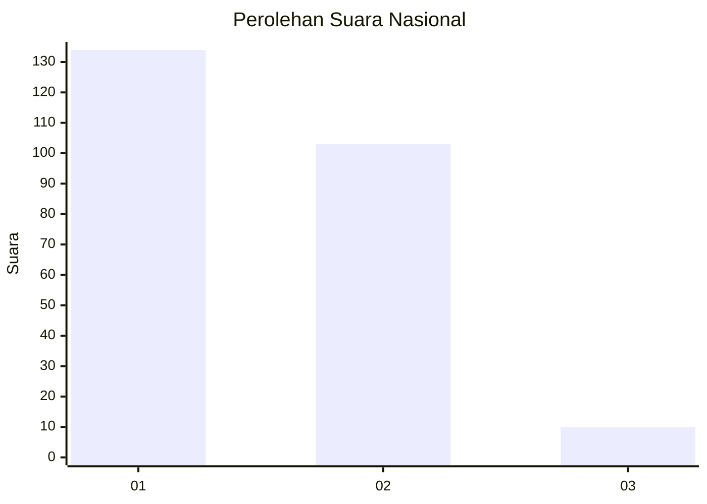
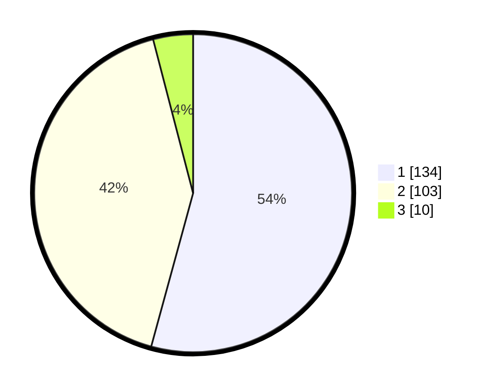

# Hasil

## Grafik

## Tabel

| No. | Nama Paslon    | Suara | Suara (raw) | Persentase |
|:--- |:-------------- | -----:| -----------:| ----------:|
| 1   | ANIES MUHAIMIN | 134   | [134][p-1]  | 54,25      |
| 2   | PRABOWO GIBRAN | 103   | [103][p-2]  | 41,70      |
| 3   | GANJAR MAHFUD  | 10    | [10][p-3]   | 4,05       |

[p-1]: https://github.com/gigit-pemilu/pemilu-2024/blob/main/pilpres/hitung-suara/sub/14-riau/sub/01-kampar/sub/03-tambang/sub/2002-kuapan/sub/005-tps/sub/paslon-1.txt
[p-2]: https://github.com/gigit-pemilu/pemilu-2024/blob/main/pilpres/hitung-suara/sub/14-riau/sub/01-kampar/sub/03-tambang/sub/2002-kuapan/sub/005-tps/sub/paslon-2.txt
[p-3]: https://github.com/gigit-pemilu/pemilu-2024/blob/main/pilpres/hitung-suara/sub/14-riau/sub/01-kampar/sub/03-tambang/sub/2002-kuapan/sub/005-tps/sub/paslon-3.txt

## Foto C Plano

https://sirekap-obj-formc.kpu.go.id/e9f7/pemilu/ppwp/14/01/03/20/02/1401032002005-20240214-212343--4f6a474b-ac28-4c61-b8de-450411a8eaea.jpg

https://sirekap-obj-formc.kpu.go.id/e9f7/pemilu/ppwp/14/01/03/20/02/1401032002005-20240214-213255--3efacb2b-cbc6-4c34-82b5-838b116d9779.jpg

https://sirekap-obj-formc.kpu.go.id/e9f7/pemilu/ppwp/14/01/03/20/02/1401032002005-20240214-213432--64169bab-90c1-408b-8d14-8bafe4f55a1a.jpg

## Metadata

| Key        | Value               |
| ---------- | ------------------- |
| Time Stamp | 2024-02-25 10:00:00 |

