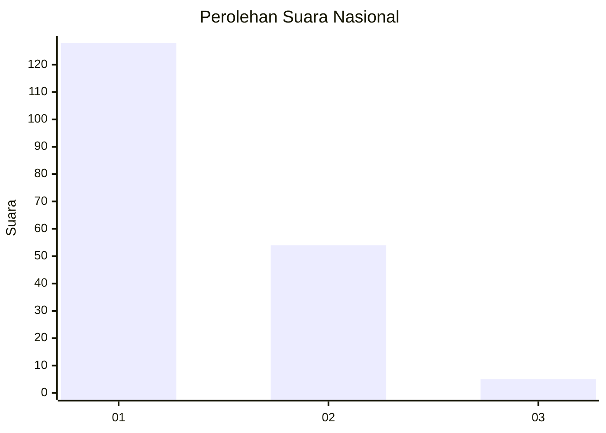
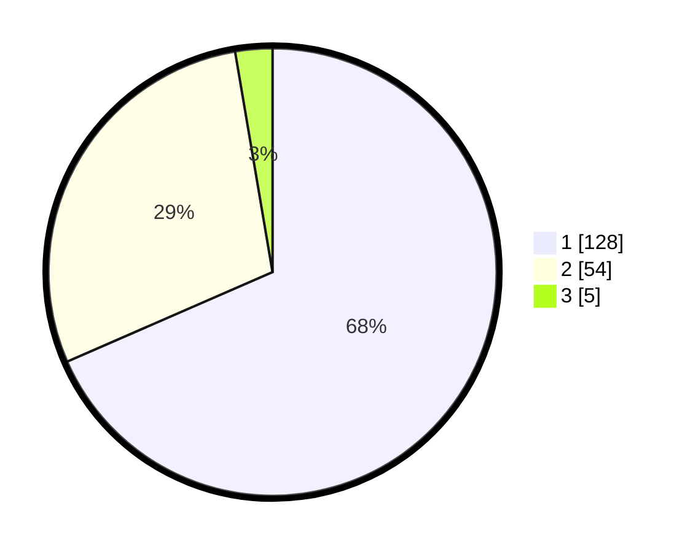

# Hasil

## Grafik

## Tabel

| No. | Nama Paslon    | Suara | Suara (raw) | Persentase |
|:--- |:-------------- | -----:| -----------:| ----------:|
| 1   | ANIES MUHAIMIN | 128   | [128][p-1]  | 68,45      |
| 2   | PRABOWO GIBRAN | 54    | [54][p-2]   | 28,88      |
| 3   | GANJAR MAHFUD  | 5     | [5][p-3]    | 2,67       |

[p-1]: https://github.com/gigit-pemilu/pemilu-2024/blob/main/pilpres/hitung-suara/sub/14-riau/sub/01-kampar/sub/03-tambang/sub/2003-gobah/sub/001-tps/sub/paslon-1.txt
[p-2]: https://github.com/gigit-pemilu/pemilu-2024/blob/main/pilpres/hitung-suara/sub/14-riau/sub/01-kampar/sub/03-tambang/sub/2003-gobah/sub/001-tps/sub/paslon-2.txt
[p-3]: https://github.com/gigit-pemilu/pemilu-2024/blob/main/pilpres/hitung-suara/sub/14-riau/sub/01-kampar/sub/03-tambang/sub/2003-gobah/sub/001-tps/sub/paslon-3.txt

## Foto C Plano

https://sirekap-obj-formc.kpu.go.id/c2f3/pemilu/ppwp/14/01/03/20/03/1401032003001-20240214-205320--232ddaba-9117-49a6-b8b3-d409803dc2fa.jpg

https://sirekap-obj-formc.kpu.go.id/c2f3/pemilu/ppwp/14/01/03/20/03/1401032003001-20240214-205832--e63ae1c8-be18-414e-8a89-a98441b4876a.jpg

https://sirekap-obj-formc.kpu.go.id/c2f3/pemilu/ppwp/14/01/03/20/03/1401032003001-20240215-090708--e90ec630-93a8-4d3d-98f1-1138be296961.jpg

## Metadata

| Key        | Value               |
| ---------- | ------------------- |
| Time Stamp | 2024-02-25 22:00:00 |

