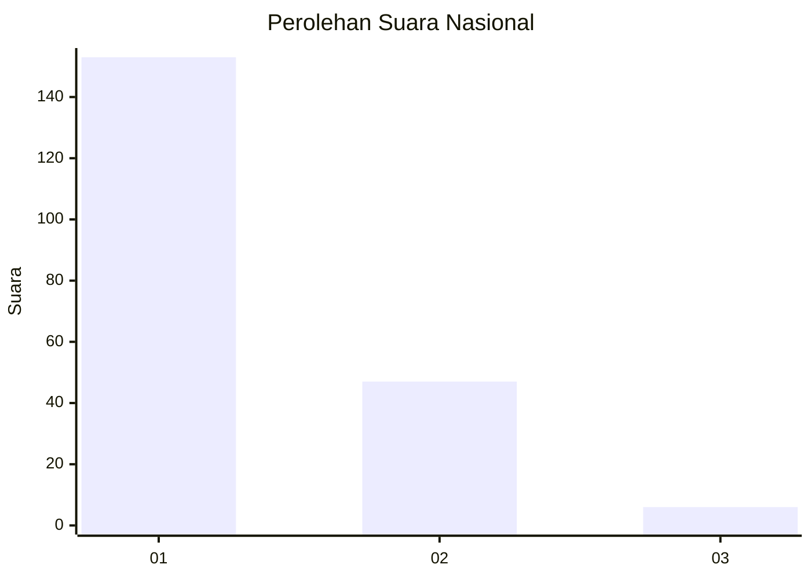
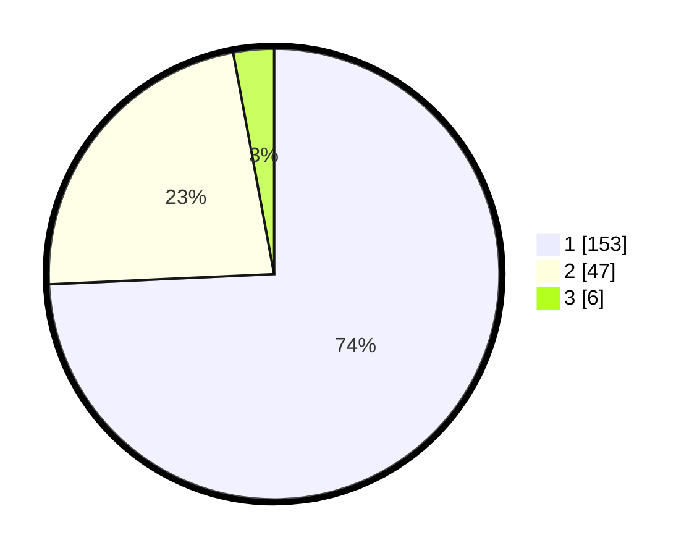

# Hasil

## Grafik

## Tabel

| No. | Nama Paslon    | Suara | Suara (raw) | Persentase |
|:--- |:-------------- | -----:| -----------:| ----------:|
| 1   | ANIES MUHAIMIN | 153   | [153][p-1]  | 74,27      |
| 2   | PRABOWO GIBRAN | 47    | [47][p-2]   | 22,82      |
| 3   | GANJAR MAHFUD  | 6     | [6][p-3]    | 2,91       |

[p-1]: https://github.com/gigit-pemilu/pemilu-2024/blob/main/pilpres/hitung-suara/sub/14-riau/sub/01-kampar/sub/03-tambang/sub/2003-gobah/sub/002-tps/sub/paslon-1.txt
[p-2]: https://github.com/gigit-pemilu/pemilu-2024/blob/main/pilpres/hitung-suara/sub/14-riau/sub/01-kampar/sub/03-tambang/sub/2003-gobah/sub/002-tps/sub/paslon-2.txt
[p-3]: https://github.com/gigit-pemilu/pemilu-2024/blob/main/pilpres/hitung-suara/sub/14-riau/sub/01-kampar/sub/03-tambang/sub/2003-gobah/sub/002-tps/sub/paslon-3.txt

## Foto C Plano

https://sirekap-obj-formc.kpu.go.id/d91a/pemilu/ppwp/14/01/03/20/03/1401032003002-20240215-095900--515140fb-7165-4b73-9651-806370f83efe.jpg

https://sirekap-obj-formc.kpu.go.id/d91a/pemilu/ppwp/14/01/03/20/03/1401032003002-20240215-100215--4494c57e-2a74-4bab-bef1-289933a1d0f4.jpg

https://sirekap-obj-formc.kpu.go.id/d91a/pemilu/ppwp/14/01/03/20/03/1401032003002-20240215-100436--837866be-30ad-4878-aef9-99f6f1221a8b.jpg

## Metadata

| Key        | Value               |
| ---------- | ------------------- |
| Time Stamp | 2024-02-15 22:00:27 |

