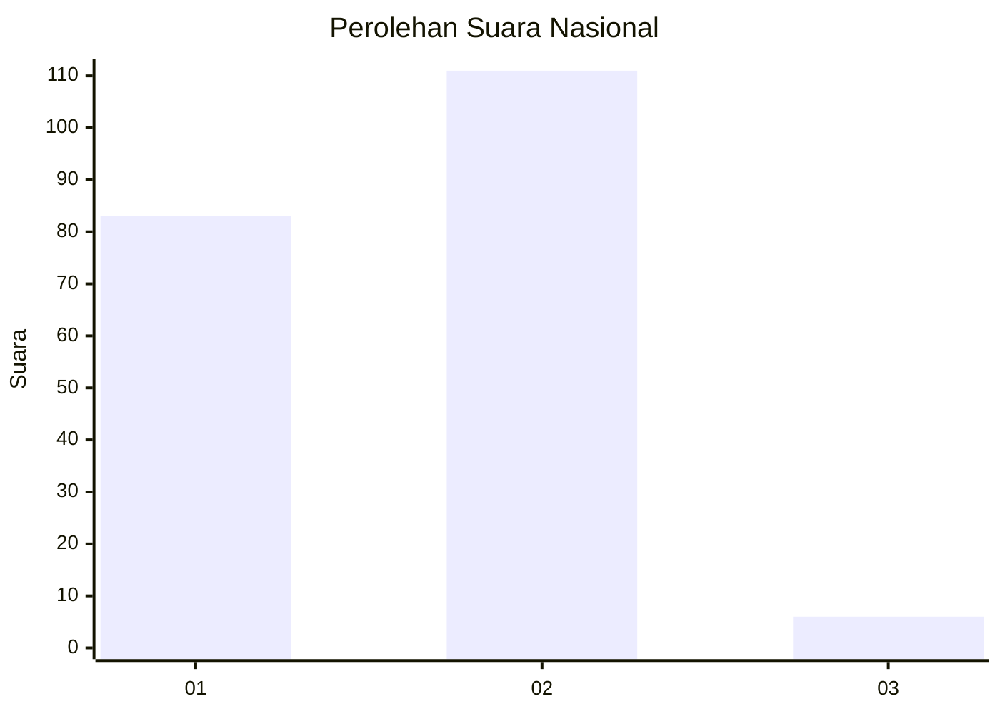
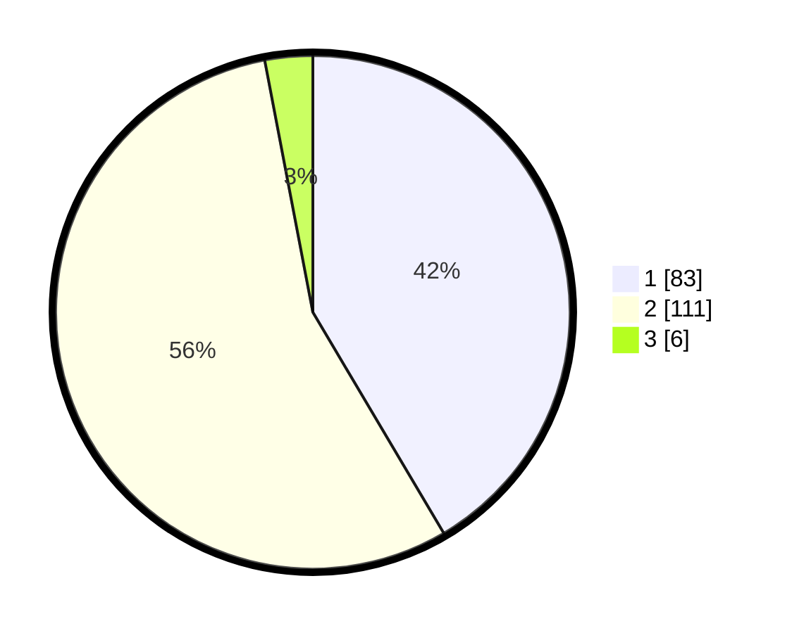

# Hasil

## Grafik

## Tabel

| No. | Nama Paslon    | Suara | Suara (raw) | Persentase |
|:--- |:-------------- | -----:| -----------:| ----------:|
| 1   | ANIES MUHAIMIN | 83    | [83][p-1]   | 41,50      |
| 2   | PRABOWO GIBRAN | 111   | [111][p-2]  | 55,50      |
| 3   | GANJAR MAHFUD  | 6     | [6][p-3]    | 3,00       |

[p-1]: https://github.com/gigit-pemilu/pemilu-2024/blob/main/pilpres/hitung-suara/sub/14-riau/sub/01-kampar/sub/03-tambang/sub/2004-teluk-kenidai/sub/003-tps/sub/paslon-1.txt
[p-2]: https://github.com/gigit-pemilu/pemilu-2024/blob/main/pilpres/hitung-suara/sub/14-riau/sub/01-kampar/sub/03-tambang/sub/2004-teluk-kenidai/sub/003-tps/sub/paslon-2.txt
[p-3]: https://github.com/gigit-pemilu/pemilu-2024/blob/main/pilpres/hitung-suara/sub/14-riau/sub/01-kampar/sub/03-tambang/sub/2004-teluk-kenidai/sub/003-tps/sub/paslon-3.txt

## Foto C Plano

https://sirekap-obj-formc.kpu.go.id/c5ec/pemilu/ppwp/14/01/03/20/04/1401032004003-20240214-155825--e138a3ab-b1ba-470c-a830-18f994889978.jpg

https://sirekap-obj-formc.kpu.go.id/c5ec/pemilu/ppwp/14/01/03/20/04/1401032004003-20240214-155853--962089d6-8db3-49c6-add6-b1458061ef15.jpg

https://sirekap-obj-formc.kpu.go.id/c5ec/pemilu/ppwp/14/01/03/20/04/1401032004003-20240214-160100--0f91bffc-f581-40d6-869f-a792ca197d56.jpg

## Metadata

| Key        | Value               |
| ---------- | ------------------- |
| Time Stamp | 2024-02-15 12:00:28 |

