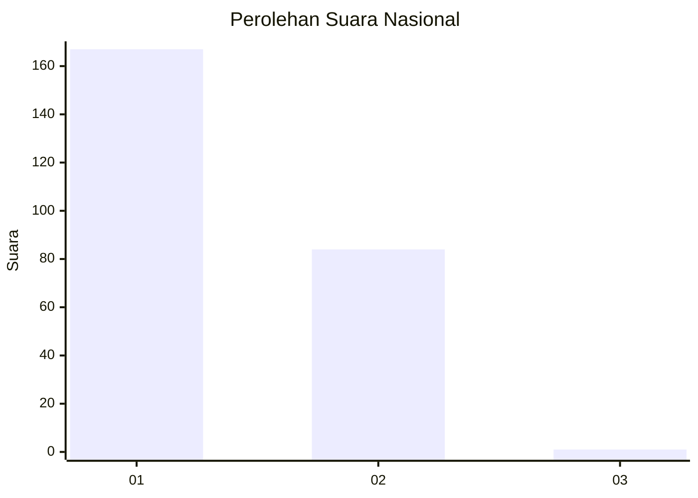
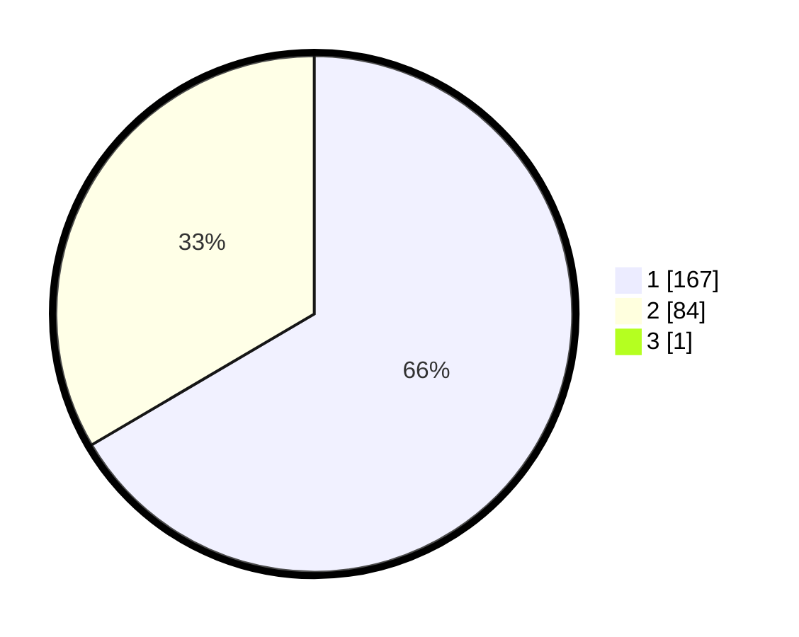

# Hasil

## Grafik

## Tabel

| No. | Nama Paslon    | Suara | Suara (raw) | Persentase |
|:--- |:-------------- | -----:| -----------:| ----------:|
| 1   | ANIES MUHAIMIN | 167   | [167][p-1]  | 66,27      |
| 2   | PRABOWO GIBRAN | 84    | [84][p-2]   | 33,33      |
| 3   | GANJAR MAHFUD  | 1     | [1][p-3]    | 0,40       |

[p-1]: https://github.com/gigit-pemilu/pemilu-2024/blob/main/pilpres/hitung-suara/sub/14-riau/sub/01-kampar/sub/03-tambang/sub/2005-aursati/sub/001-tps/sub/paslon-1.txt
[p-2]: https://github.com/gigit-pemilu/pemilu-2024/blob/main/pilpres/hitung-suara/sub/14-riau/sub/01-kampar/sub/03-tambang/sub/2005-aursati/sub/001-tps/sub/paslon-2.txt
[p-3]: https://github.com/gigit-pemilu/pemilu-2024/blob/main/pilpres/hitung-suara/sub/14-riau/sub/01-kampar/sub/03-tambang/sub/2005-aursati/sub/001-tps/sub/paslon-3.txt

## Foto C Plano

https://sirekap-obj-formc.kpu.go.id/a0a9/pemilu/ppwp/14/01/03/20/05/1401032005001-20240217-114425--ba79beef-be6e-49df-a9ea-e35a1361e72b.jpg

https://sirekap-obj-formc.kpu.go.id/a0a9/pemilu/ppwp/14/01/03/20/05/1401032005001-20240217-114935--be568c95-ee3a-4676-a0ba-f97960139261.jpg

https://sirekap-obj-formc.kpu.go.id/a0a9/pemilu/ppwp/14/01/03/20/05/1401032005001-20240217-115107--9526c3c5-aac4-4a7d-9497-d8eb286040f7.jpg

## Metadata

| Key        | Value               |
| ---------- | ------------------- |
| Time Stamp | 2024-02-25 14:00:00 |

