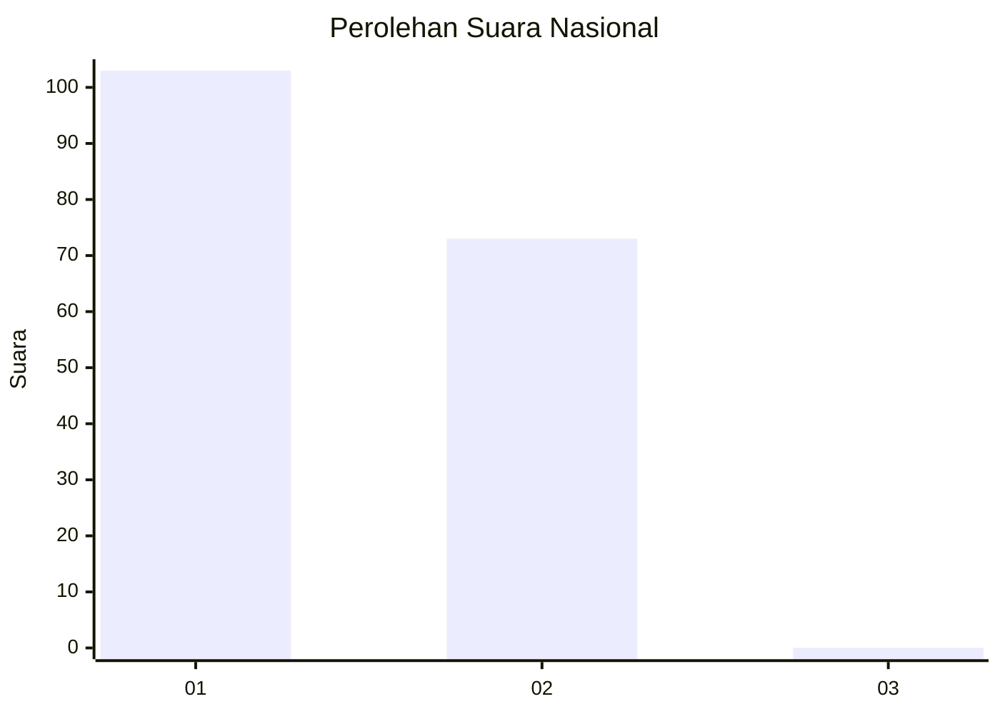
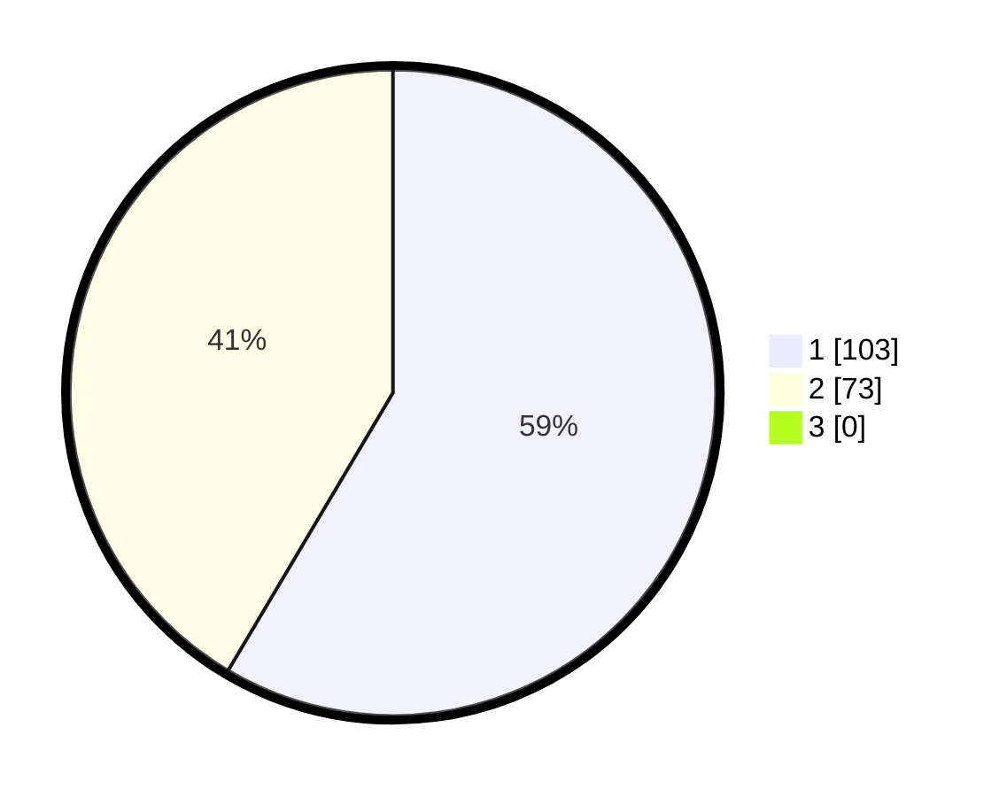

# Hasil

## Grafik

## Tabel

| No. | Nama Paslon    | Suara | Suara (raw) | Persentase |
|:--- |:-------------- | -----:| -----------:| ----------:|
| 1   | ANIES MUHAIMIN | 103   | [103][p-1]  | 58,52      |
| 2   | PRABOWO GIBRAN | 73    | [73][p-2]   | 41,48      |
| 3   | GANJAR MAHFUD  | 0     | [0][p-3]    | 0,00       |

[p-1]: https://github.com/gigit-pemilu/pemilu-2024/blob/main/pilpres/hitung-suara/sub/14-riau/sub/01-kampar/sub/03-tambang/sub/2005-aursati/sub/004-tps/sub/paslon-1.txt
[p-2]: https://github.com/gigit-pemilu/pemilu-2024/blob/main/pilpres/hitung-suara/sub/14-riau/sub/01-kampar/sub/03-tambang/sub/2005-aursati/sub/004-tps/sub/paslon-2.txt
[p-3]: https://github.com/gigit-pemilu/pemilu-2024/blob/main/pilpres/hitung-suara/sub/14-riau/sub/01-kampar/sub/03-tambang/sub/2005-aursati/sub/004-tps/sub/paslon-3.txt

## Foto C Plano

https://sirekap-obj-formc.kpu.go.id/0a75/pemilu/ppwp/14/01/03/20/05/1401032005004-20240217-121454--4b90fccf-3e8b-4088-9aa4-79e81d802519.jpg

https://sirekap-obj-formc.kpu.go.id/0a75/pemilu/ppwp/14/01/03/20/05/1401032005004-20240217-121611--e3cccc96-02cb-42a0-917d-650e4beb66d4.jpg

https://sirekap-obj-formc.kpu.go.id/0a75/pemilu/ppwp/14/01/03/20/05/1401032005004-20240217-121719--2d71f06a-9bdc-4dcb-a6dd-ae4072aad14e.jpg

## Metadata

| Key        | Value               |
| ---------- | ------------------- |
| Time Stamp | 2024-02-26 16:00:00 |

