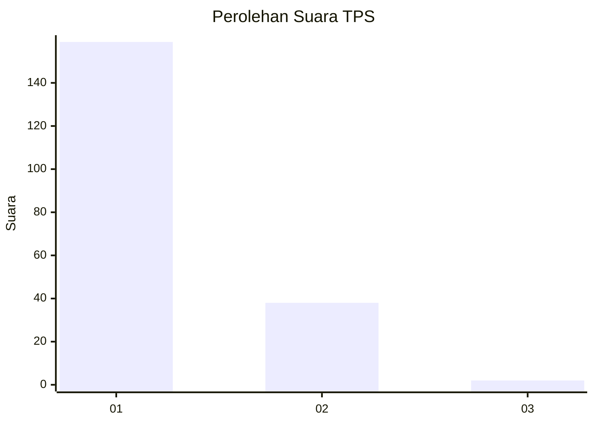
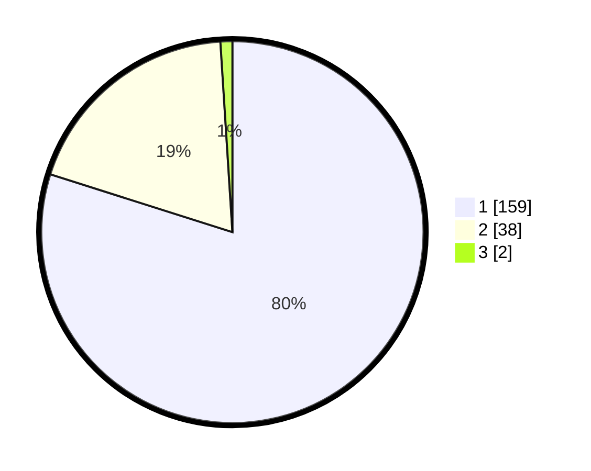

# Hasil

## Grafik

## Tabel

| No. | Nama Paslon    | Suara | Suara (raw) | Persentase |
|:--- |:-------------- | -----:| -----------:| ----------:|
| 1   | ANIES MUHAIMIN | 159   | [159][p-1]  | 79,90      |
| 2   | PRABOWO GIBRAN | 38    | [38][p-2]   | 19,10      |
| 3   | GANJAR MAHFUD  | 2     | [2][p-3]    | 1,01       |

[p-1]: https://github.com/gigit-pemilu/pemilu-2024-14-riau/blob/main/pilpres/hitung-suara/sub/14-riau/sub/01-kampar/sub/03-tambang/sub/2007-terantang/sub/002-tps/sub/paslon-1.txt
[p-2]: https://github.com/gigit-pemilu/pemilu-2024-14-riau/blob/main/pilpres/hitung-suara/sub/14-riau/sub/01-kampar/sub/03-tambang/sub/2007-terantang/sub/002-tps/sub/paslon-2.txt
[p-3]: https://github.com/gigit-pemilu/pemilu-2024-14-riau/blob/main/pilpres/hitung-suara/sub/14-riau/sub/01-kampar/sub/03-tambang/sub/2007-terantang/sub/002-tps/sub/paslon-3.txt

## Foto C Plano

https://sirekap-obj-formc.kpu.go.id/627e/pemilu/ppwp/14/01/03/20/07/1401032007002-20240214-231231--50b6ac77-78ab-48a8-8c5f-4a1b35f6e770.jpg

https://sirekap-obj-formc.kpu.go.id/627e/pemilu/ppwp/14/01/03/20/07/1401032007002-20240214-231325--285cac36-4ba3-4a0b-a2da-3bbab06d2d8f.jpg

https://sirekap-obj-formc.kpu.go.id/627e/pemilu/ppwp/14/01/03/20/07/1401032007002-20240214-231433--c520c9f6-cd0c-4634-ac8e-69675f54f004.jpg

## Metadata

| Key        | Value               |
| ---------- | ------------------- |
| Time Stamp | 2024-02-15 15:00:29 |

