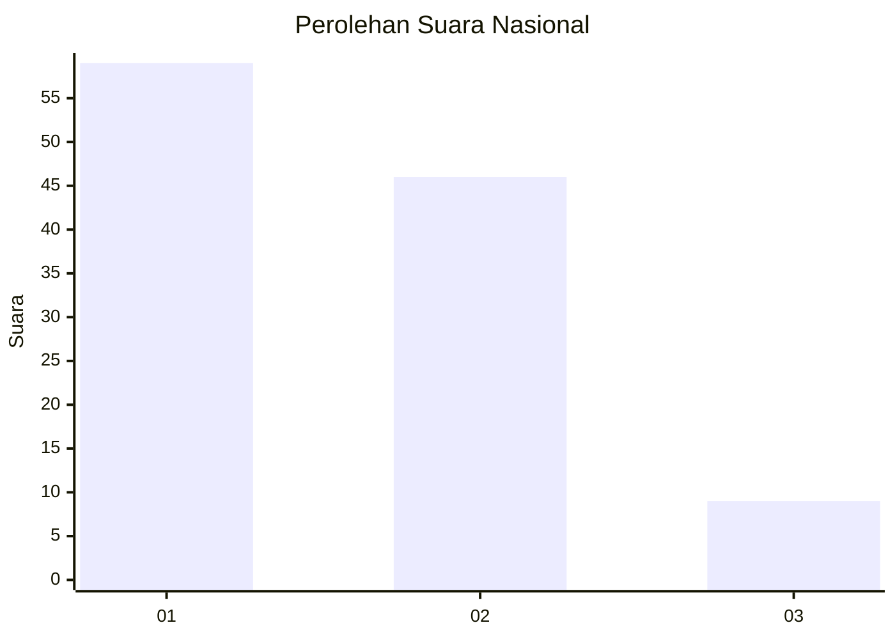
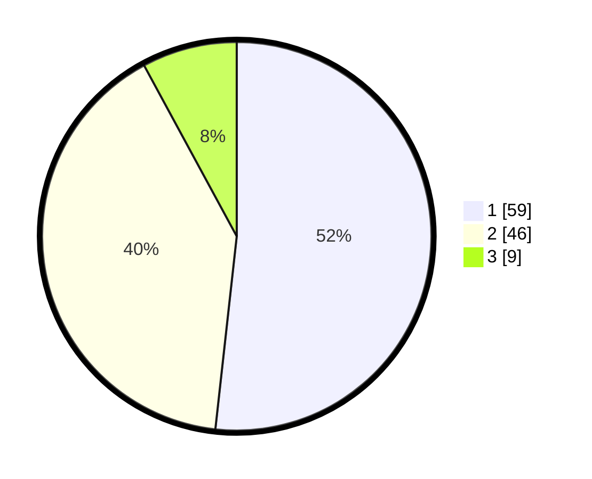

# Hasil

## Grafik

## Tabel

| No. | Nama Paslon    | Suara | Suara (raw) | Persentase |
|:--- |:-------------- | -----:| -----------:| ----------:|
| 1   | ANIES MUHAIMIN | 59    | [59][p-1]   | 51,75      |
| 2   | PRABOWO GIBRAN | 46    | [46][p-2]   | 40,35      |
| 3   | GANJAR MAHFUD  | 9     | [9][p-3]    | 7,89       |

[p-1]: https://github.com/gigit-pemilu/pemilu-2024/blob/main/pilpres/hitung-suara/sub/14-riau/sub/01-kampar/sub/03-tambang/sub/2008-kualu/sub/037-tps/sub/paslon-1.txt
[p-2]: https://github.com/gigit-pemilu/pemilu-2024/blob/main/pilpres/hitung-suara/sub/14-riau/sub/01-kampar/sub/03-tambang/sub/2008-kualu/sub/037-tps/sub/paslon-2.txt
[p-3]: https://github.com/gigit-pemilu/pemilu-2024/blob/main/pilpres/hitung-suara/sub/14-riau/sub/01-kampar/sub/03-tambang/sub/2008-kualu/sub/037-tps/sub/paslon-3.txt

## Foto C Plano

https://sirekap-obj-formc.kpu.go.id/e2d1/pemilu/ppwp/14/01/03/20/08/1401032008037-20240214-201623--4dcc7d17-3dc1-4668-916b-0a7c9d806af5.jpg

https://sirekap-obj-formc.kpu.go.id/e2d1/pemilu/ppwp/14/01/03/20/08/1401032008037-20240214-202043--0aafc926-a172-41c5-8fc8-8049cf122ba4.jpg

https://sirekap-obj-formc.kpu.go.id/e2d1/pemilu/ppwp/14/01/03/20/08/1401032008037-20240214-202155--d9407cb9-bff8-46b9-a8d4-2274a6edf080.jpg

## Metadata

| Key        | Value               |
| ---------- | ------------------- |
| Time Stamp | 2024-02-15 15:00:29 |

