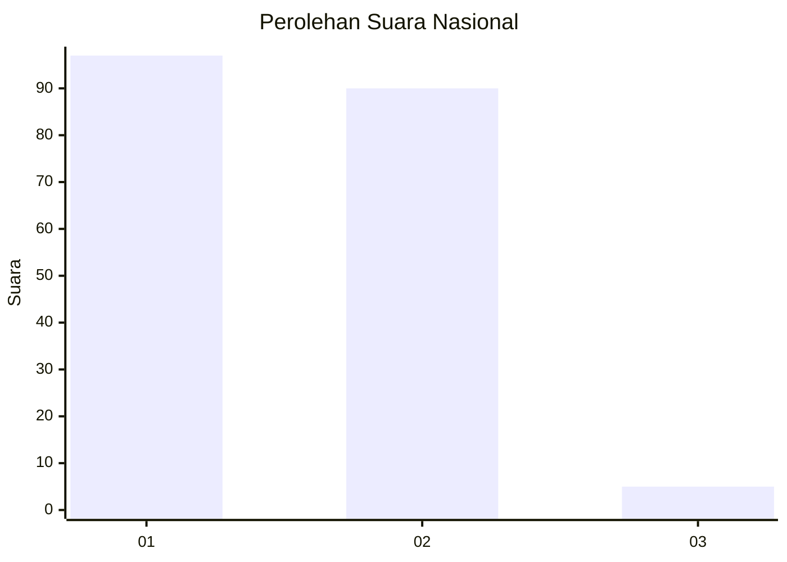
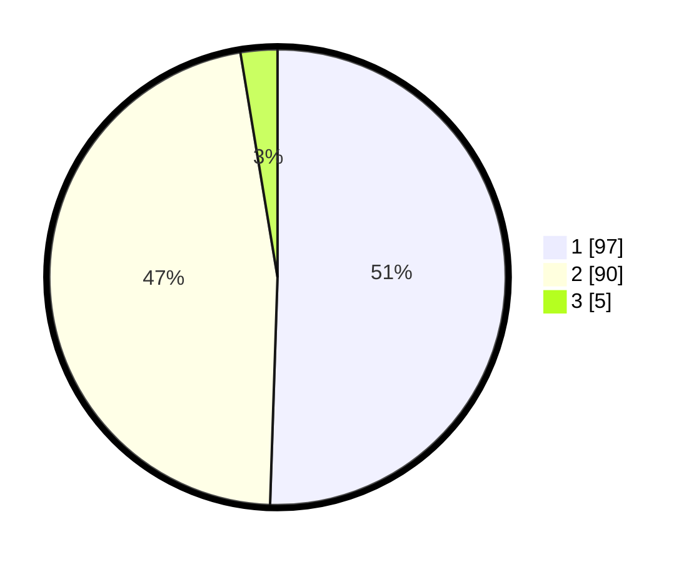

# Hasil

## Grafik

## Tabel

| No. | Nama Paslon    | Suara | Suara (raw) | Persentase |
|:--- |:-------------- | -----:| -----------:| ----------:|
| 1   | ANIES MUHAIMIN | 97    | [97][p-1]   | 50,52      |
| 2   | PRABOWO GIBRAN | 90    | [90][p-2]   | 46,88      |
| 3   | GANJAR MAHFUD  | 5     | [5][p-3]    | 2,60       |

[p-1]: https://github.com/gigit-pemilu/pemilu-2024/blob/main/pilpres/hitung-suara/sub/14-riau/sub/01-kampar/sub/03-tambang/sub/2012-kualu-nenas/sub/009-tps/sub/paslon-1.txt
[p-2]: https://github.com/gigit-pemilu/pemilu-2024/blob/main/pilpres/hitung-suara/sub/14-riau/sub/01-kampar/sub/03-tambang/sub/2012-kualu-nenas/sub/009-tps/sub/paslon-2.txt
[p-3]: https://github.com/gigit-pemilu/pemilu-2024/blob/main/pilpres/hitung-suara/sub/14-riau/sub/01-kampar/sub/03-tambang/sub/2012-kualu-nenas/sub/009-tps/sub/paslon-3.txt

## Foto C Plano

https://sirekap-obj-formc.kpu.go.id/fb24/pemilu/ppwp/14/01/03/20/12/1401032012009-20240215-020049--c757ca33-165c-48b3-9941-2840d80dbbac.jpg

https://sirekap-obj-formc.kpu.go.id/fb24/pemilu/ppwp/14/01/03/20/12/1401032012009-20240215-021854--03624fe3-d029-45d5-9616-b3d3435af318.jpg

https://sirekap-obj-formc.kpu.go.id/fb24/pemilu/ppwp/14/01/03/20/12/1401032012009-20240215-022011--90e67a43-5d91-4b04-be5a-e641c0f43664.jpg

## Metadata

| Key        | Value               |
| ---------- | ------------------- |
| Time Stamp | 2024-02-16 12:51:22 |

