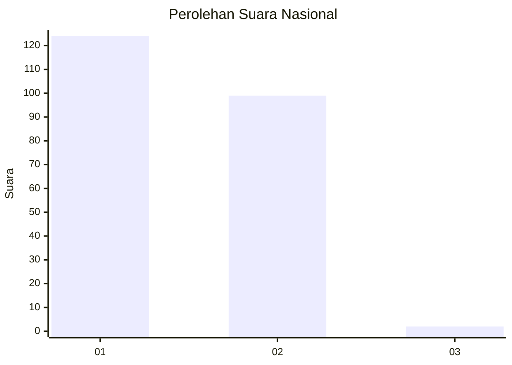
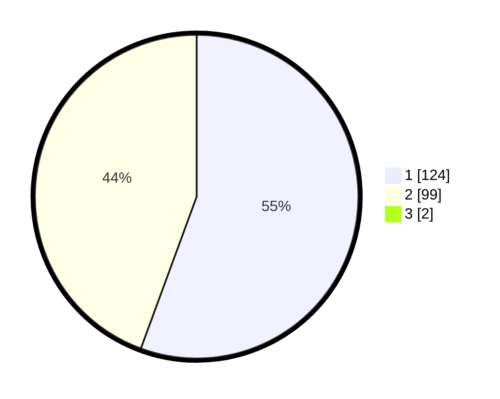

# Hasil

## Grafik

## Tabel

| No. | Nama Paslon    | Suara | Suara (raw) | Persentase |
|:--- |:-------------- | -----:| -----------:| ----------:|
| 1   | ANIES MUHAIMIN | 124   | [124][p-1]  | 55,11      |
| 2   | PRABOWO GIBRAN | 99    | [99][p-2]   | 44,00      |
| 3   | GANJAR MAHFUD  | 2     | [2][p-3]    | 0,89       |

[p-1]: https://github.com/gigit-pemilu/pemilu-2024/blob/main/pilpres/hitung-suara/sub/14-riau/sub/01-kampar/sub/03-tambang/sub/2013-tarai-bangun/sub/001-tps/sub/paslon-1.txt
[p-2]: https://github.com/gigit-pemilu/pemilu-2024/blob/main/pilpres/hitung-suara/sub/14-riau/sub/01-kampar/sub/03-tambang/sub/2013-tarai-bangun/sub/001-tps/sub/paslon-2.txt
[p-3]: https://github.com/gigit-pemilu/pemilu-2024/blob/main/pilpres/hitung-suara/sub/14-riau/sub/01-kampar/sub/03-tambang/sub/2013-tarai-bangun/sub/001-tps/sub/paslon-3.txt

## Foto C Plano

https://sirekap-obj-formc.kpu.go.id/c488/pemilu/ppwp/14/01/03/20/13/1401032013001-20240215-000728--ed6e5a40-2635-469f-b649-9ed54b4fb2cf.jpg

https://sirekap-obj-formc.kpu.go.id/c488/pemilu/ppwp/14/01/03/20/13/1401032013001-20240215-000847--02c68369-9cb2-4c4e-9f48-5a9e8cc25c2c.jpg

https://sirekap-obj-formc.kpu.go.id/c488/pemilu/ppwp/14/01/03/20/13/1401032013001-20240215-001334--dada8470-bec3-4496-a233-b92016b40928.jpg

## Metadata

| Key        | Value               |
| ---------- | ------------------- |
| Time Stamp | 2024-02-16 12:51:22 |

