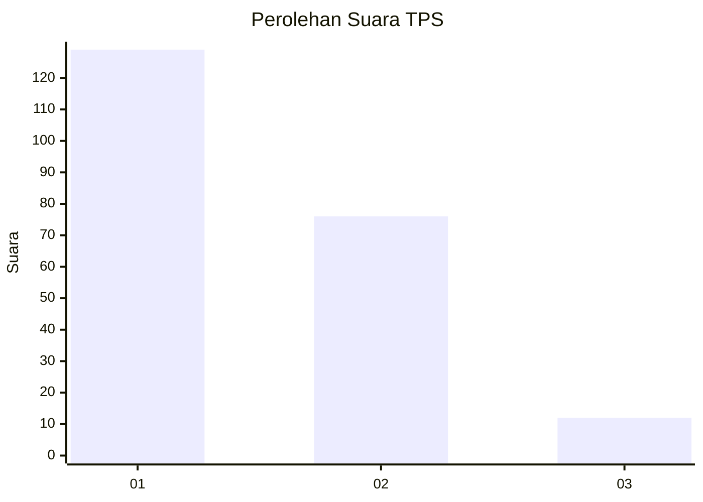
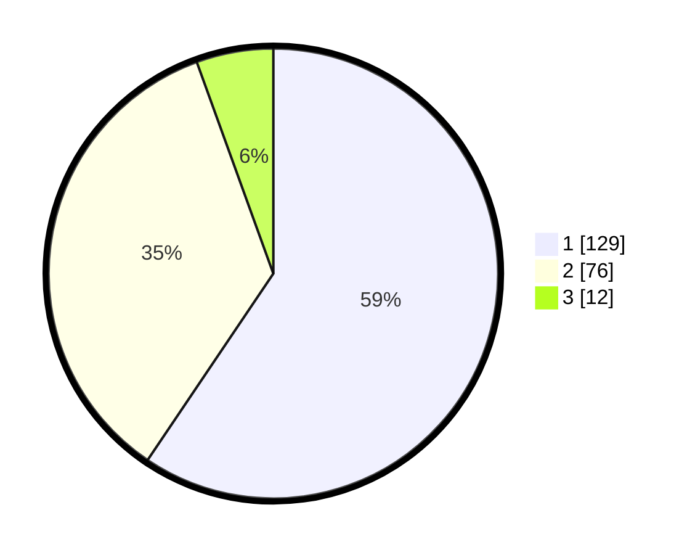

# Hasil

## Grafik

## Tabel

| No. | Nama Paslon    | Suara | Suara (raw) | Persentase |
|:--- |:-------------- | -----:| -----------:| ----------:|
| 1   | ANIES MUHAIMIN | 129   | [129][p-1]  | 59,45      |
| 2   | PRABOWO GIBRAN | 76    | [76][p-2]   | 35,02      |
| 3   | GANJAR MAHFUD  | 12    | [12][p-3]   | 5,53       |

[p-1]: https://github.com/gigit-pemilu/pemilu-2024-14-riau/blob/main/pilpres/hitung-suara/sub/14-riau/sub/01-kampar/sub/03-tambang/sub/2013-tarai-bangun/sub/002-tps/sub/paslon-1.txt
[p-2]: https://github.com/gigit-pemilu/pemilu-2024-14-riau/blob/main/pilpres/hitung-suara/sub/14-riau/sub/01-kampar/sub/03-tambang/sub/2013-tarai-bangun/sub/002-tps/sub/paslon-2.txt
[p-3]: https://github.com/gigit-pemilu/pemilu-2024-14-riau/blob/main/pilpres/hitung-suara/sub/14-riau/sub/01-kampar/sub/03-tambang/sub/2013-tarai-bangun/sub/002-tps/sub/paslon-3.txt

## Foto C Plano

https://sirekap-obj-formc.kpu.go.id/d7fd/pemilu/ppwp/14/01/03/20/13/1401032013002-20240214-232630--9d4cdc7c-6d2b-4c97-8f51-92694bd270ca.jpg

https://sirekap-obj-formc.kpu.go.id/d7fd/pemilu/ppwp/14/01/03/20/13/1401032013002-20240214-232722--e85ecbb8-549d-4e24-ba17-0bbb8226e081.jpg

https://sirekap-obj-formc.kpu.go.id/d7fd/pemilu/ppwp/14/01/03/20/13/1401032013002-20240214-215352--2442359e-b95a-4134-9886-d8359dc27588.jpg

## Metadata

| Key        | Value               |
| ---------- | ------------------- |
| Time Stamp | 2024-02-15 20:30:46 |

