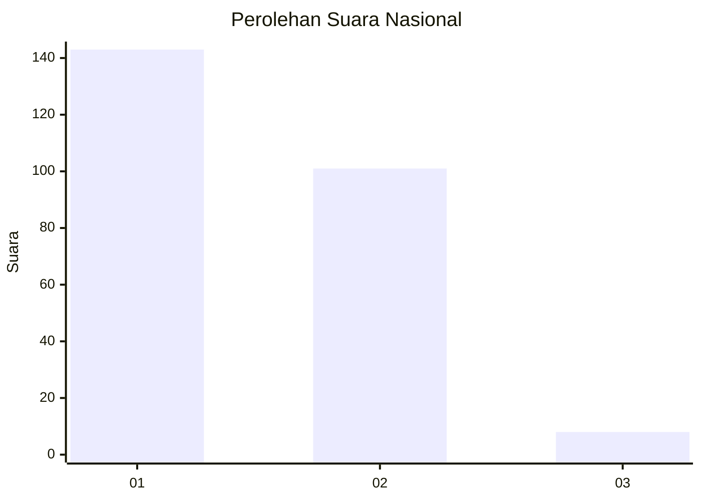
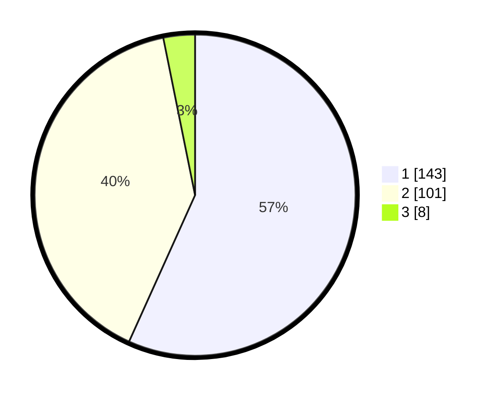

# Hasil

## Grafik

## Tabel

| No. | Nama Paslon    | Suara | Suara (raw) | Persentase |
|:--- |:-------------- | -----:| -----------:| ----------:|
| 1   | ANIES MUHAIMIN | 143   | [143][p-1]  | 56,75      |
| 2   | PRABOWO GIBRAN | 101   | [101][p-2]  | 40,08      |
| 3   | GANJAR MAHFUD  | 8     | [8][p-3]    | 3,17       |

[p-1]: https://github.com/gigit-pemilu/pemilu-2024/blob/main/pilpres/hitung-suara/sub/14-riau/sub/01-kampar/sub/03-tambang/sub/2013-tarai-bangun/sub/008-tps/sub/paslon-1.txt
[p-2]: https://github.com/gigit-pemilu/pemilu-2024/blob/main/pilpres/hitung-suara/sub/14-riau/sub/01-kampar/sub/03-tambang/sub/2013-tarai-bangun/sub/008-tps/sub/paslon-2.txt
[p-3]: https://github.com/gigit-pemilu/pemilu-2024/blob/main/pilpres/hitung-suara/sub/14-riau/sub/01-kampar/sub/03-tambang/sub/2013-tarai-bangun/sub/008-tps/sub/paslon-3.txt

## Foto C Plano

https://sirekap-obj-formc.kpu.go.id/ced7/pemilu/ppwp/14/01/03/20/13/1401032013008-20240214-231450--e850bc89-b89f-4b6b-bcb1-341063440199.jpg

https://sirekap-obj-formc.kpu.go.id/ced7/pemilu/ppwp/14/01/03/20/13/1401032013008-20240214-231620--35d77575-a623-46b0-b1c2-6272936d4240.jpg

https://sirekap-obj-formc.kpu.go.id/ced7/pemilu/ppwp/14/01/03/20/13/1401032013008-20240215-001740--e6c59123-7403-4dbc-b128-c4f9c69a1739.jpg

## Metadata

| Key        | Value               |
| ---------- | ------------------- |
| Time Stamp | 2024-02-16 12:51:22 |

