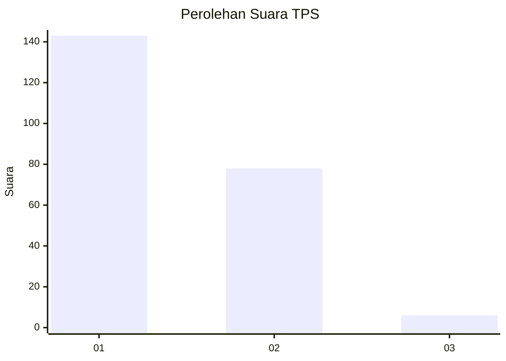
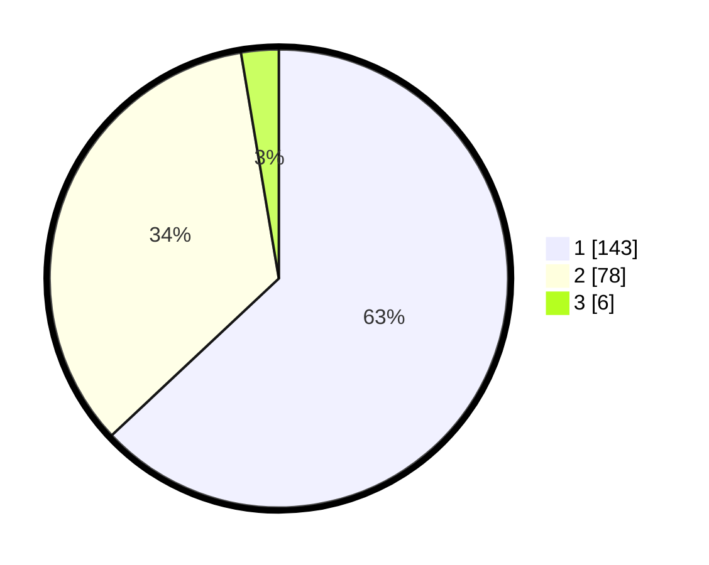

# Hasil

## Grafik

## Tabel

| No. | Nama Paslon    | Suara | Suara (raw) | Persentase |
|:--- |:-------------- | -----:| -----------:| ----------:|
| 1   | ANIES MUHAIMIN | 143   | [143][p-1]  | 63,00      |
| 2   | PRABOWO GIBRAN | 78    | [78][p-2]   | 34,36      |
| 3   | GANJAR MAHFUD  | 6     | [6][p-3]    | 2,64       |

[p-1]: https://github.com/gigit-pemilu/pemilu-2024-14-riau/blob/main/pilpres/hitung-suara/sub/14-riau/sub/01-kampar/sub/03-tambang/sub/2013-tarai-bangun/sub/023-tps/sub/paslon-1.txt
[p-2]: https://github.com/gigit-pemilu/pemilu-2024-14-riau/blob/main/pilpres/hitung-suara/sub/14-riau/sub/01-kampar/sub/03-tambang/sub/2013-tarai-bangun/sub/023-tps/sub/paslon-2.txt
[p-3]: https://github.com/gigit-pemilu/pemilu-2024-14-riau/blob/main/pilpres/hitung-suara/sub/14-riau/sub/01-kampar/sub/03-tambang/sub/2013-tarai-bangun/sub/023-tps/sub/paslon-3.txt

## Foto C Plano

https://sirekap-obj-formc.kpu.go.id/772f/pemilu/ppwp/14/01/03/20/13/1401032013023-20240214-214511--e1c13f33-20ba-456e-8021-51029ae5cdba.jpg

https://sirekap-obj-formc.kpu.go.id/772f/pemilu/ppwp/14/01/03/20/13/1401032013023-20240214-225656--49fbd5e8-2013-474d-8210-8fe090c4319c.jpg

https://sirekap-obj-formc.kpu.go.id/772f/pemilu/ppwp/14/01/03/20/13/1401032013023-20240214-225751--2f2c0240-1ec7-4a60-9c3e-7f2265df181a.jpg

## Metadata

| Key        | Value               |
| ---------- | ------------------- |
| Time Stamp | 2024-02-25 17:00:00 |

