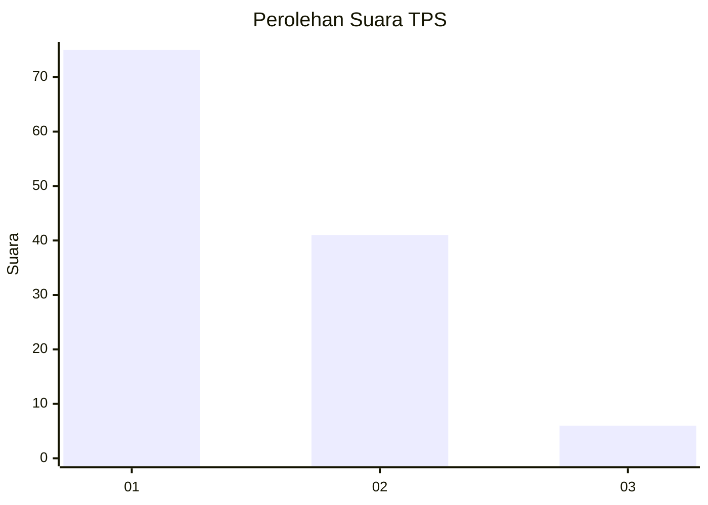
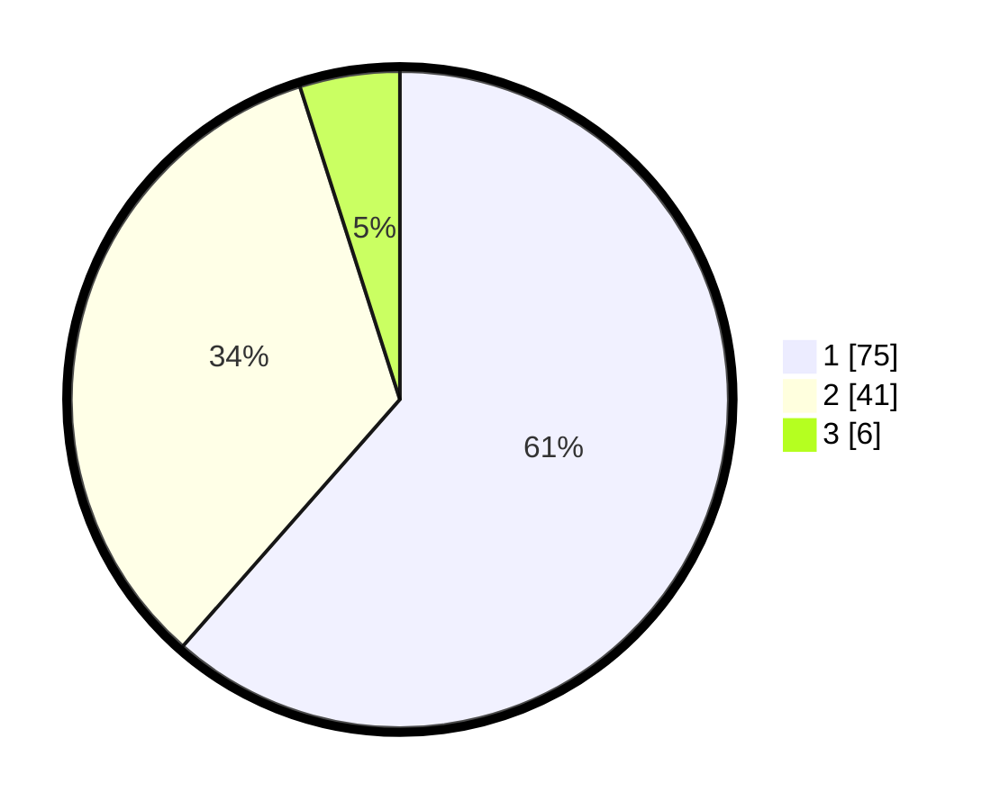

# Hasil

## Grafik

## Tabel

| No. | Nama Paslon    | Suara | Suara (raw) | Persentase |
|:--- |:-------------- | -----:| -----------:| ----------:|
| 1   | ANIES MUHAIMIN | 75    | [75][p-1]   | 61,48      |
| 2   | PRABOWO GIBRAN | 41    | [41][p-2]   | 33,61      |
| 3   | GANJAR MAHFUD  | 6     | [6][p-3]    | 4,92       |

[p-1]: https://github.com/gigit-pemilu/pemilu-2024-14-riau/blob/main/pilpres/hitung-suara/sub/14-riau/sub/01-kampar/sub/03-tambang/sub/2013-tarai-bangun/sub/052-tps/sub/paslon-1.txt
[p-2]: https://github.com/gigit-pemilu/pemilu-2024-14-riau/blob/main/pilpres/hitung-suara/sub/14-riau/sub/01-kampar/sub/03-tambang/sub/2013-tarai-bangun/sub/052-tps/sub/paslon-2.txt
[p-3]: https://github.com/gigit-pemilu/pemilu-2024-14-riau/blob/main/pilpres/hitung-suara/sub/14-riau/sub/01-kampar/sub/03-tambang/sub/2013-tarai-bangun/sub/052-tps/sub/paslon-3.txt

## Foto C Plano

https://sirekap-obj-formc.kpu.go.id/fdfe/pemilu/ppwp/14/01/03/20/13/1401032013052-20240215-035911--18cfd32a-18a8-4962-9052-6eab9b660bd0.jpg

https://sirekap-obj-formc.kpu.go.id/fdfe/pemilu/ppwp/14/01/03/20/13/1401032013052-20240215-040340--d11f7a0c-a604-489e-bafd-94e0cad94733.jpg

https://sirekap-obj-formc.kpu.go.id/fdfe/pemilu/ppwp/14/01/03/20/13/1401032013052-20240215-041207--e6b23bd0-a01d-4c71-96b1-c36c20aa7598.jpg

## Metadata

| Key        | Value               |
| ---------- | ------------------- |
| Time Stamp | 2024-02-16 12:51:22 |

