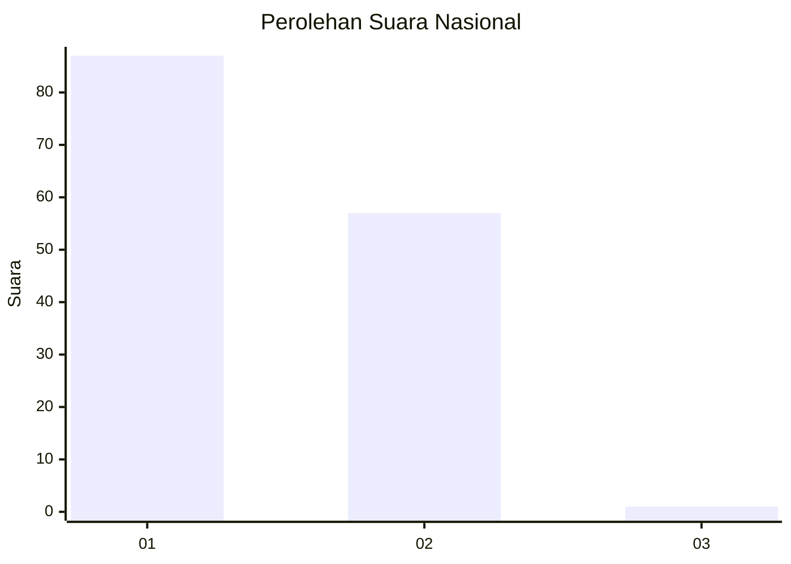
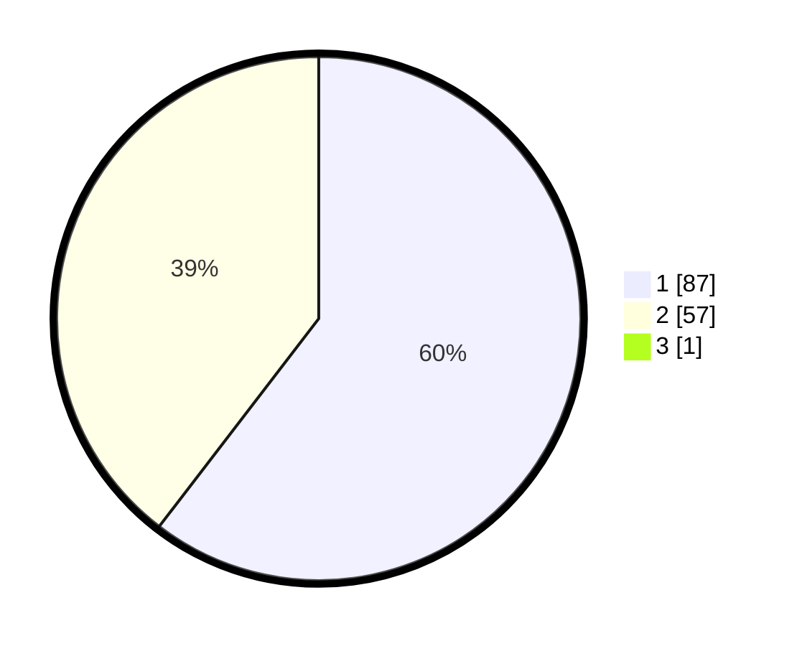

# Hasil

## Grafik

## Tabel

| No. | Nama Paslon    | Suara | Suara (raw) | Persentase |
|:--- |:-------------- | -----:| -----------:| ----------:|
| 1   | ANIES MUHAIMIN | 87    | [87][p-1]   | 60,00      |
| 2   | PRABOWO GIBRAN | 57    | [57][p-2]   | 39,31      |
| 3   | GANJAR MAHFUD  | 1     | [1][p-3]    | 0,69       |

[p-1]: https://github.com/gigit-pemilu/pemilu-2024/blob/main/pilpres/hitung-suara/sub/14-riau/sub/01-kampar/sub/03-tambang/sub/2016-pulau-permai/sub/002-tps/sub/paslon-1.txt
[p-2]: https://github.com/gigit-pemilu/pemilu-2024/blob/main/pilpres/hitung-suara/sub/14-riau/sub/01-kampar/sub/03-tambang/sub/2016-pulau-permai/sub/002-tps/sub/paslon-2.txt
[p-3]: https://github.com/gigit-pemilu/pemilu-2024/blob/main/pilpres/hitung-suara/sub/14-riau/sub/01-kampar/sub/03-tambang/sub/2016-pulau-permai/sub/002-tps/sub/paslon-3.txt

## Foto C Plano

https://sirekap-obj-formc.kpu.go.id/3e0a/pemilu/ppwp/14/01/03/20/16/1401032016002-20240214-232959--430a00d7-290e-4357-a67b-34b2e9a48eda.jpg

https://sirekap-obj-formc.kpu.go.id/3e0a/pemilu/ppwp/14/01/03/20/16/1401032016002-20240214-233040--92fb5d78-f127-4f73-bdcd-2f67ec7b9368.jpg

https://sirekap-obj-formc.kpu.go.id/3e0a/pemilu/ppwp/14/01/03/20/16/1401032016002-20240214-233125--44f572fa-1e2a-4a63-89a6-de4bec5c9179.jpg

## Metadata

| Key        | Value               |
| ---------- | ------------------- |
| Time Stamp | 2024-02-16 12:51:22 |

