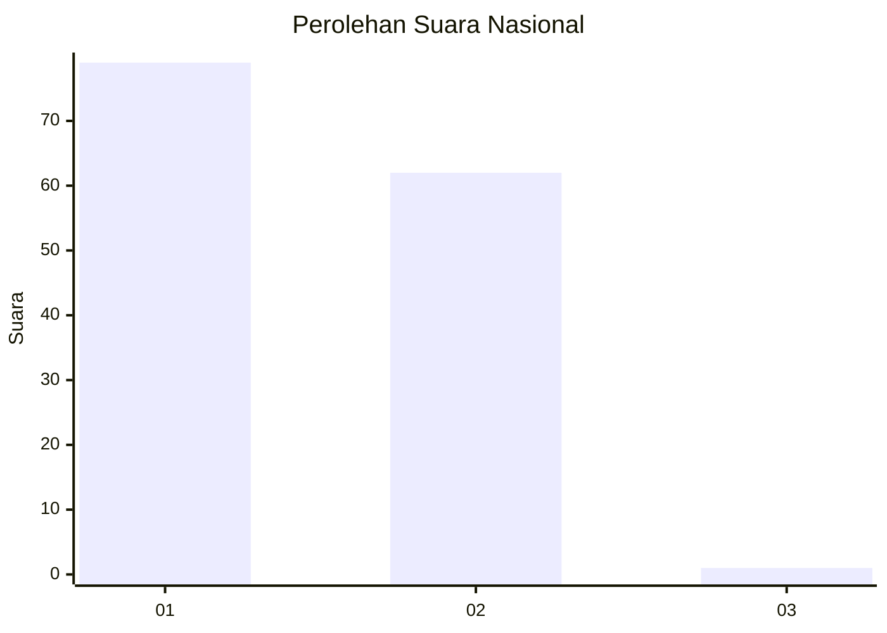
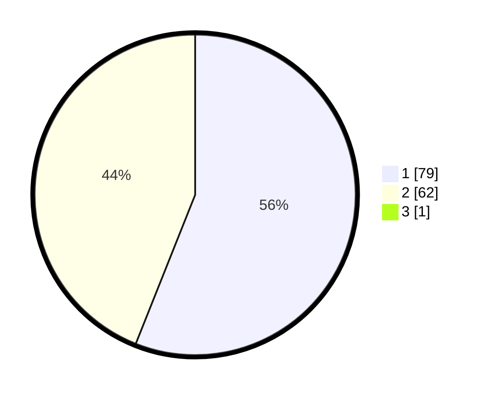

# Hasil

## Grafik

## Tabel

| No. | Nama Paslon    | Suara | Suara (raw) | Persentase |
|:--- |:-------------- | -----:| -----------:| ----------:|
| 1   | ANIES MUHAIMIN | 79    | [79][p-1]   | 55,63      |
| 2   | PRABOWO GIBRAN | 62    | [62][p-2]   | 43,66      |
| 3   | GANJAR MAHFUD  | 1     | [1][p-3]    | 0,70       |

[p-1]: https://github.com/gigit-pemilu/pemilu-2024/blob/main/pilpres/hitung-suara/sub/14-riau/sub/01-kampar/sub/03-tambang/sub/2016-pulau-permai/sub/006-tps/sub/paslon-1.txt
[p-2]: https://github.com/gigit-pemilu/pemilu-2024/blob/main/pilpres/hitung-suara/sub/14-riau/sub/01-kampar/sub/03-tambang/sub/2016-pulau-permai/sub/006-tps/sub/paslon-2.txt
[p-3]: https://github.com/gigit-pemilu/pemilu-2024/blob/main/pilpres/hitung-suara/sub/14-riau/sub/01-kampar/sub/03-tambang/sub/2016-pulau-permai/sub/006-tps/sub/paslon-3.txt

## Foto C Plano

https://sirekap-obj-formc.kpu.go.id/c7e8/pemilu/ppwp/14/01/03/20/16/1401032016006-20240215-024733--f5e91102-15d7-4abf-ba5e-1b63c125f1cc.jpg

https://sirekap-obj-formc.kpu.go.id/c7e8/pemilu/ppwp/14/01/03/20/16/1401032016006-20240215-025126--c2a9ff05-d573-4bc9-8d33-a1596532e00a.jpg

https://sirekap-obj-formc.kpu.go.id/c7e8/pemilu/ppwp/14/01/03/20/16/1401032016006-20240215-025243--081e3032-3ea3-4f20-a8f8-17dc8d3a0f92.jpg

## Metadata

| Key        | Value               |
| ---------- | ------------------- |
| Time Stamp | 2024-02-16 12:51:22 |

