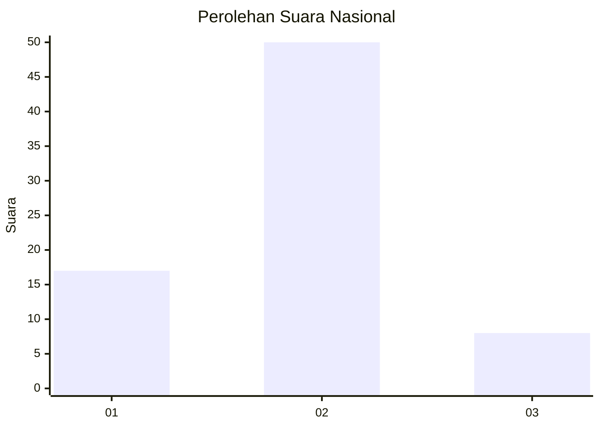

# Hasil

## Grafik

## Tabel

| No. | Nama Paslon    | Suara | Suara (raw) | Persentase |
|:--- |:-------------- | -----:| -----------:| ----------:|
| 1   | ANIES MUHAIMIN | 17    | [17][p-1]   | 22,67      |
| 2   | PRABOWO GIBRAN | 50    | [50][p-2]   | 66,67      |
| 3   | GANJAR MAHFUD  | 8     | [8][p-3]    | 10,67      |

[p-1]: https://github.com/gigit-pemilu/pemilu-2024/blob/main/pilpres/hitung-suara/sub/14-riau/sub/01-kampar/sub/04-xiii-koto-kampar/sub/2005-koto-tuo/sub/005-tps/sub/paslon-1.txt
[p-2]: https://github.com/gigit-pemilu/pemilu-2024/blob/main/pilpres/hitung-suara/sub/14-riau/sub/01-kampar/sub/04-xiii-koto-kampar/sub/2005-koto-tuo/sub/005-tps/sub/paslon-2.txt
[p-3]: https://github.com/gigit-pemilu/pemilu-2024/blob/main/pilpres/hitung-suara/sub/14-riau/sub/01-kampar/sub/04-xiii-koto-kampar/sub/2005-koto-tuo/sub/005-tps/sub/paslon-3.txt

## Foto C Plano

https://sirekap-obj-formc.kpu.go.id/1fdb/pemilu/ppwp/14/01/04/20/05/1401042005005-20240215-083052--eb2537f3-ae2b-4007-99f5-135b2296d5d1.jpg

https://sirekap-obj-formc.kpu.go.id/1fdb/pemilu/ppwp/14/01/04/20/05/1401042005005-20240215-023720--4a304ebd-2f11-4c67-9713-7fab04e8d5d8.jpg

https://sirekap-obj-formc.kpu.go.id/1fdb/pemilu/ppwp/14/01/04/20/05/1401042005005-20240215-024328--2bf5bf30-11f5-4ad9-aa9a-af19873262b0.jpg

## Metadata

| Key        | Value               |
| ---------- | ------------------- |
| Time Stamp | 2024-02-15 22:00:27 |

