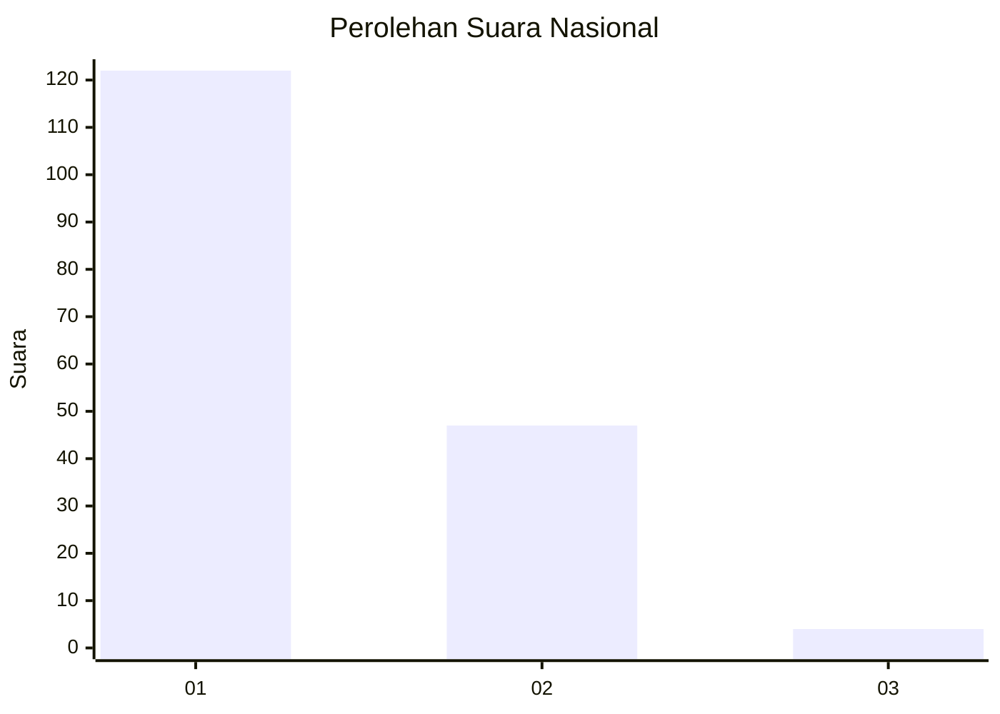
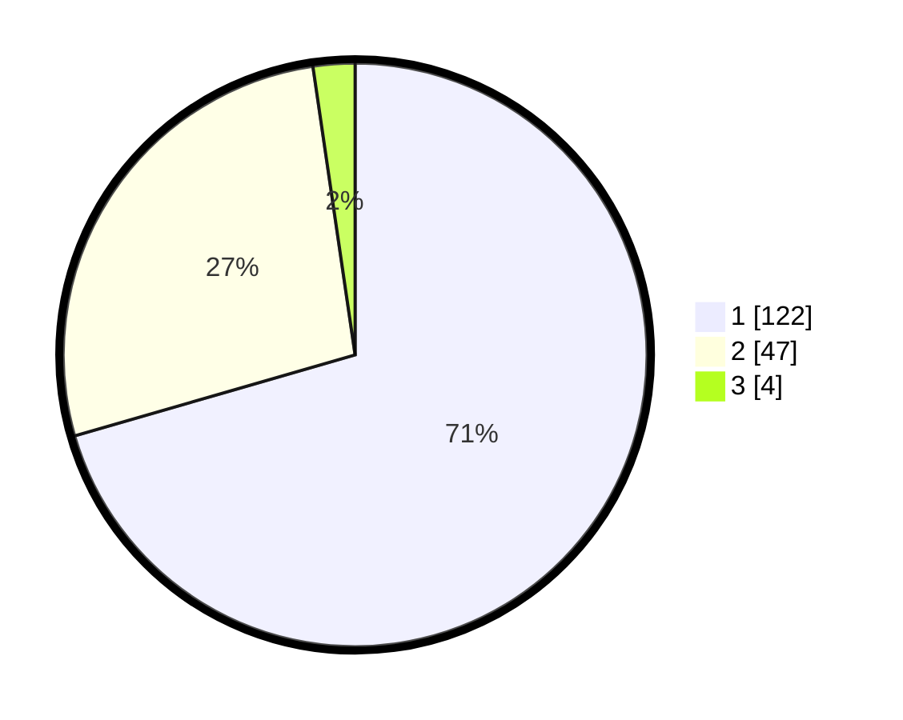

# Hasil

## Grafik

## Tabel

| No. | Nama Paslon    | Suara | Suara (raw) | Persentase |
|:--- |:-------------- | -----:| -----------:| ----------:|
| 1   | ANIES MUHAIMIN | 122   | [122][p-1]  | 70,52      |
| 2   | PRABOWO GIBRAN | 47    | [47][p-2]   | 27,17      |
| 3   | GANJAR MAHFUD  | 4     | [4][p-3]    | 2,31       |

[p-1]: https://github.com/gigit-pemilu/pemilu-2024/blob/main/pilpres/hitung-suara/sub/14-riau/sub/01-kampar/sub/05-kuok/sub/2001-kuok/sub/003-tps/sub/paslon-1.txt
[p-2]: https://github.com/gigit-pemilu/pemilu-2024/blob/main/pilpres/hitung-suara/sub/14-riau/sub/01-kampar/sub/05-kuok/sub/2001-kuok/sub/003-tps/sub/paslon-2.txt
[p-3]: https://github.com/gigit-pemilu/pemilu-2024/blob/main/pilpres/hitung-suara/sub/14-riau/sub/01-kampar/sub/05-kuok/sub/2001-kuok/sub/003-tps/sub/paslon-3.txt

## Foto C Plano

https://sirekap-obj-formc.kpu.go.id/8586/pemilu/ppwp/14/01/05/20/01/1401052001003-20240214-221517--4076b450-0286-4067-aeb6-8f75996d9891.jpg

https://sirekap-obj-formc.kpu.go.id/8586/pemilu/ppwp/14/01/05/20/01/1401052001003-20240214-222023--f257c7e8-beef-4591-87e2-963309b08273.jpg

https://sirekap-obj-formc.kpu.go.id/8586/pemilu/ppwp/14/01/05/20/01/1401052001003-20240214-221532--cd7c0621-4f09-4d75-a1a0-1b866a77bf42.jpg

## Metadata

| Key        | Value               |
| ---------- | ------------------- |
| Time Stamp | 2024-02-15 12:00:28 |

