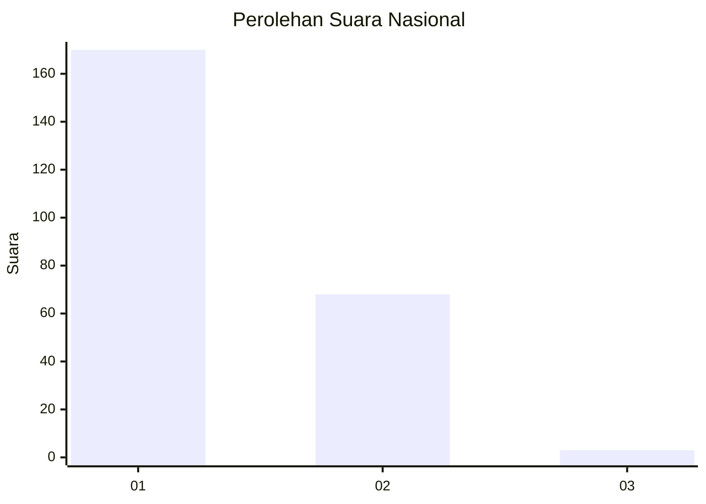
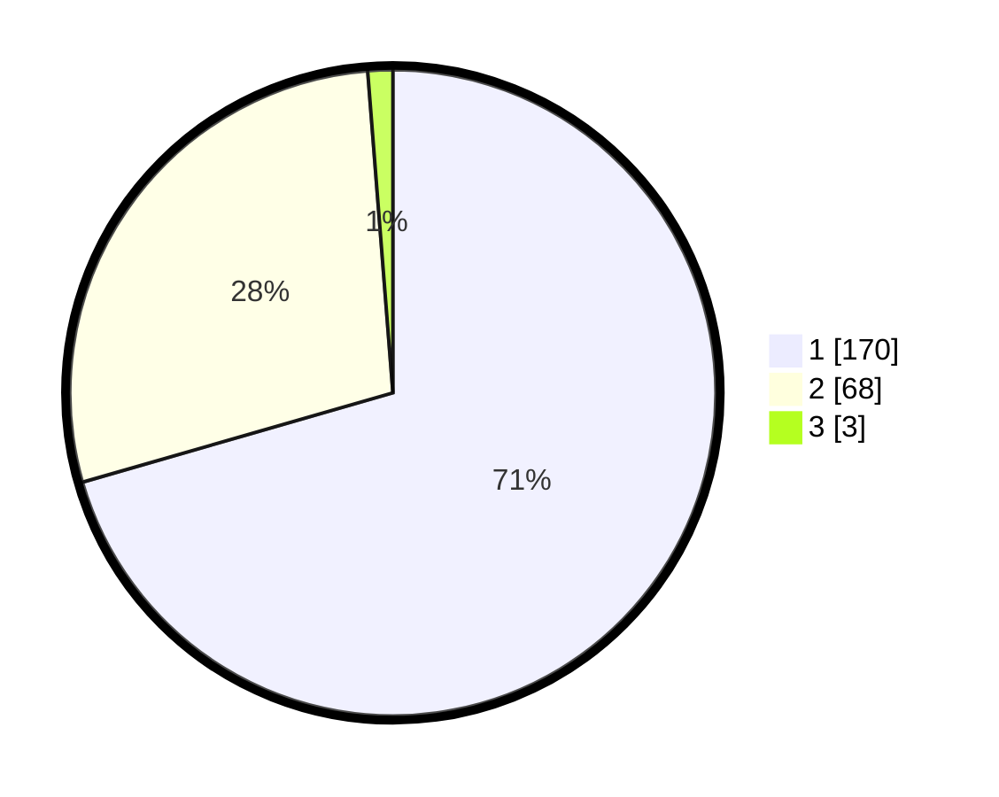

# Hasil

## Grafik

## Tabel

| No. | Nama Paslon    | Suara | Suara (raw) | Persentase |
|:--- |:-------------- | -----:| -----------:| ----------:|
| 1   | ANIES MUHAIMIN | 170   | [170][p-1]  | 70,54      |
| 2   | PRABOWO GIBRAN | 68    | [68][p-2]   | 28,22      |
| 3   | GANJAR MAHFUD  | 3     | [3][p-3]    | 1,24       |

[p-1]: https://github.com/gigit-pemilu/pemilu-2024/blob/main/pilpres/hitung-suara/sub/14-riau/sub/01-kampar/sub/05-kuok/sub/2001-kuok/sub/008-tps/sub/paslon-1.txt
[p-2]: https://github.com/gigit-pemilu/pemilu-2024/blob/main/pilpres/hitung-suara/sub/14-riau/sub/01-kampar/sub/05-kuok/sub/2001-kuok/sub/008-tps/sub/paslon-2.txt
[p-3]: https://github.com/gigit-pemilu/pemilu-2024/blob/main/pilpres/hitung-suara/sub/14-riau/sub/01-kampar/sub/05-kuok/sub/2001-kuok/sub/008-tps/sub/paslon-3.txt

## Foto C Plano

https://sirekap-obj-formc.kpu.go.id/ffd6/pemilu/ppwp/14/01/05/20/01/1401052001008-20240214-215313--51e544de-7734-4773-ac68-f2322311cab3.jpg

https://sirekap-obj-formc.kpu.go.id/ffd6/pemilu/ppwp/14/01/05/20/01/1401052001008-20240214-160056--2eb489e5-f83c-43b0-9eee-2df6a8231d26.jpg

https://sirekap-obj-formc.kpu.go.id/ffd6/pemilu/ppwp/14/01/05/20/01/1401052001008-20240214-155456--5c036d36-30a0-4510-8f10-e3d171cb503d.jpg

## Metadata

| Key        | Value               |
| ---------- | ------------------- |
| Time Stamp | 2024-02-15 12:00:28 |

