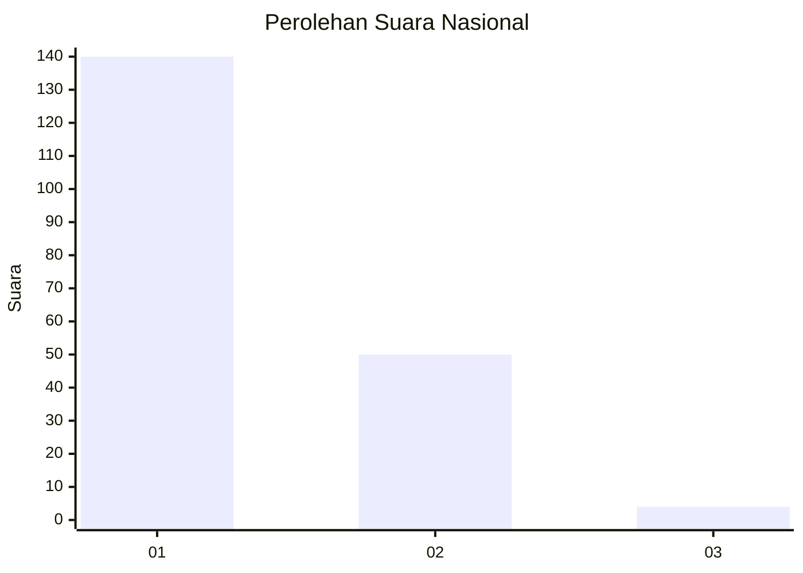
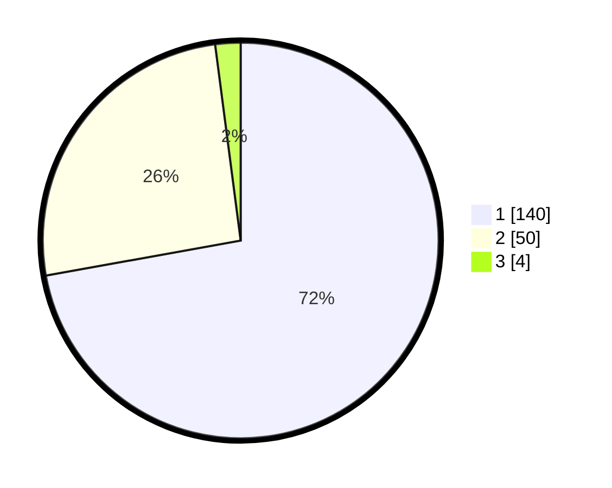

# Hasil

## Grafik

## Tabel

| No. | Nama Paslon    | Suara | Suara (raw) | Persentase |
|:--- |:-------------- | -----:| -----------:| ----------:|
| 1   | ANIES MUHAIMIN | 140   | [140][p-1]  | 72,16      |
| 2   | PRABOWO GIBRAN | 50    | [50][p-2]   | 25,77      |
| 3   | GANJAR MAHFUD  | 4     | [4][p-3]    | 2,06       |

[p-1]: https://github.com/gigit-pemilu/pemilu-2024/blob/main/pilpres/hitung-suara/sub/14-riau/sub/01-kampar/sub/05-kuok/sub/2006-empat-balai/sub/003-tps/sub/paslon-1.txt
[p-2]: https://github.com/gigit-pemilu/pemilu-2024/blob/main/pilpres/hitung-suara/sub/14-riau/sub/01-kampar/sub/05-kuok/sub/2006-empat-balai/sub/003-tps/sub/paslon-2.txt
[p-3]: https://github.com/gigit-pemilu/pemilu-2024/blob/main/pilpres/hitung-suara/sub/14-riau/sub/01-kampar/sub/05-kuok/sub/2006-empat-balai/sub/003-tps/sub/paslon-3.txt

## Foto C Plano

https://sirekap-obj-formc.kpu.go.id/506d/pemilu/ppwp/14/01/05/20/06/1401052006003-20240219-090514--8bdb0f79-a79f-4834-b965-7324229ab693.jpg

https://sirekap-obj-formc.kpu.go.id/506d/pemilu/ppwp/14/01/05/20/06/1401052006003-20240220-231211--1489718b-1bb5-4f5d-96cb-68c524710303.jpg

https://sirekap-obj-formc.kpu.go.id/506d/pemilu/ppwp/14/01/05/20/06/1401052006003-20240220-231210--40114e8d-80dd-4c04-b9e3-32167b0f0f62.jpg

## Metadata

| Key        | Value               |
| ---------- | ------------------- |
| Time Stamp | 2024-02-24 22:31:28 |

## DATA PEMILIH TETAP

Jumlah pemilih dalam DPT: **243**.
 * L: **120**.
 * P: **123**.

## DATA PENGGUNA HAK PILIH

Jumlah pengguna hak pilih dalam DPT: **195**.
 * L: **37**.
 * P: **105**.

Jumlah pengguna hak pilih dalam DPTb: **20**.
 * L: **0**.
 * P: **522**.

Jumlah pengguna hak pilih dalam DPK: **222**.
 * L: **75**.
 * P: **22**.

Jumlah pengguna hak pilih: **193**.
 * L: **807**.
 * P: **110**.

## JUMLAH SUARA SAH DAN TIDAK SAH

JUMLAH SELURUH SUARA SAH: **194**.

JUMLAH SUARA TIDAK SAH: **3**.

JUMLAH SELURUH SUARA SAH DAN SUARA TIDAK SAH: **197**.

