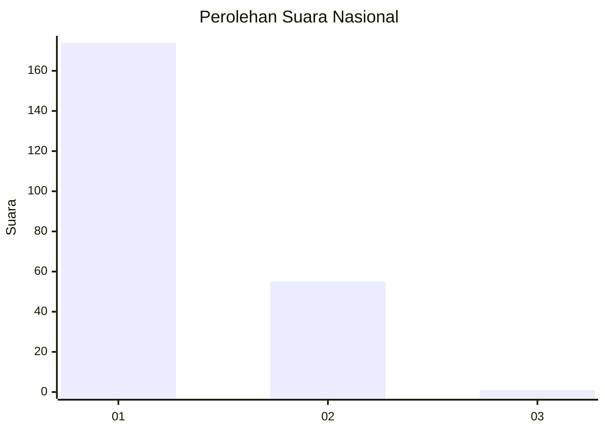
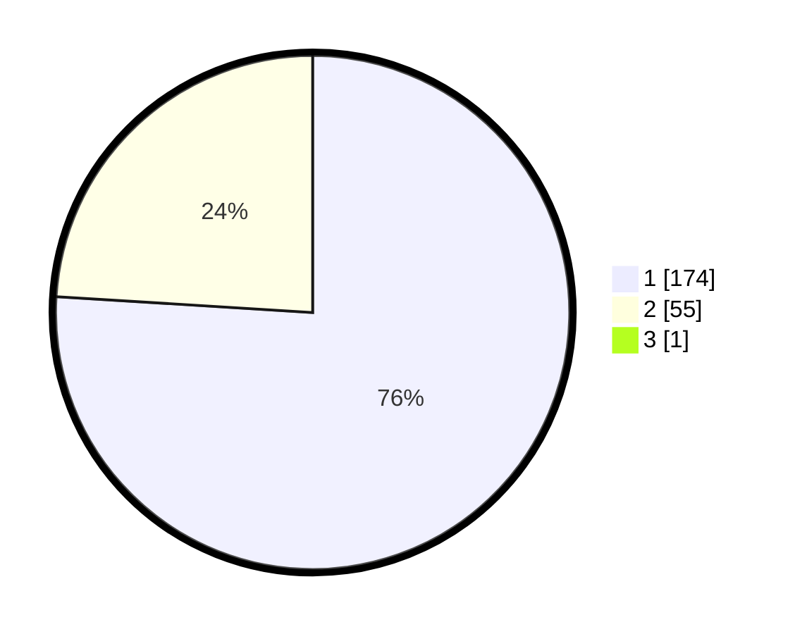

# Hasil

## Grafik

## Tabel

| No. | Nama Paslon    | Suara | Suara (raw) | Persentase |
|:--- |:-------------- | -----:| -----------:| ----------:|
| 1   | ANIES MUHAIMIN | 174   | [174][p-1]  | 75,65      |
| 2   | PRABOWO GIBRAN | 55    | [55][p-2]   | 23,91      |
| 3   | GANJAR MAHFUD  | 1     | [1][p-3]    | 0,43       |

[p-1]: https://github.com/gigit-pemilu/pemilu-2024/blob/main/pilpres/hitung-suara/sub/14-riau/sub/01-kampar/sub/05-kuok/sub/2007-pulau-jambu/sub/002-tps/sub/paslon-1.txt
[p-2]: https://github.com/gigit-pemilu/pemilu-2024/blob/main/pilpres/hitung-suara/sub/14-riau/sub/01-kampar/sub/05-kuok/sub/2007-pulau-jambu/sub/002-tps/sub/paslon-2.txt
[p-3]: https://github.com/gigit-pemilu/pemilu-2024/blob/main/pilpres/hitung-suara/sub/14-riau/sub/01-kampar/sub/05-kuok/sub/2007-pulau-jambu/sub/002-tps/sub/paslon-3.txt

## Foto C Plano

https://sirekap-obj-formc.kpu.go.id/3ba8/pemilu/ppwp/14/01/05/20/07/1401052007002-20240215-032425--9b7b6c97-c86d-49ef-b8ef-a5b96a1462b8.jpg

https://sirekap-obj-formc.kpu.go.id/3ba8/pemilu/ppwp/14/01/05/20/07/1401052007002-20240215-032447--c5853fe6-504c-4b9e-9fc7-894316297187.jpg

https://sirekap-obj-formc.kpu.go.id/3ba8/pemilu/ppwp/14/01/05/20/07/1401052007002-20240215-032455--e06753a8-aee5-4a97-935e-25e0a5c40cb9.jpg

## Metadata

| Key        | Value               |
| ---------- | ------------------- |
| Time Stamp | 2024-02-15 15:00:29 |

