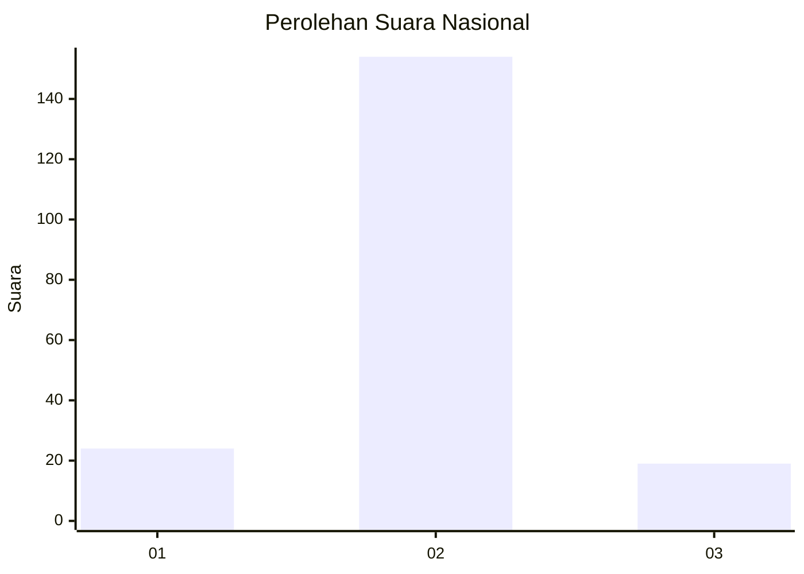
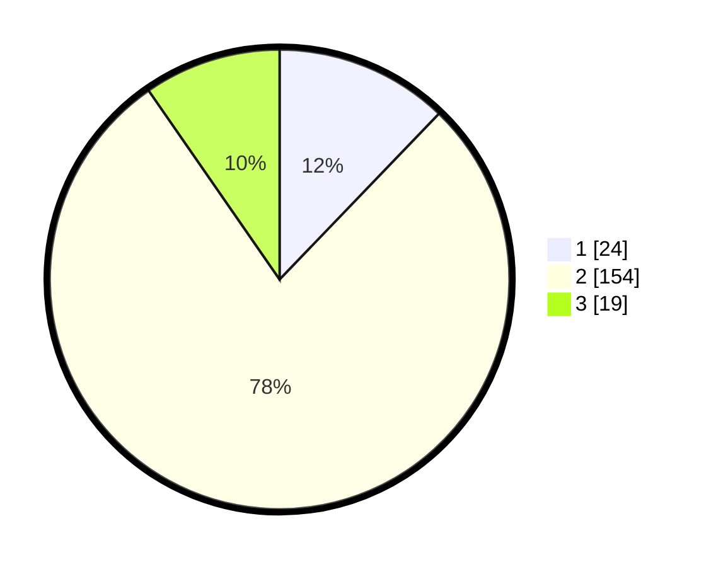

# Hasil

## Grafik

## Tabel

| No. | Nama Paslon    | Suara | Suara (raw) | Persentase |
|:--- |:-------------- | -----:| -----------:| ----------:|
| 1   | ANIES MUHAIMIN | 24    | [24][p-1]   | 12,18      |
| 2   | PRABOWO GIBRAN | 154   | [154][p-2]  | 78,17      |
| 3   | GANJAR MAHFUD  | 19    | [19][p-3]   | 9,64       |

[p-1]: https://github.com/gigit-pemilu/pemilu-2024/blob/main/pilpres/hitung-suara/sub/14-riau/sub/01-kampar/sub/06-siak-hulu/sub/2001-pangkalan-baru/sub/006-tps/sub/paslon-1.txt
[p-2]: https://github.com/gigit-pemilu/pemilu-2024/blob/main/pilpres/hitung-suara/sub/14-riau/sub/01-kampar/sub/06-siak-hulu/sub/2001-pangkalan-baru/sub/006-tps/sub/paslon-2.txt
[p-3]: https://github.com/gigit-pemilu/pemilu-2024/blob/main/pilpres/hitung-suara/sub/14-riau/sub/01-kampar/sub/06-siak-hulu/sub/2001-pangkalan-baru/sub/006-tps/sub/paslon-3.txt

## Foto C Plano

https://sirekap-obj-formc.kpu.go.id/4b01/pemilu/ppwp/14/01/06/20/01/1401062001006-20240215-113403--fa50ff95-47a9-4e66-b305-892103426153.jpg

https://sirekap-obj-formc.kpu.go.id/4b01/pemilu/ppwp/14/01/06/20/01/1401062001006-20240215-113621--1335f9e9-4675-4e23-9c93-597400ee4100.jpg

https://sirekap-obj-formc.kpu.go.id/4b01/pemilu/ppwp/14/01/06/20/01/1401062001006-20240215-113746--524ed0c9-f949-4bdc-81ef-b8ed6c551c67.jpg

## Metadata

| Key        | Value               |
| ---------- | ------------------- |
| Time Stamp | 2024-02-25 16:00:00 |

