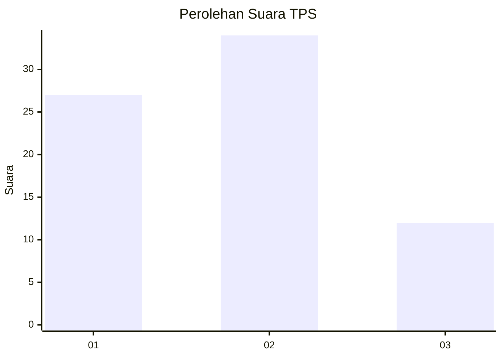
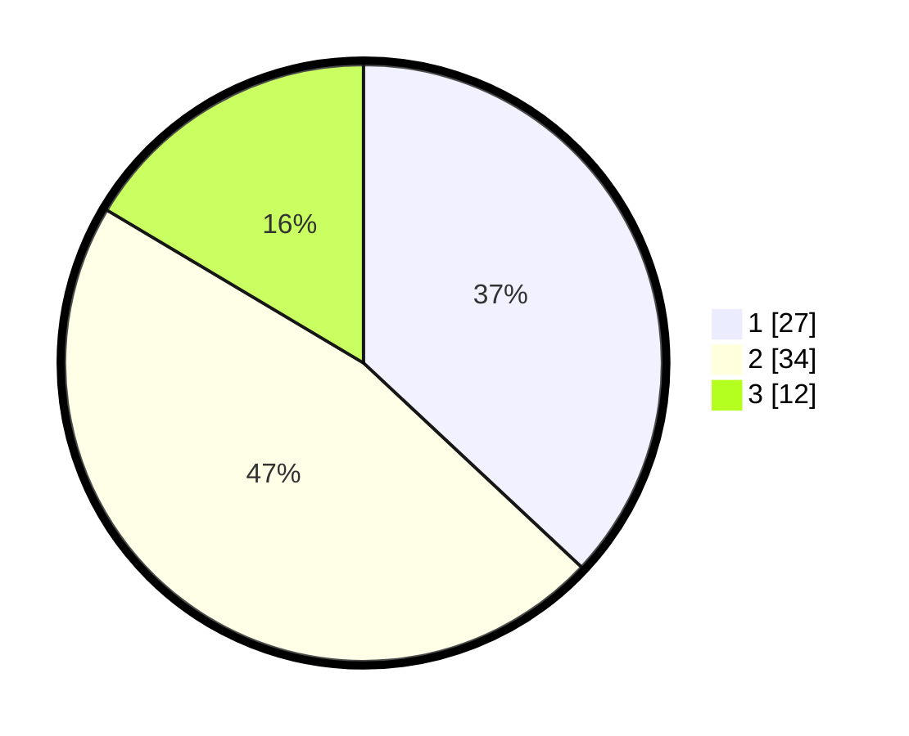

# Hasil

## Grafik

## Tabel

| No. | Nama Paslon    | Suara | Suara (raw) | Persentase |
|:--- |:-------------- | -----:| -----------:| ----------:|
| 1   | ANIES MUHAIMIN | 27    | [27][p-1]   | 36,99      |
| 2   | PRABOWO GIBRAN | 34    | [34][p-2]   | 46,58      |
| 3   | GANJAR MAHFUD  | 12    | [12][p-3]   | 16,44      |

[p-1]: https://github.com/gigit-pemilu/pemilu-2024-14-riau/blob/main/pilpres/hitung-suara/sub/14-riau/sub/01-kampar/sub/06-siak-hulu/sub/2002-desa-baru/sub/022-tps/sub/paslon-1.txt
[p-2]: https://github.com/gigit-pemilu/pemilu-2024-14-riau/blob/main/pilpres/hitung-suara/sub/14-riau/sub/01-kampar/sub/06-siak-hulu/sub/2002-desa-baru/sub/022-tps/sub/paslon-2.txt
[p-3]: https://github.com/gigit-pemilu/pemilu-2024-14-riau/blob/main/pilpres/hitung-suara/sub/14-riau/sub/01-kampar/sub/06-siak-hulu/sub/2002-desa-baru/sub/022-tps/sub/paslon-3.txt

## Foto C Plano

https://sirekap-obj-formc.kpu.go.id/a8ec/pemilu/ppwp/14/01/06/20/02/1401062002022-20240214-203454--4edfca58-9c87-4712-b496-18f249568f34.jpg

https://sirekap-obj-formc.kpu.go.id/a8ec/pemilu/ppwp/14/01/06/20/02/1401062002022-20240214-203620--d3f215a6-36e8-420a-8188-8133b0a68c33.jpg

https://sirekap-obj-formc.kpu.go.id/a8ec/pemilu/ppwp/14/01/06/20/02/1401062002022-20240214-203725--0fac4ff2-60a9-4ad3-9cf7-550225b3de00.jpg

## Metadata

| Key        | Value               |
| ---------- | ------------------- |
| Time Stamp | 2024-02-15 22:30:27 |

