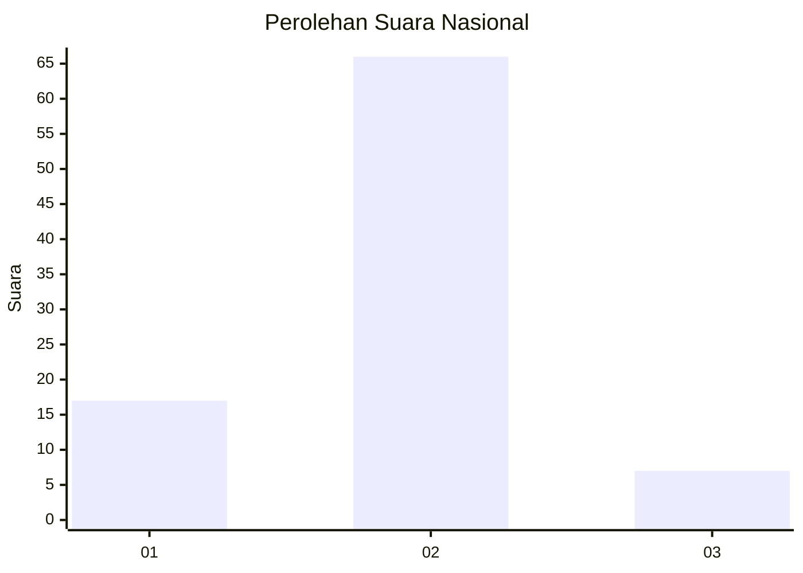
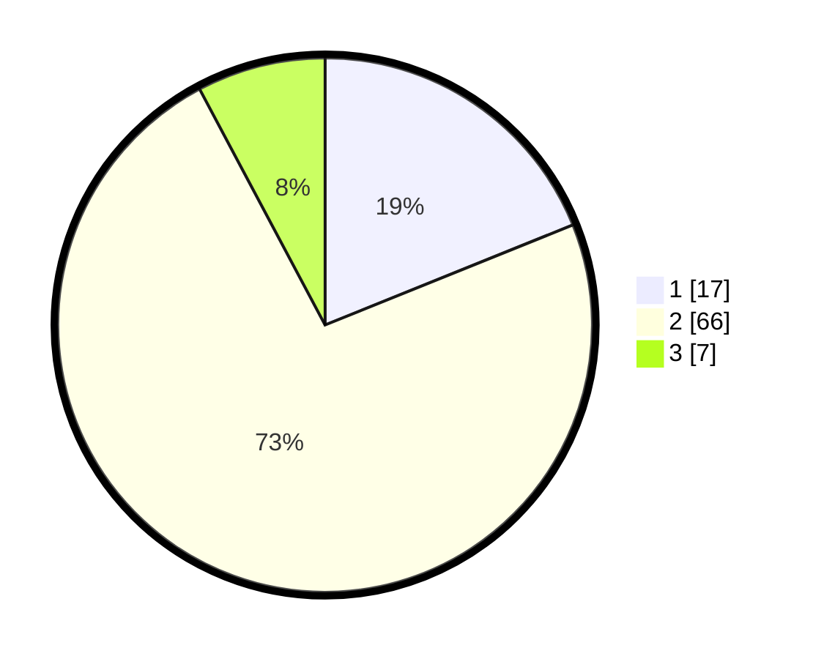

# Hasil

## Grafik

## Tabel

| No. | Nama Paslon    | Suara | Suara (raw) | Persentase |
|:--- |:-------------- | -----:| -----------:| ----------:|
| 1   | ANIES MUHAIMIN | 17    | [17][p-1]   | 18,89      |
| 2   | PRABOWO GIBRAN | 66    | [66][p-2]   | 73,33      |
| 3   | GANJAR MAHFUD  | 7     | [7][p-3]    | 7,78       |

[p-1]: https://github.com/gigit-pemilu/pemilu-2024/blob/main/pilpres/hitung-suara/sub/14-riau/sub/01-kampar/sub/06-siak-hulu/sub/2002-desa-baru/sub/032-tps/sub/paslon-1.txt
[p-2]: https://github.com/gigit-pemilu/pemilu-2024/blob/main/pilpres/hitung-suara/sub/14-riau/sub/01-kampar/sub/06-siak-hulu/sub/2002-desa-baru/sub/032-tps/sub/paslon-2.txt
[p-3]: https://github.com/gigit-pemilu/pemilu-2024/blob/main/pilpres/hitung-suara/sub/14-riau/sub/01-kampar/sub/06-siak-hulu/sub/2002-desa-baru/sub/032-tps/sub/paslon-3.txt

## Foto C Plano

https://sirekap-obj-formc.kpu.go.id/0c8e/pemilu/ppwp/14/01/06/20/02/1401062002032-20240214-232225--077339f9-0c96-4f78-af08-947744a2dcd5.jpg

https://sirekap-obj-formc.kpu.go.id/0c8e/pemilu/ppwp/14/01/06/20/02/1401062002032-20240214-232517--e4cc00ec-3258-4e24-89c1-3e2051fa14ce.jpg

https://sirekap-obj-formc.kpu.go.id/0c8e/pemilu/ppwp/14/01/06/20/02/1401062002032-20240214-232651--c565100f-052d-419b-a02b-7631dd34baac.jpg

## Metadata

| Key        | Value               |
| ---------- | ------------------- |
| Time Stamp | 2024-02-15 15:00:29 |

