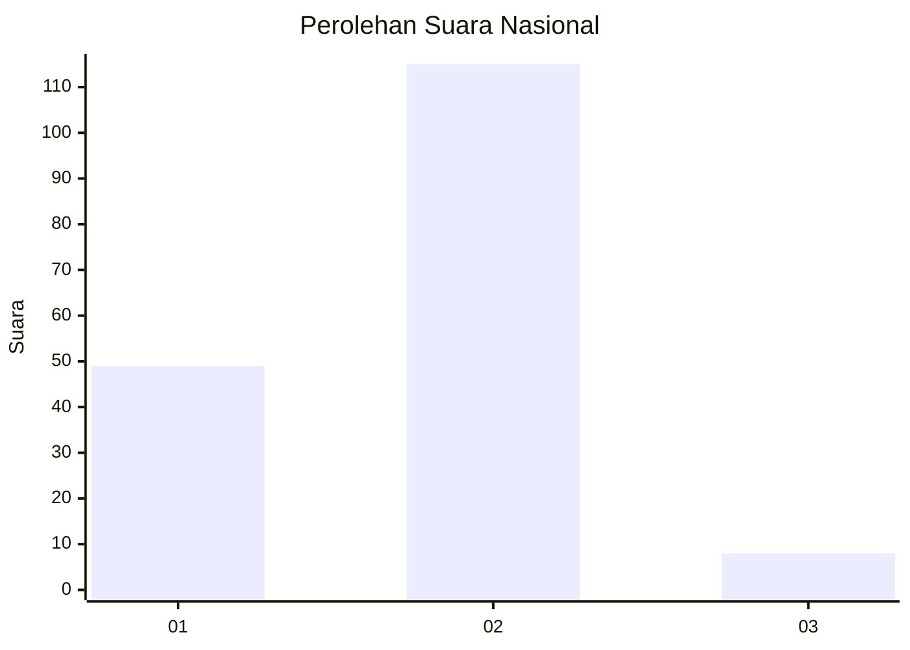
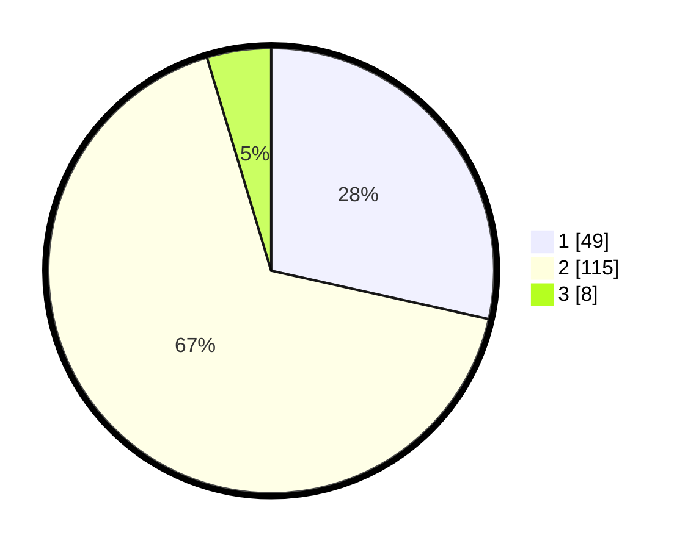

# Hasil

## Grafik

## Tabel

| No. | Nama Paslon    | Suara | Suara (raw) | Persentase |
|:--- |:-------------- | -----:| -----------:| ----------:|
| 1   | ANIES MUHAIMIN | 49    | [49][p-1]   | 28,49      |
| 2   | PRABOWO GIBRAN | 115   | [115][p-2]  | 66,86      |
| 3   | GANJAR MAHFUD  | 8     | [8][p-3]    | 4,65       |

[p-1]: https://github.com/gigit-pemilu/pemilu-2024/blob/main/pilpres/hitung-suara/sub/14-riau/sub/01-kampar/sub/06-siak-hulu/sub/2005-lubuk-siam/sub/002-tps/sub/paslon-1.txt
[p-2]: https://github.com/gigit-pemilu/pemilu-2024/blob/main/pilpres/hitung-suara/sub/14-riau/sub/01-kampar/sub/06-siak-hulu/sub/2005-lubuk-siam/sub/002-tps/sub/paslon-2.txt
[p-3]: https://github.com/gigit-pemilu/pemilu-2024/blob/main/pilpres/hitung-suara/sub/14-riau/sub/01-kampar/sub/06-siak-hulu/sub/2005-lubuk-siam/sub/002-tps/sub/paslon-3.txt

## Foto C Plano

https://sirekap-obj-formc.kpu.go.id/53c3/pemilu/ppwp/14/01/06/20/05/1401062005002-20240214-231107--6715ff20-5649-47e7-836c-371d40f17419.jpg

https://sirekap-obj-formc.kpu.go.id/53c3/pemilu/ppwp/14/01/06/20/05/1401062005002-20240214-231300--49fa299f-d0e4-4704-a177-9f6401a22bba.jpg

https://sirekap-obj-formc.kpu.go.id/53c3/pemilu/ppwp/14/01/06/20/05/1401062005002-20240214-231349--46efae77-5710-43e6-af4c-4b575621861e.jpg

## Metadata

| Key        | Value               |
| ---------- | ------------------- |
| Time Stamp | 2024-02-15 22:30:27 |

