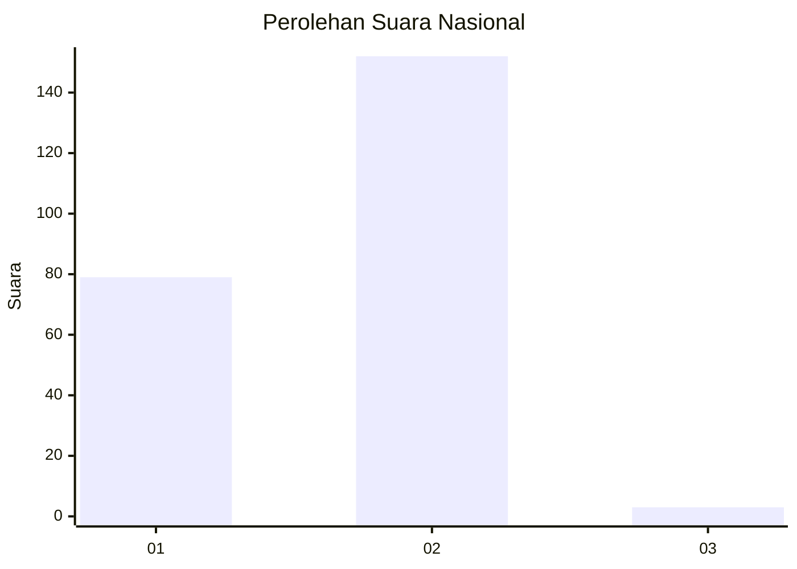
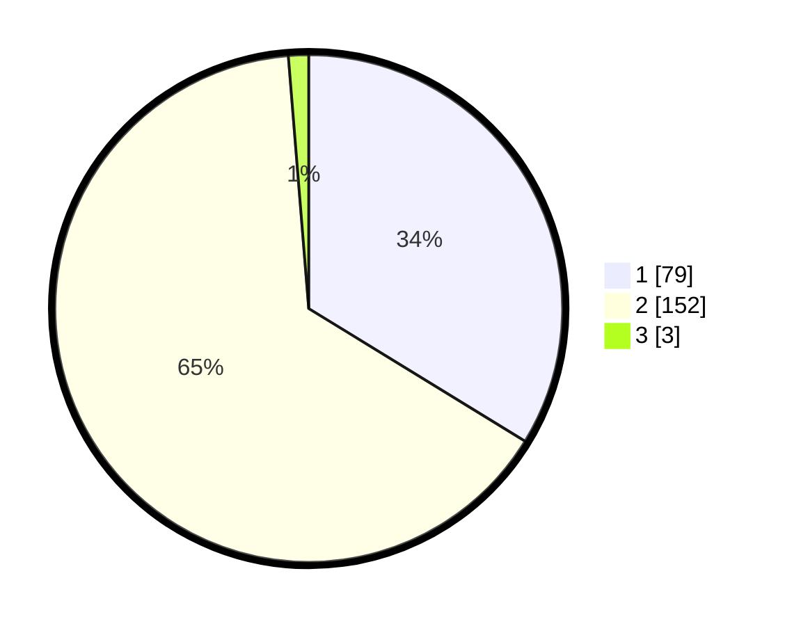

# Hasil

## Grafik

## Tabel

| No. | Nama Paslon    | Suara | Suara (raw) | Persentase |
|:--- |:-------------- | -----:| -----------:| ----------:|
| 1   | ANIES MUHAIMIN | 79    | [79][p-1]   | 33,76      |
| 2   | PRABOWO GIBRAN | 152   | [152][p-2]  | 64,96      |
| 3   | GANJAR MAHFUD  | 3     | [3][p-3]    | 1,28       |

[p-1]: https://github.com/gigit-pemilu/pemilu-2024/blob/main/pilpres/hitung-suara/sub/14-riau/sub/01-kampar/sub/06-siak-hulu/sub/2006-buluh-cina/sub/001-tps/sub/paslon-1.txt
[p-2]: https://github.com/gigit-pemilu/pemilu-2024/blob/main/pilpres/hitung-suara/sub/14-riau/sub/01-kampar/sub/06-siak-hulu/sub/2006-buluh-cina/sub/001-tps/sub/paslon-2.txt
[p-3]: https://github.com/gigit-pemilu/pemilu-2024/blob/main/pilpres/hitung-suara/sub/14-riau/sub/01-kampar/sub/06-siak-hulu/sub/2006-buluh-cina/sub/001-tps/sub/paslon-3.txt

## Foto C Plano

https://sirekap-obj-formc.kpu.go.id/481b/pemilu/ppwp/14/01/06/20/06/1401062006001-20240215-072556--b30486f9-12ee-4446-be9e-6a4dae2b430d.jpg

https://sirekap-obj-formc.kpu.go.id/481b/pemilu/ppwp/14/01/06/20/06/1401062006001-20240215-072631--e60f2dd6-0104-4c60-8e74-2a04e067aa4e.jpg

https://sirekap-obj-formc.kpu.go.id/481b/pemilu/ppwp/14/01/06/20/06/1401062006001-20240215-072706--d8ba4af7-6c88-4a06-884c-cbb7277c6449.jpg

## Metadata

| Key        | Value               |
| ---------- | ------------------- |
| Time Stamp | 2024-02-16 21:01:00 |

