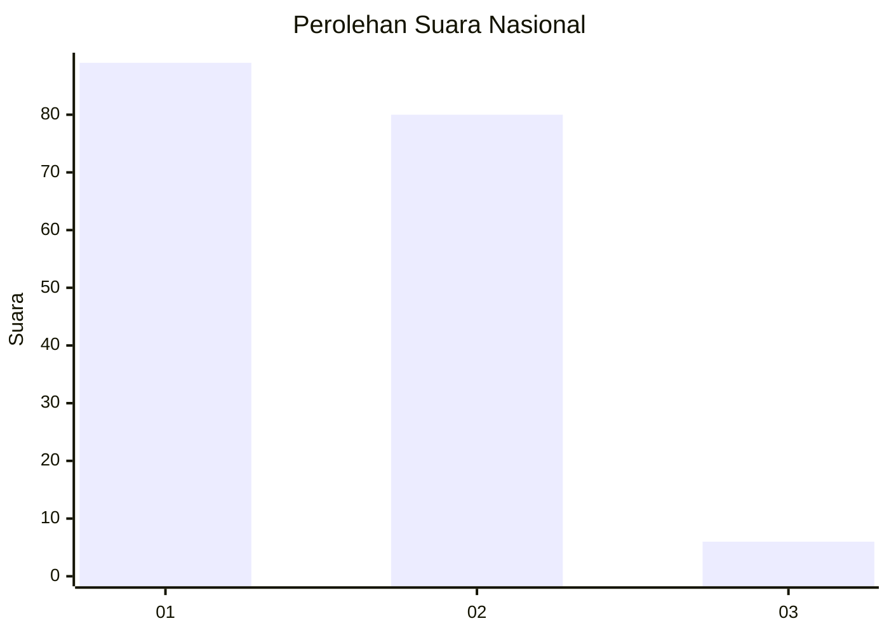
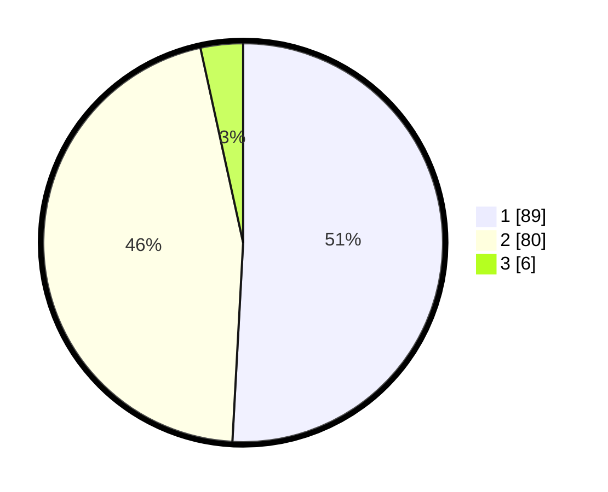

# Hasil

## Grafik

## Tabel

| No. | Nama Paslon    | Suara | Suara (raw) | Persentase |
|:--- |:-------------- | -----:| -----------:| ----------:|
| 1   | ANIES MUHAIMIN | 89    | [89][p-1]   | 50,86      |
| 2   | PRABOWO GIBRAN | 80    | [80][p-2]   | 45,71      |
| 3   | GANJAR MAHFUD  | 6     | [6][p-3]    | 3,43       |

[p-1]: https://github.com/gigit-pemilu/pemilu-2024/blob/main/pilpres/hitung-suara/sub/14-riau/sub/01-kampar/sub/06-siak-hulu/sub/2007-buluh-nipis/sub/005-tps/sub/paslon-1.txt
[p-2]: https://github.com/gigit-pemilu/pemilu-2024/blob/main/pilpres/hitung-suara/sub/14-riau/sub/01-kampar/sub/06-siak-hulu/sub/2007-buluh-nipis/sub/005-tps/sub/paslon-2.txt
[p-3]: https://github.com/gigit-pemilu/pemilu-2024/blob/main/pilpres/hitung-suara/sub/14-riau/sub/01-kampar/sub/06-siak-hulu/sub/2007-buluh-nipis/sub/005-tps/sub/paslon-3.txt

## Foto C Plano

https://sirekap-obj-formc.kpu.go.id/eeaf/pemilu/ppwp/14/01/06/20/07/1401062007005-20240215-002636--0d5980ce-9e40-44b0-b563-2e9bda7d3bd4.jpg

https://sirekap-obj-formc.kpu.go.id/eeaf/pemilu/ppwp/14/01/06/20/07/1401062007005-20240215-002715--94f2ae51-d6f1-4589-b2a4-24c8fcc33970.jpg

https://sirekap-obj-formc.kpu.go.id/eeaf/pemilu/ppwp/14/01/06/20/07/1401062007005-20240216-102032--78c886f3-22b1-49cb-b8d4-5abbd5b69412.jpg

## Metadata

| Key        | Value               |
| ---------- | ------------------- |
| Time Stamp | 2024-02-16 10:30:29 |

