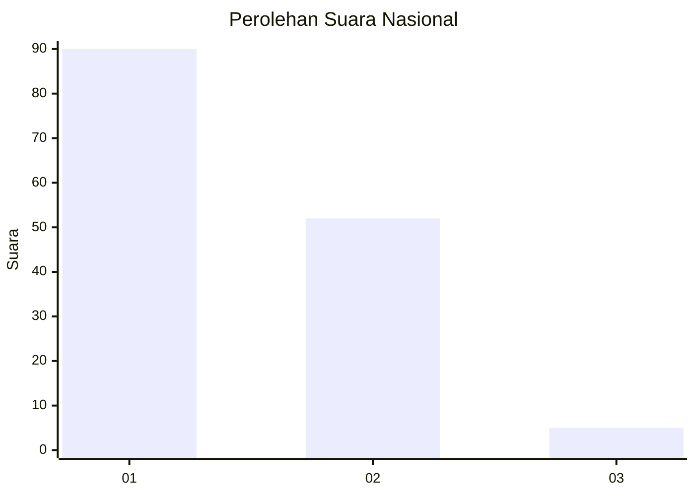
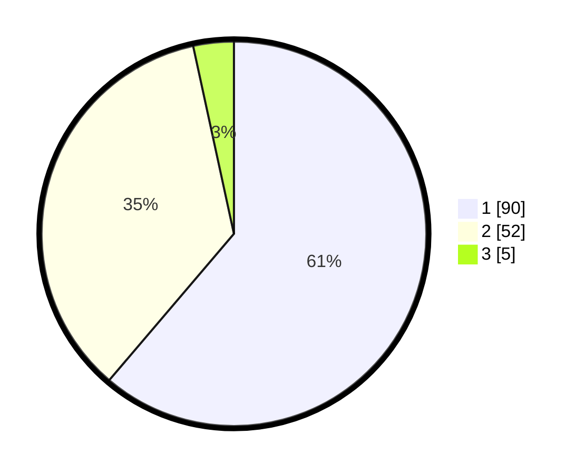

# Hasil

## Grafik

## Tabel

| No. | Nama Paslon    | Suara | Suara (raw) | Persentase |
|:--- |:-------------- | -----:| -----------:| ----------:|
| 1   | ANIES MUHAIMIN | 90    | [90][p-1]   | 61,22      |
| 2   | PRABOWO GIBRAN | 52    | [52][p-2]   | 35,37      |
| 3   | GANJAR MAHFUD  | 5     | [5][p-3]    | 3,40       |

[p-1]: https://github.com/gigit-pemilu/pemilu-2024/blob/main/pilpres/hitung-suara/sub/14-riau/sub/01-kampar/sub/06-siak-hulu/sub/2012-pandau-jaya/sub/013-tps/sub/paslon-1.txt
[p-2]: https://github.com/gigit-pemilu/pemilu-2024/blob/main/pilpres/hitung-suara/sub/14-riau/sub/01-kampar/sub/06-siak-hulu/sub/2012-pandau-jaya/sub/013-tps/sub/paslon-2.txt
[p-3]: https://github.com/gigit-pemilu/pemilu-2024/blob/main/pilpres/hitung-suara/sub/14-riau/sub/01-kampar/sub/06-siak-hulu/sub/2012-pandau-jaya/sub/013-tps/sub/paslon-3.txt

## Foto C Plano

https://sirekap-obj-formc.kpu.go.id/62ef/pemilu/ppwp/14/01/06/20/12/1401062012013-20240214-232723--b2e0a883-2771-46d5-beca-c1b0d12789f8.jpg

https://sirekap-obj-formc.kpu.go.id/62ef/pemilu/ppwp/14/01/06/20/12/1401062012013-20240214-232831--cf306b3d-c221-43bc-aa6a-64b0a92bc499.jpg

https://sirekap-obj-formc.kpu.go.id/62ef/pemilu/ppwp/14/01/06/20/12/1401062012013-20240214-232936--6080c4f7-277f-41d5-b6e4-c346946ee5c2.jpg

## Metadata

| Key        | Value               |
| ---------- | ------------------- |
| Time Stamp | 2024-02-24 22:31:28 |

