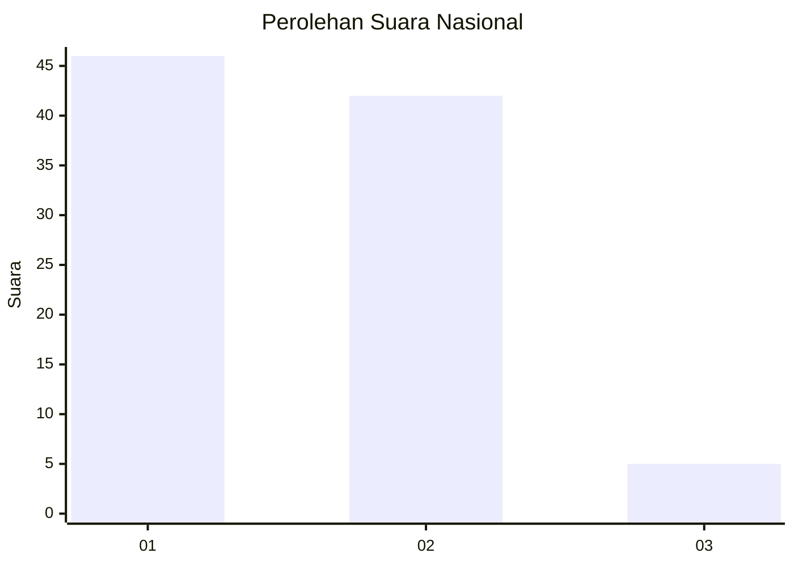
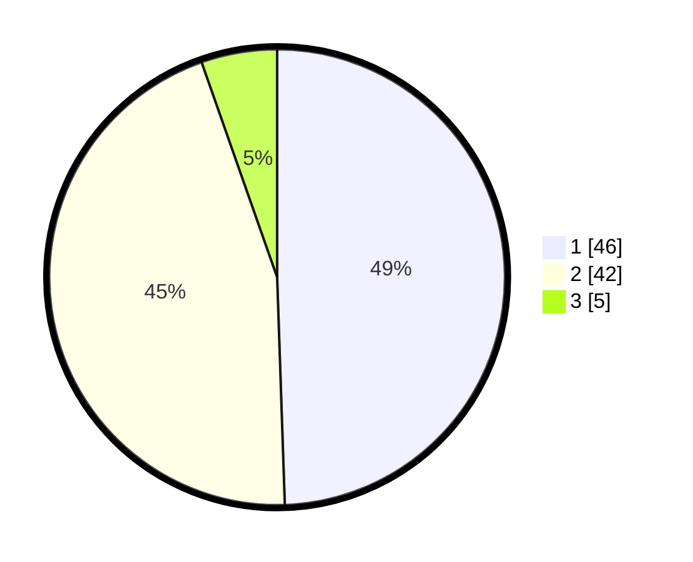

# Hasil

## Grafik

## Tabel

| No. | Nama Paslon    | Suara | Suara (raw) | Persentase |
|:--- |:-------------- | -----:| -----------:| ----------:|
| 1   | ANIES MUHAIMIN | 46    | [46][p-1]   | 49,46      |
| 2   | PRABOWO GIBRAN | 42    | [42][p-2]   | 45,16      |
| 3   | GANJAR MAHFUD  | 5     | [5][p-3]    | 5,38       |

[p-1]: https://github.com/gigit-pemilu/pemilu-2024/blob/main/pilpres/hitung-suara/sub/14-riau/sub/01-kampar/sub/06-siak-hulu/sub/2012-pandau-jaya/sub/016-tps/sub/paslon-1.txt
[p-2]: https://github.com/gigit-pemilu/pemilu-2024/blob/main/pilpres/hitung-suara/sub/14-riau/sub/01-kampar/sub/06-siak-hulu/sub/2012-pandau-jaya/sub/016-tps/sub/paslon-2.txt
[p-3]: https://github.com/gigit-pemilu/pemilu-2024/blob/main/pilpres/hitung-suara/sub/14-riau/sub/01-kampar/sub/06-siak-hulu/sub/2012-pandau-jaya/sub/016-tps/sub/paslon-3.txt

## Foto C Plano

https://sirekap-obj-formc.kpu.go.id/b78d/pemilu/ppwp/14/01/06/20/12/1401062012016-20240215-040439--595c65ed-c61b-4316-b941-dd4a6c574800.jpg

https://sirekap-obj-formc.kpu.go.id/b78d/pemilu/ppwp/14/01/06/20/12/1401062012016-20240215-040549--22fd4094-024d-4cee-bd1c-de361acf2797.jpg

https://sirekap-obj-formc.kpu.go.id/b78d/pemilu/ppwp/14/01/06/20/12/1401062012016-20240215-040733--101c7786-1c58-489e-85c2-59a3d618a7b7.jpg

## Metadata

| Key        | Value               |
| ---------- | ------------------- |
| Time Stamp | 2024-02-25 15:00:00 |

