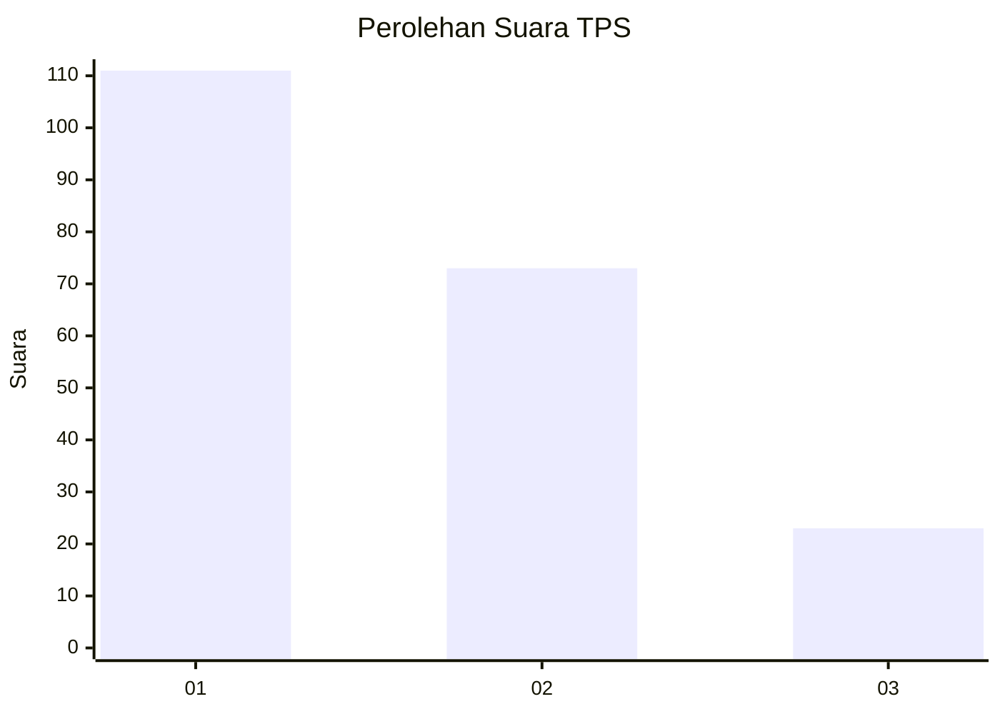
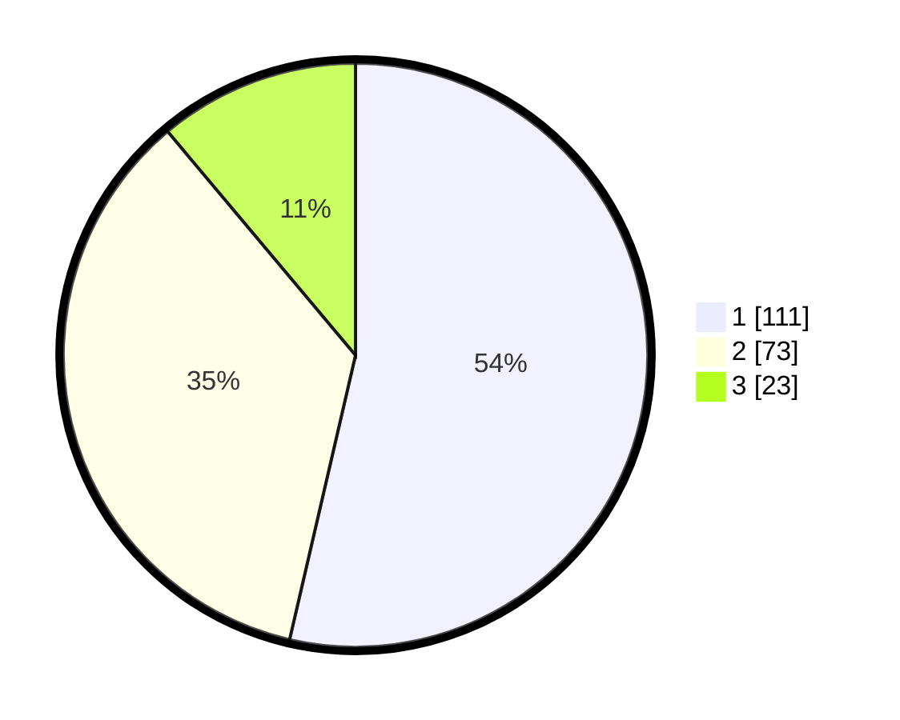

# Hasil

## Grafik

## Tabel

| No. | Nama Paslon    | Suara | Suara (raw) | Persentase |
|:--- |:-------------- | -----:| -----------:| ----------:|
| 1   | ANIES MUHAIMIN | 111   | [111][p-1]  | 53,62      |
| 2   | PRABOWO GIBRAN | 73    | [73][p-2]   | 35,27      |
| 3   | GANJAR MAHFUD  | 23    | [23][p-3]   | 11,11      |

[p-1]: https://github.com/gigit-pemilu/pemilu-2024-14-riau/blob/main/pilpres/hitung-suara/sub/14-riau/sub/01-kampar/sub/06-siak-hulu/sub/2012-pandau-jaya/sub/025-tps/sub/paslon-1.txt
[p-2]: https://github.com/gigit-pemilu/pemilu-2024-14-riau/blob/main/pilpres/hitung-suara/sub/14-riau/sub/01-kampar/sub/06-siak-hulu/sub/2012-pandau-jaya/sub/025-tps/sub/paslon-2.txt
[p-3]: https://github.com/gigit-pemilu/pemilu-2024-14-riau/blob/main/pilpres/hitung-suara/sub/14-riau/sub/01-kampar/sub/06-siak-hulu/sub/2012-pandau-jaya/sub/025-tps/sub/paslon-3.txt

## Foto C Plano

https://sirekap-obj-formc.kpu.go.id/3933/pemilu/ppwp/14/01/06/20/12/1401062012025-20240215-013448--d2d03af1-bc3d-42ff-a335-2b4ee6e624d8.jpg

https://sirekap-obj-formc.kpu.go.id/3933/pemilu/ppwp/14/01/06/20/12/1401062012025-20240215-013548--650af3c4-42d6-494b-8f75-d52924495de4.jpg

https://sirekap-obj-formc.kpu.go.id/3933/pemilu/ppwp/14/01/06/20/12/1401062012025-20240215-013659--6f327c36-caef-44c3-9bbd-5ea78cb0d51d.jpg

## Metadata

| Key        | Value               |
| ---------- | ------------------- |
| Time Stamp | 2024-02-15 15:00:29 |

