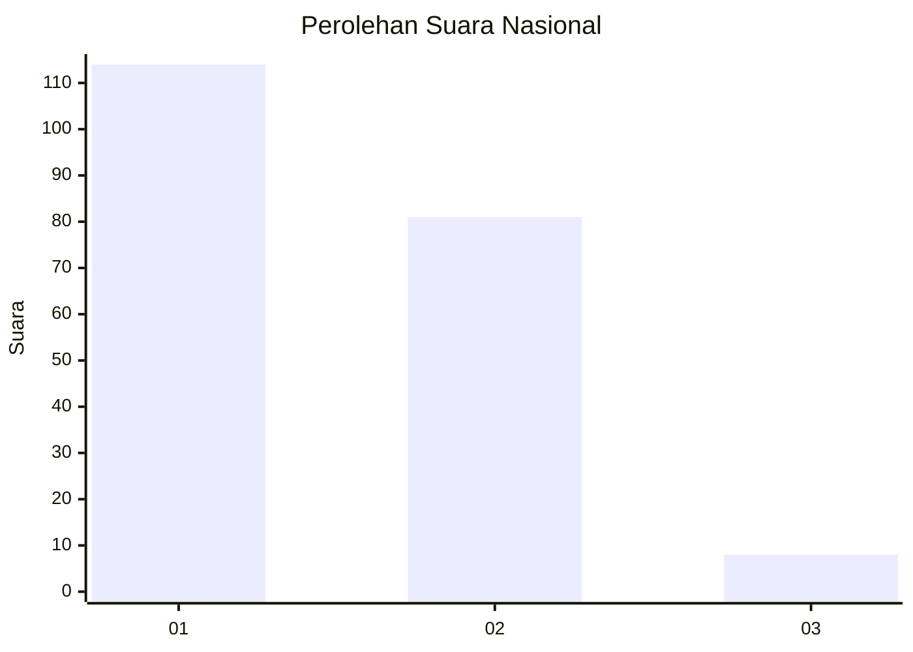
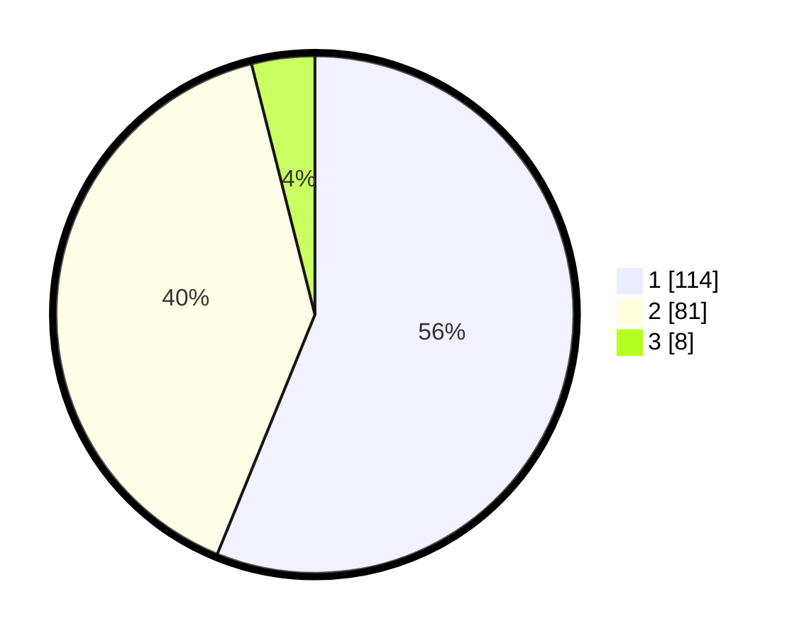

# Hasil

## Grafik

## Tabel

| No. | Nama Paslon    | Suara | Suara (raw) | Persentase |
|:--- |:-------------- | -----:| -----------:| ----------:|
| 1   | ANIES MUHAIMIN | 114   | [114][p-1]  | 56,16      |
| 2   | PRABOWO GIBRAN | 81    | [81][p-2]   | 39,90      |
| 3   | GANJAR MAHFUD  | 8     | [8][p-3]    | 3,94       |

[p-1]: https://github.com/gigit-pemilu/pemilu-2024/blob/main/pilpres/hitung-suara/sub/14-riau/sub/01-kampar/sub/07-kampar-kiri/sub/1027-lipat-kain/sub/002-tps/sub/paslon-1.txt
[p-2]: https://github.com/gigit-pemilu/pemilu-2024/blob/main/pilpres/hitung-suara/sub/14-riau/sub/01-kampar/sub/07-kampar-kiri/sub/1027-lipat-kain/sub/002-tps/sub/paslon-2.txt
[p-3]: https://github.com/gigit-pemilu/pemilu-2024/blob/main/pilpres/hitung-suara/sub/14-riau/sub/01-kampar/sub/07-kampar-kiri/sub/1027-lipat-kain/sub/002-tps/sub/paslon-3.txt

## Foto C Plano

https://sirekap-obj-formc.kpu.go.id/420e/pemilu/ppwp/14/01/07/10/27/1401071027002-20240215-001458--a089f82d-85f0-4076-9ef0-5efafab325e0.jpg

https://sirekap-obj-formc.kpu.go.id/420e/pemilu/ppwp/14/01/07/10/27/1401071027002-20240215-001705--db5c71f9-115a-4711-8edc-090e9b8a3d68.jpg

https://sirekap-obj-formc.kpu.go.id/420e/pemilu/ppwp/14/01/07/10/27/1401071027002-20240215-001912--fb13b3c5-9b3e-458d-bcf5-cd5cd7635517.jpg

## Metadata

| Key        | Value               |
| ---------- | ------------------- |
| Time Stamp | 2024-02-15 16:00:26 |

