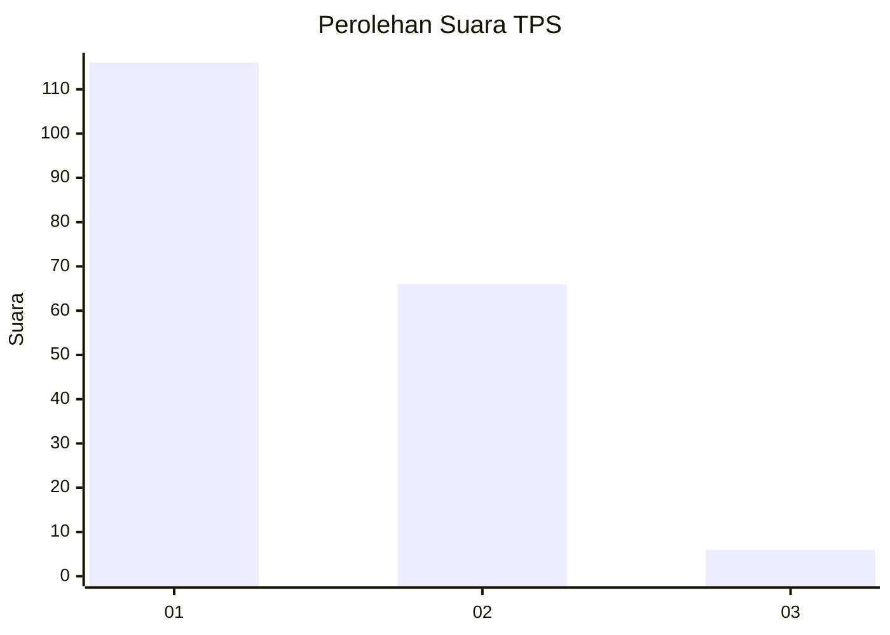
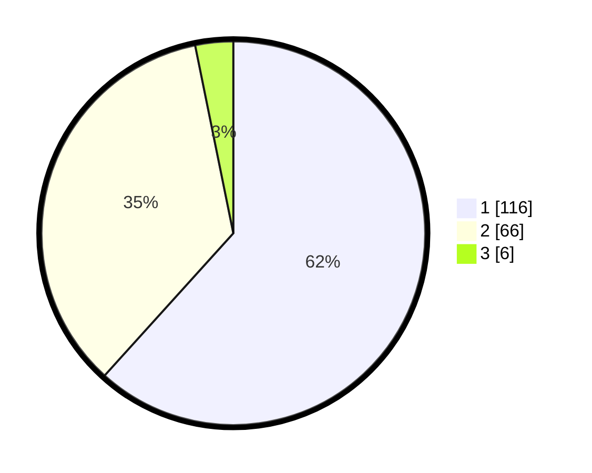

# Hasil

## Grafik

## Tabel

| No. | Nama Paslon    | Suara | Suara (raw) | Persentase |
|:--- |:-------------- | -----:| -----------:| ----------:|
| 1   | ANIES MUHAIMIN | 116   | [116][p-1]  | 61,70      |
| 2   | PRABOWO GIBRAN | 66    | [66][p-2]   | 35,11      |
| 3   | GANJAR MAHFUD  | 6     | [6][p-3]    | 3,19       |

[p-1]: https://github.com/gigit-pemilu/pemilu-2024-14-riau/blob/main/pilpres/hitung-suara/sub/14-riau/sub/01-kampar/sub/07-kampar-kiri/sub/1027-lipat-kain/sub/005-tps/sub/paslon-1.txt
[p-2]: https://github.com/gigit-pemilu/pemilu-2024-14-riau/blob/main/pilpres/hitung-suara/sub/14-riau/sub/01-kampar/sub/07-kampar-kiri/sub/1027-lipat-kain/sub/005-tps/sub/paslon-2.txt
[p-3]: https://github.com/gigit-pemilu/pemilu-2024-14-riau/blob/main/pilpres/hitung-suara/sub/14-riau/sub/01-kampar/sub/07-kampar-kiri/sub/1027-lipat-kain/sub/005-tps/sub/paslon-3.txt

## Foto C Plano

https://sirekap-obj-formc.kpu.go.id/2315/pemilu/ppwp/14/01/07/10/27/1401071027005-20240215-075129--1e980fd2-00d7-4587-ab83-637ef34f5afb.jpg

https://sirekap-obj-formc.kpu.go.id/2315/pemilu/ppwp/14/01/07/10/27/1401071027005-20240215-075314--1c535fdc-0011-407b-bbeb-8a838c168898.jpg

https://sirekap-obj-formc.kpu.go.id/2315/pemilu/ppwp/14/01/07/10/27/1401071027005-20240215-075545--bb98b414-2742-473a-b749-5da337aeb96c.jpg

## Metadata

| Key        | Value               |
| ---------- | ------------------- |
| Time Stamp | 2024-02-15 21:30:27 |

