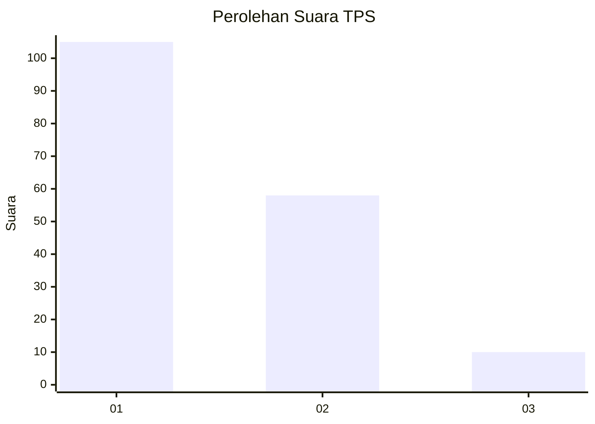
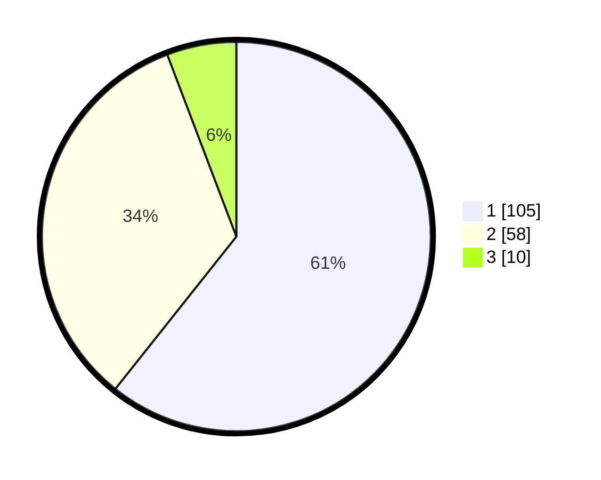

# Hasil

## Grafik

## Tabel

| No. | Nama Paslon    | Suara | Suara (raw) | Persentase |
|:--- |:-------------- | -----:| -----------:| ----------:|
| 1   | ANIES MUHAIMIN | 105   | [105][p-1]  | 60,69      |
| 2   | PRABOWO GIBRAN | 58    | [58][p-2]   | 33,53      |
| 3   | GANJAR MAHFUD  | 10    | [10][p-3]   | 5,78       |

[p-1]: https://github.com/gigit-pemilu/pemilu-2024-14-riau/blob/main/pilpres/hitung-suara/sub/14-riau/sub/01-kampar/sub/07-kampar-kiri/sub/1027-lipat-kain/sub/008-tps/sub/paslon-1.txt
[p-2]: https://github.com/gigit-pemilu/pemilu-2024-14-riau/blob/main/pilpres/hitung-suara/sub/14-riau/sub/01-kampar/sub/07-kampar-kiri/sub/1027-lipat-kain/sub/008-tps/sub/paslon-2.txt
[p-3]: https://github.com/gigit-pemilu/pemilu-2024-14-riau/blob/main/pilpres/hitung-suara/sub/14-riau/sub/01-kampar/sub/07-kampar-kiri/sub/1027-lipat-kain/sub/008-tps/sub/paslon-3.txt

## Foto C Plano

https://sirekap-obj-formc.kpu.go.id/d966/pemilu/ppwp/14/01/07/10/27/1401071027008-20240214-155228--20de2f63-8336-4b7a-ad0c-ee1b1c99422b.jpg

https://sirekap-obj-formc.kpu.go.id/d966/pemilu/ppwp/14/01/07/10/27/1401071027008-20240214-212412--c1e9c0ac-c55e-4414-a1b2-3483dd9f338a.jpg

https://sirekap-obj-formc.kpu.go.id/d966/pemilu/ppwp/14/01/07/10/27/1401071027008-20240214-155259--f251b301-ff9a-43db-bf9a-dcc4fa3fbc88.jpg

## Metadata

| Key        | Value               |
| ---------- | ------------------- |
| Time Stamp | 2024-02-15 12:00:28 |

