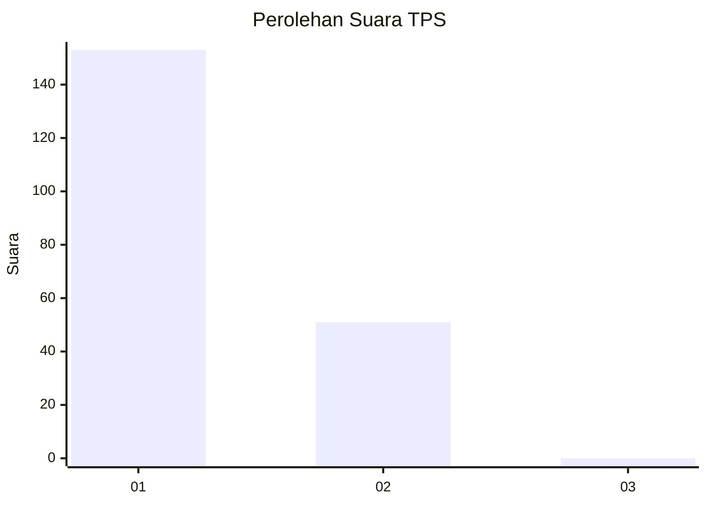
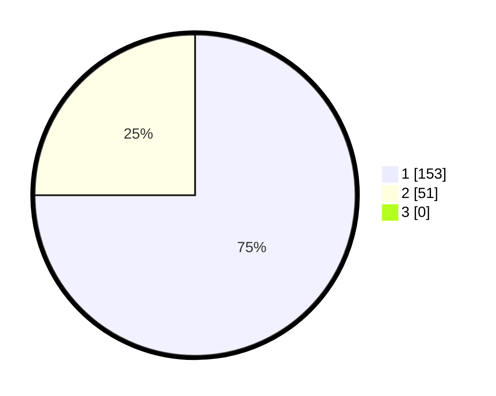

# Hasil

## Grafik

## Tabel

| No. | Nama Paslon    | Suara | Suara (raw) | Persentase |
|:--- |:-------------- | -----:| -----------:| ----------:|
| 1   | ANIES MUHAIMIN | 153   | [153][p-1]  | 75,00      |
| 2   | PRABOWO GIBRAN | 51    | [51][p-2]   | 25,00      |
| 3   | GANJAR MAHFUD  | 0     | [0][p-3]    | 0,00       |

[p-1]: https://github.com/gigit-pemilu/pemilu-2024-14-riau/blob/main/pilpres/hitung-suara/sub/14-riau/sub/01-kampar/sub/07-kampar-kiri/sub/2003-kuntu/sub/006-tps/sub/paslon-1.txt
[p-2]: https://github.com/gigit-pemilu/pemilu-2024-14-riau/blob/main/pilpres/hitung-suara/sub/14-riau/sub/01-kampar/sub/07-kampar-kiri/sub/2003-kuntu/sub/006-tps/sub/paslon-2.txt
[p-3]: https://github.com/gigit-pemilu/pemilu-2024-14-riau/blob/main/pilpres/hitung-suara/sub/14-riau/sub/01-kampar/sub/07-kampar-kiri/sub/2003-kuntu/sub/006-tps/sub/paslon-3.txt

## Foto C Plano

https://sirekap-obj-formc.kpu.go.id/6ec2/pemilu/ppwp/14/01/07/20/03/1401072003006-20240215-033613--74bd2e23-70ec-421b-9929-30209dbc8c43.jpg

https://sirekap-obj-formc.kpu.go.id/6ec2/pemilu/ppwp/14/01/07/20/03/1401072003006-20240215-034115--a090c5a0-05ed-478b-9aa1-3d7a3839ca0b.jpg

https://sirekap-obj-formc.kpu.go.id/6ec2/pemilu/ppwp/14/01/07/20/03/1401072003006-20240215-034218--79fadd4f-a82f-42d1-a4e4-b624baabf80a.jpg

## Metadata

| Key        | Value               |
| ---------- | ------------------- |
| Time Stamp | 2024-02-15 16:00:26 |

