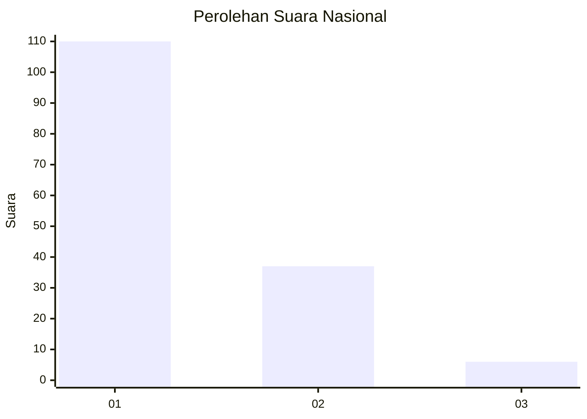
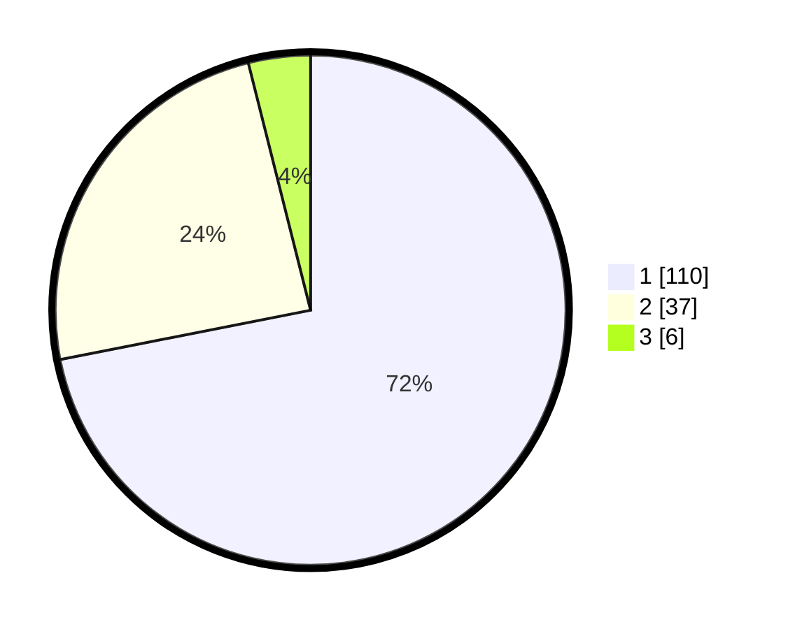

# Hasil

## Grafik

## Tabel

| No. | Nama Paslon    | Suara | Suara (raw) | Persentase |
|:--- |:-------------- | -----:| -----------:| ----------:|
| 1   | ANIES MUHAIMIN | 110   | [110][p-1]  | 71,90      |
| 2   | PRABOWO GIBRAN | 37    | [37][p-2]   | 24,18      |
| 3   | GANJAR MAHFUD  | 6     | [6][p-3]    | 3,92       |

[p-1]: https://github.com/gigit-pemilu/pemilu-2024/blob/main/pilpres/hitung-suara/sub/14-riau/sub/01-kampar/sub/07-kampar-kiri/sub/2003-kuntu/sub/011-tps/sub/paslon-1.txt
[p-2]: https://github.com/gigit-pemilu/pemilu-2024/blob/main/pilpres/hitung-suara/sub/14-riau/sub/01-kampar/sub/07-kampar-kiri/sub/2003-kuntu/sub/011-tps/sub/paslon-2.txt
[p-3]: https://github.com/gigit-pemilu/pemilu-2024/blob/main/pilpres/hitung-suara/sub/14-riau/sub/01-kampar/sub/07-kampar-kiri/sub/2003-kuntu/sub/011-tps/sub/paslon-3.txt

## Foto C Plano

https://sirekap-obj-formc.kpu.go.id/d9b0/pemilu/ppwp/14/01/07/20/03/1401072003011-20240215-011541--0e225c6c-afdf-4f85-81b7-46307c84fb37.jpg

https://sirekap-obj-formc.kpu.go.id/d9b0/pemilu/ppwp/14/01/07/20/03/1401072003011-20240215-031303--b9d785de-335c-4bd9-89fd-e1f8be10181d.jpg

https://sirekap-obj-formc.kpu.go.id/d9b0/pemilu/ppwp/14/01/07/20/03/1401072003011-20240215-012811--5ba8d912-8baf-44eb-910c-899347c10a5c.jpg

## Metadata

| Key        | Value               |
| ---------- | ------------------- |
| Time Stamp | 2024-02-15 22:00:27 |

