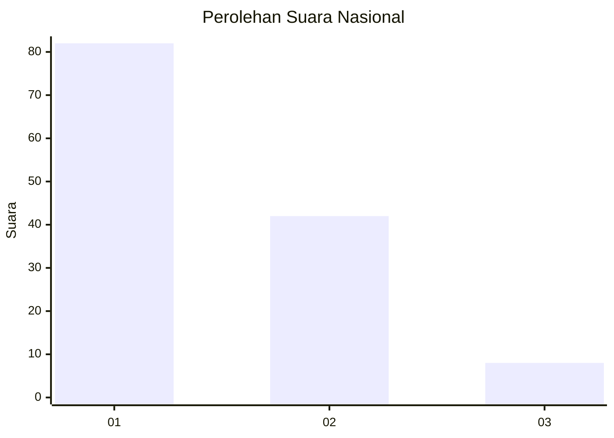
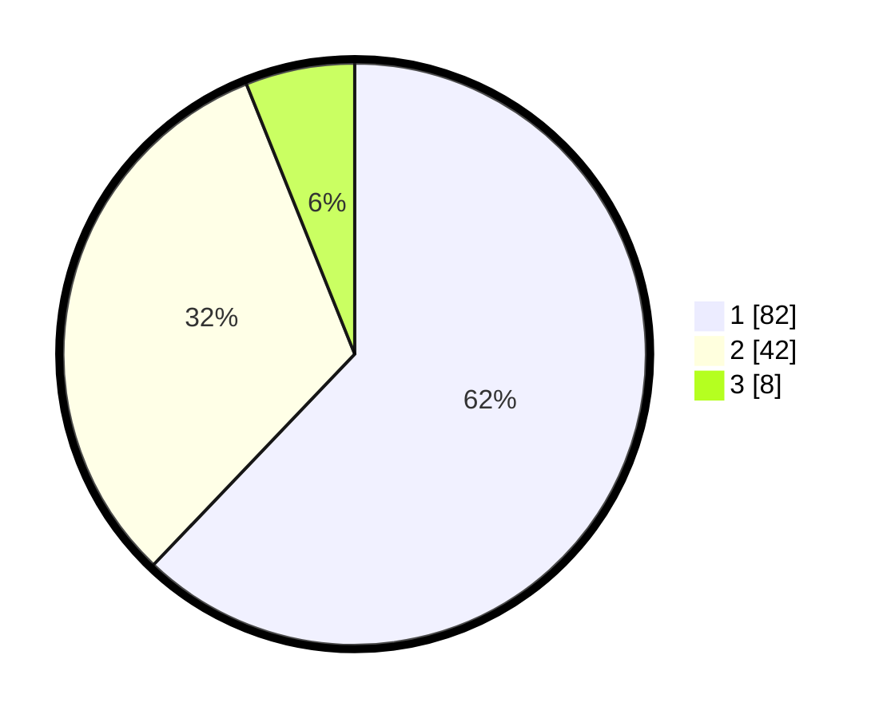

# Hasil

## Grafik

## Tabel

| No. | Nama Paslon    | Suara | Suara (raw) | Persentase |
|:--- |:-------------- | -----:| -----------:| ----------:|
| 1   | ANIES MUHAIMIN | 82    | [82][p-1]   | 62,12      |
| 2   | PRABOWO GIBRAN | 42    | [42][p-2]   | 31,82      |
| 3   | GANJAR MAHFUD  | 8     | [8][p-3]    | 6,06       |

[p-1]: https://github.com/gigit-pemilu/pemilu-2024/blob/main/pilpres/hitung-suara/sub/14-riau/sub/01-kampar/sub/07-kampar-kiri/sub/2003-kuntu/sub/013-tps/sub/paslon-1.txt
[p-2]: https://github.com/gigit-pemilu/pemilu-2024/blob/main/pilpres/hitung-suara/sub/14-riau/sub/01-kampar/sub/07-kampar-kiri/sub/2003-kuntu/sub/013-tps/sub/paslon-2.txt
[p-3]: https://github.com/gigit-pemilu/pemilu-2024/blob/main/pilpres/hitung-suara/sub/14-riau/sub/01-kampar/sub/07-kampar-kiri/sub/2003-kuntu/sub/013-tps/sub/paslon-3.txt

## Foto C Plano

https://sirekap-obj-formc.kpu.go.id/5214/pemilu/ppwp/14/01/07/20/03/1401072003013-20240215-010415--367e8c99-a81d-4021-a071-c630fd740fc8.jpg

https://sirekap-obj-formc.kpu.go.id/5214/pemilu/ppwp/14/01/07/20/03/1401072003013-20240215-010644--dab1588c-65d4-4195-96ec-e0325435bebe.jpg

https://sirekap-obj-formc.kpu.go.id/5214/pemilu/ppwp/14/01/07/20/03/1401072003013-20240215-010817--a6181f11-351a-4c09-9b81-3c4ce4539cb9.jpg

## Metadata

| Key        | Value               |
| ---------- | ------------------- |
| Time Stamp | 2024-02-15 12:00:28 |

