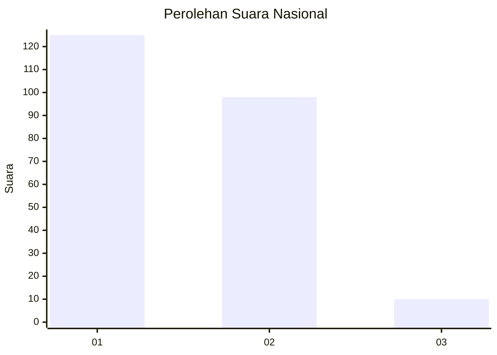
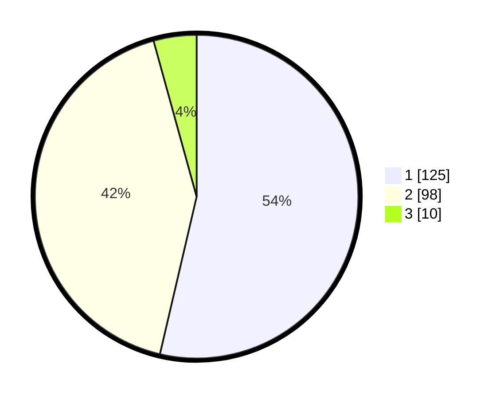

# Hasil

## Grafik

## Tabel

| No. | Nama Paslon    | Suara | Suara (raw) | Persentase |
|:--- |:-------------- | -----:| -----------:| ----------:|
| 1   | ANIES MUHAIMIN | 125   | [125][p-1]  | 53,65      |
| 2   | PRABOWO GIBRAN | 98    | [98][p-2]   | 42,06      |
| 3   | GANJAR MAHFUD  | 10    | [10][p-3]   | 4,29       |

[p-1]: https://github.com/gigit-pemilu/pemilu-2024/blob/main/pilpres/hitung-suara/sub/14-riau/sub/01-kampar/sub/07-kampar-kiri/sub/2006-iv-koto-setingkai/sub/004-tps/sub/paslon-1.txt
[p-2]: https://github.com/gigit-pemilu/pemilu-2024/blob/main/pilpres/hitung-suara/sub/14-riau/sub/01-kampar/sub/07-kampar-kiri/sub/2006-iv-koto-setingkai/sub/004-tps/sub/paslon-2.txt
[p-3]: https://github.com/gigit-pemilu/pemilu-2024/blob/main/pilpres/hitung-suara/sub/14-riau/sub/01-kampar/sub/07-kampar-kiri/sub/2006-iv-koto-setingkai/sub/004-tps/sub/paslon-3.txt

## Foto C Plano

https://sirekap-obj-formc.kpu.go.id/992f/pemilu/ppwp/14/01/07/20/06/1401072006004-20240215-091114--e7369cbe-2cf0-4697-ad6d-b0ef3af14e6c.jpg

https://sirekap-obj-formc.kpu.go.id/992f/pemilu/ppwp/14/01/07/20/06/1401072006004-20240214-211030--7c8e46bb-440b-4a78-b0ec-30c477563d52.jpg

https://sirekap-obj-formc.kpu.go.id/992f/pemilu/ppwp/14/01/07/20/06/1401072006004-20240214-211133--4ed8e5d2-f98c-473c-ab23-153cc974c150.jpg

## Metadata

| Key        | Value               |
| ---------- | ------------------- |
| Time Stamp | 2024-02-15 18:30:25 |

