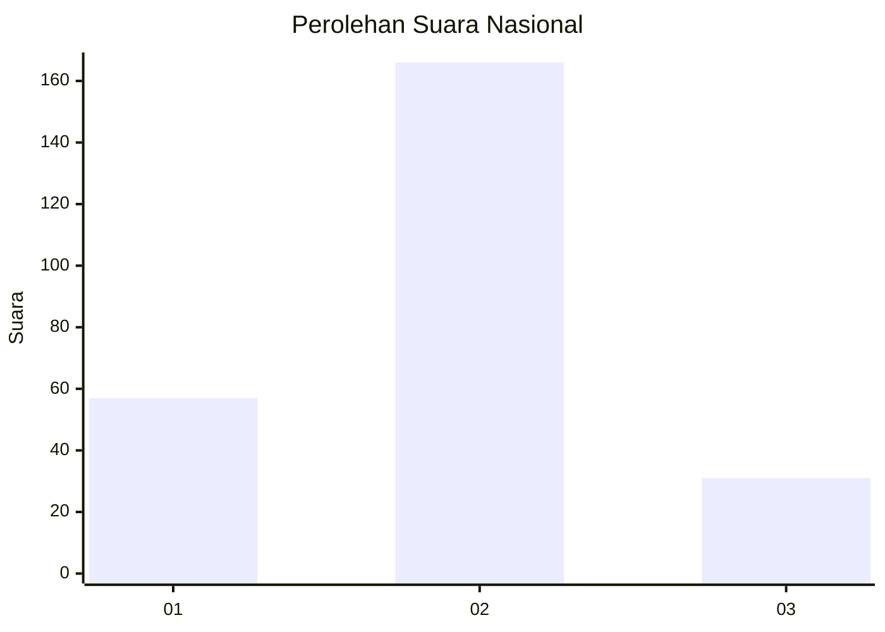
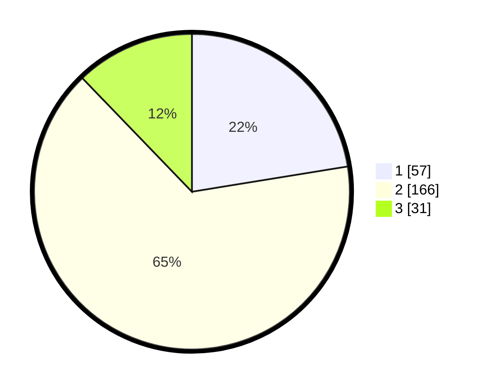

# Hasil

## Grafik

## Tabel

| No. | Nama Paslon    | Suara | Suara (raw) | Persentase |
|:--- |:-------------- | -----:| -----------:| ----------:|
| 1   | ANIES MUHAIMIN | 57    | [57][p-1]   | 22,44      |
| 2   | PRABOWO GIBRAN | 166   | [166][p-2]  | 65,35      |
| 3   | GANJAR MAHFUD  | 31    | [31][p-3]   | 12,20      |

[p-1]: https://github.com/gigit-pemilu/pemilu-2024/blob/main/pilpres/hitung-suara/sub/14-riau/sub/01-kampar/sub/07-kampar-kiri/sub/2013-sungai-geringging/sub/002-tps/sub/paslon-1.txt
[p-2]: https://github.com/gigit-pemilu/pemilu-2024/blob/main/pilpres/hitung-suara/sub/14-riau/sub/01-kampar/sub/07-kampar-kiri/sub/2013-sungai-geringging/sub/002-tps/sub/paslon-2.txt
[p-3]: https://github.com/gigit-pemilu/pemilu-2024/blob/main/pilpres/hitung-suara/sub/14-riau/sub/01-kampar/sub/07-kampar-kiri/sub/2013-sungai-geringging/sub/002-tps/sub/paslon-3.txt

## Foto C Plano

https://sirekap-obj-formc.kpu.go.id/c5e3/pemilu/ppwp/14/01/07/20/13/1401072013002-20240215-101031--b2d0d605-dbd8-4cc5-94b8-fd388a6711ed.jpg

https://sirekap-obj-formc.kpu.go.id/c5e3/pemilu/ppwp/14/01/07/20/13/1401072013002-20240215-101051--c24110e5-8189-42d2-abd0-9e2d174ac4c0.jpg

https://sirekap-obj-formc.kpu.go.id/c5e3/pemilu/ppwp/14/01/07/20/13/1401072013002-20240215-111828--6e15c74c-23d4-44d2-ae45-998a3070f387.jpg

## Metadata

| Key        | Value               |
| ---------- | ------------------- |
| Time Stamp | 2024-02-15 22:00:27 |

