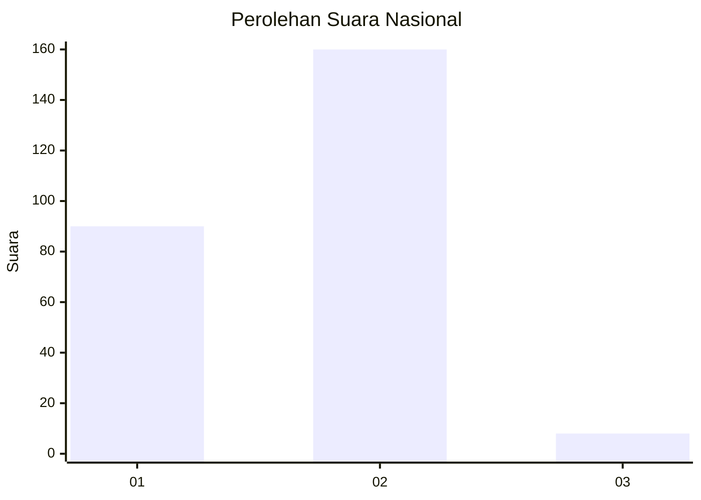
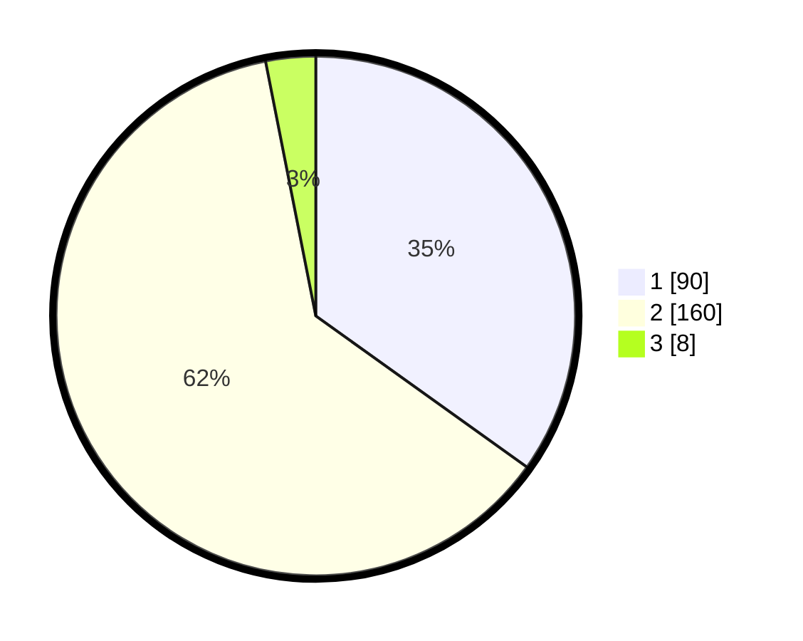

# Hasil

## Grafik

## Tabel

| No. | Nama Paslon    | Suara | Suara (raw) | Persentase |
|:--- |:-------------- | -----:| -----------:| ----------:|
| 1   | ANIES MUHAIMIN | 90    | [90][p-1]   | 34,88      |
| 2   | PRABOWO GIBRAN | 160   | [160][p-2]  | 62,02      |
| 3   | GANJAR MAHFUD  | 8     | [8][p-3]    | 3,10       |

[p-1]: https://github.com/gigit-pemilu/pemilu-2024/blob/main/pilpres/hitung-suara/sub/14-riau/sub/01-kampar/sub/07-kampar-kiri/sub/2023-sungai-raja/sub/001-tps/sub/paslon-1.txt
[p-2]: https://github.com/gigit-pemilu/pemilu-2024/blob/main/pilpres/hitung-suara/sub/14-riau/sub/01-kampar/sub/07-kampar-kiri/sub/2023-sungai-raja/sub/001-tps/sub/paslon-2.txt
[p-3]: https://github.com/gigit-pemilu/pemilu-2024/blob/main/pilpres/hitung-suara/sub/14-riau/sub/01-kampar/sub/07-kampar-kiri/sub/2023-sungai-raja/sub/001-tps/sub/paslon-3.txt

## Foto C Plano

https://sirekap-obj-formc.kpu.go.id/d36c/pemilu/ppwp/14/01/07/20/23/1401072023001-20240215-144912--f094797e-77c3-4bd0-b62c-2f0cb42f735f.jpg

https://sirekap-obj-formc.kpu.go.id/d36c/pemilu/ppwp/14/01/07/20/23/1401072023001-20240215-121147--59f42ec3-adf2-48c6-81bd-c0aaa75f6f68.jpg

https://sirekap-obj-formc.kpu.go.id/d36c/pemilu/ppwp/14/01/07/20/23/1401072023001-20240215-122221--41f23db9-b801-43d6-9fea-243b78dc73e8.jpg

## Metadata

| Key        | Value               |
| ---------- | ------------------- |
| Time Stamp | 2024-02-15 20:00:44 |

