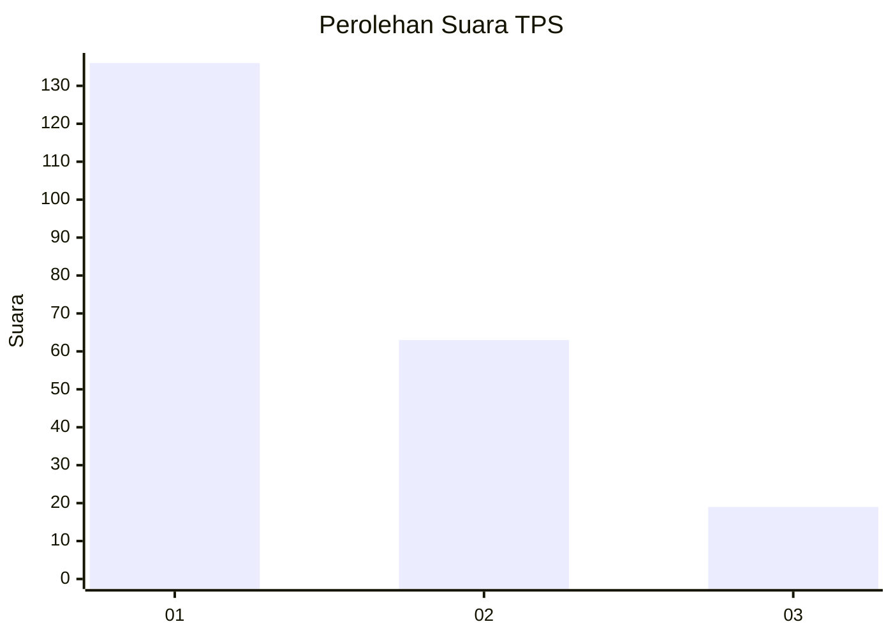
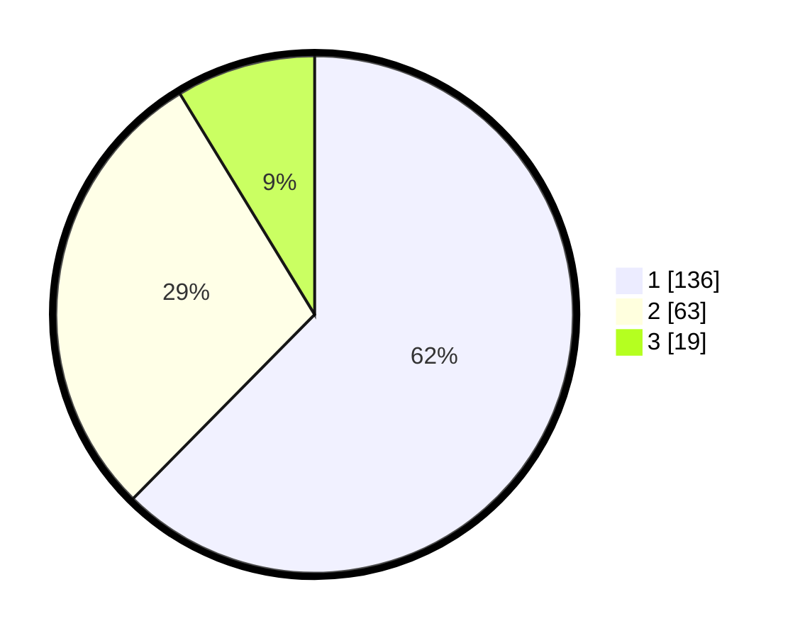

# Hasil

## Grafik

## Tabel

| No. | Nama Paslon    | Suara | Suara (raw) | Persentase |
|:--- |:-------------- | -----:| -----------:| ----------:|
| 1   | ANIES MUHAIMIN | 136   | [136][p-1]  | 62,39      |
| 2   | PRABOWO GIBRAN | 63    | [63][p-2]   | 28,90      |
| 3   | GANJAR MAHFUD  | 19    | [19][p-3]   | 8,72       |

[p-1]: https://github.com/gigit-pemilu/pemilu-2024-14-riau/blob/main/pilpres/hitung-suara/sub/14-riau/sub/01-kampar/sub/09-kampar-kiri-hulu/sub/2003-tanjung-belit-selatan/sub/001-tps/sub/paslon-1.txt
[p-2]: https://github.com/gigit-pemilu/pemilu-2024-14-riau/blob/main/pilpres/hitung-suara/sub/14-riau/sub/01-kampar/sub/09-kampar-kiri-hulu/sub/2003-tanjung-belit-selatan/sub/001-tps/sub/paslon-2.txt
[p-3]: https://github.com/gigit-pemilu/pemilu-2024-14-riau/blob/main/pilpres/hitung-suara/sub/14-riau/sub/01-kampar/sub/09-kampar-kiri-hulu/sub/2003-tanjung-belit-selatan/sub/001-tps/sub/paslon-3.txt

## Foto C Plano

https://sirekap-obj-formc.kpu.go.id/2f51/pemilu/ppwp/14/01/09/20/03/1401092003001-20240215-040915--138ff9d2-3aed-4395-97bb-bf6bcb649e13.jpg

https://sirekap-obj-formc.kpu.go.id/2f51/pemilu/ppwp/14/01/09/20/03/1401092003001-20240215-041000--61845659-66c4-4885-b646-a44370213f0b.jpg

https://sirekap-obj-formc.kpu.go.id/2f51/pemilu/ppwp/14/01/09/20/03/1401092003001-20240215-041025--c1f2a004-e2e7-4349-98d6-f0b34f4dd78c.jpg

## Metadata

| Key        | Value               |
| ---------- | ------------------- |
| Time Stamp | 2024-02-16 09:00:28 |

