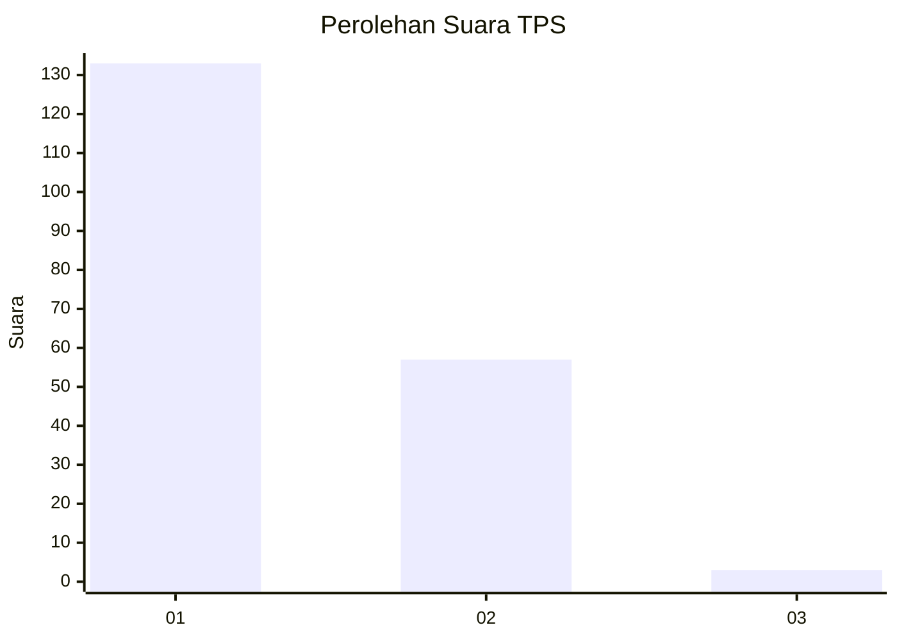
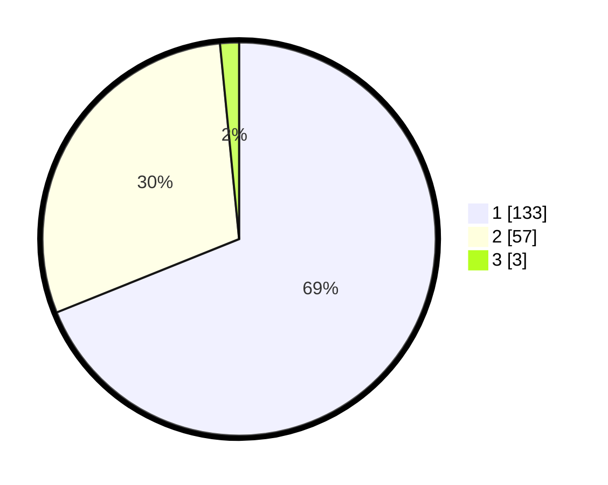

# Hasil

## Grafik

## Tabel

| No. | Nama Paslon    | Suara | Suara (raw) | Persentase |
|:--- |:-------------- | -----:| -----------:| ----------:|
| 1   | ANIES MUHAIMIN | 133   | [133][p-1]  | 68,91      |
| 2   | PRABOWO GIBRAN | 57    | [57][p-2]   | 29,53      |
| 3   | GANJAR MAHFUD  | 3     | [3][p-3]    | 1,55       |

[p-1]: https://github.com/gigit-pemilu/pemilu-2024-14-riau/blob/main/pilpres/hitung-suara/sub/14-riau/sub/01-kampar/sub/10-tapung/sub/2001-petapahan/sub/001-tps/sub/paslon-1.txt
[p-2]: https://github.com/gigit-pemilu/pemilu-2024-14-riau/blob/main/pilpres/hitung-suara/sub/14-riau/sub/01-kampar/sub/10-tapung/sub/2001-petapahan/sub/001-tps/sub/paslon-2.txt
[p-3]: https://github.com/gigit-pemilu/pemilu-2024-14-riau/blob/main/pilpres/hitung-suara/sub/14-riau/sub/01-kampar/sub/10-tapung/sub/2001-petapahan/sub/001-tps/sub/paslon-3.txt

## Foto C Plano

https://sirekap-obj-formc.kpu.go.id/1ec6/pemilu/ppwp/14/01/10/20/01/1401102001001-20240223-121627--78d8d642-6256-4b21-90cd-1dbe4a230441.jpg

https://sirekap-obj-formc.kpu.go.id/1ec6/pemilu/ppwp/14/01/10/20/01/1401102001001-20240214-203826--8181ffa1-454e-459a-b5d9-b1011c1f3c96.jpg

https://sirekap-obj-formc.kpu.go.id/1ec6/pemilu/ppwp/14/01/10/20/01/1401102001001-20240214-160114--2464b500-c1b9-420e-957a-1b4c7cdafb21.jpg

## Metadata

| Key        | Value               |
| ---------- | ------------------- |
| Time Stamp | 2024-02-24 22:31:28 |

